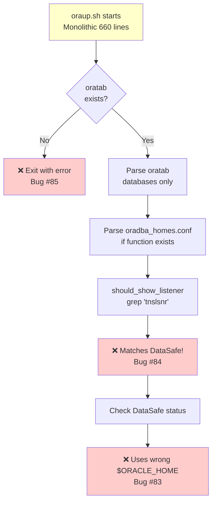
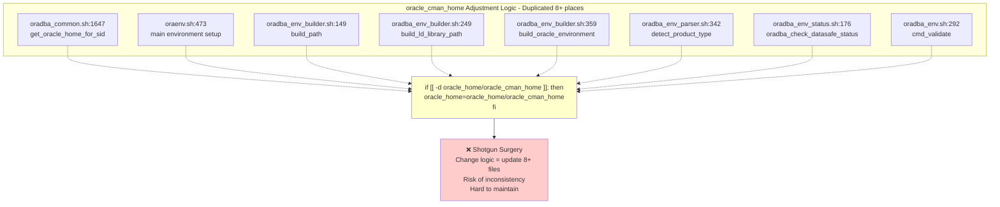
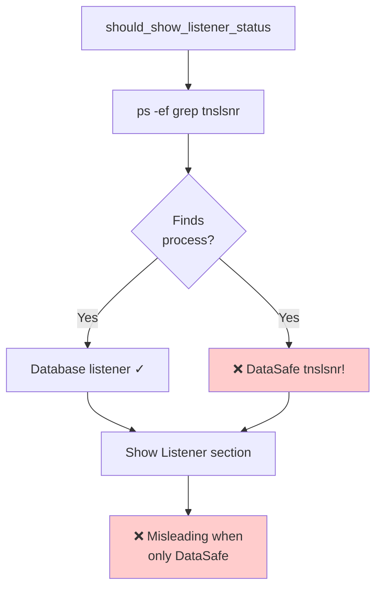

# OraDBA Architecture Diagrams

## Current Architecture (v1.2.x) - The Problem



**Problems:**
- ❌ Hard dependency on oratab (fails without it)
- ❌ Two separate config systems (oratab + oradba_homes.conf)
- ❌ No abstraction layer
- ❌ Product-specific code scattered everywhere
- ❌ Process detection mixed with configuration

## Current DataSafe Handling - Duplicated Logic


mermaid
graph TB
    Start[oraup.sh Refactored<br/>Modular ~100 lines each] --> Registry[oradba_registry_get_all]
    
    subgraph "Unified Registry API"
        Registry --> Check1[Check oratab<br/>if exists]
        Registry --> Check2[Check oradba_homes.conf<br/>if exists]
        Registry --> Check3[Auto-discover<br/>if enabled]
        Check1 --> Unified[Return unified<br/>installation list]
        Check2 --> Unified
        Check3 --> Unified
    end
    
    Unified --> Group[Group by Product Type]
    Group --> DB[databases array]
    Group --> Homes[oracle_homes array]
    
    DB --> Display[Modular Display Functions]
    Homes --> Display
    
    subgraph "Modular Display"
        Display --> D1[display_oracle_homes]
        Display --> D2[display_databases]
        Display --> D3[display_listeners]
        D3 --> P1[plugin_should_show_listener<br/>✅ DataSafe returns false]
        Display --> D4[display_datasafe_connectors]
        D4 --> P2[plugin_check_status<br/>✅ Explicit ORACLE_HOME]
    end
    
    style Start fill:#ccffcc
    style Registry fill:#ccffcc
    style Unified fill:#ccffcc
    style P1 fill:#ccffcc
    style P2 fill:#ccffcc
```

**Benefits:**
- ✅ Works with oratab, oradba_homes.conf, or neither
- ✅ Single source of truth (registry API)
- ✅ Product-specific logic in plugins
- ✅ Testable, modular functions
- ✅ Clear separation of concernsroduct-specific logic in plugins
✅ Testable, modular functions
✅ Clear separation of concerns
```

## Registry System Architecture

```
┌──────────────────────────────────────────────────────────────────────┐
│  mermaid
graph TB
    subgraph "Data Sources - Unchanged"
        Oratab[(oratab<br/>SID:HOME:FLAGS)]
        Homes[(oradba_homes.conf<br/>NAME:PATH:TYPE:ORDER...)]
    end
    
    Oratab --> RegAPI[lib/oradba_registry.sh<br/>New Abstraction Layer]
    Homes --> RegAPI
    
    subgraph "Registry API Functions"
        RegAPI --> F1[oradba_registry_get_all<br/>All installations]
        RegAPI --> F2[oradba_registry_get_by_name<br/>Specific installation]
        RegAPI --> F3[oradba_registry_get_by_type<br/>Filter by product type]
        RegAPI --> F4[oradba_registry_discover_all<br/>Auto-discover instances]
    end
    
    F1 --> Output[Unified Installation Objects]
    F2 --> Output
    F3 --> Output
    F4 --> Output
    
    subgraph "Installation Object Format"
        Output --> Obj["type=database|datasafe|oud...<br/>name=SID or home name<br/>home=ORACLE_HOME path<br/>flags=startup flags<br/>order=display order<br/>..."]
    end
    
    style RegAPI fill:#ccffcc
    style Output fill:#ccffcc
    style Obj fill:#e6f3ff
```

**Advantages:**
- ✅ Single API regardless of data source
- ✅ Easy to add new data sources
- ✅ Consistent data format
- ✅ Testable in isolationPlugin System Architecture

```
┌──────────────────────────────────────────────────────────────────────┐
│                      Product Plugin System                           │
├──────────────────────────────────────────────────────────────────────┤
│                                                                      │
│  Plugin Interface (lib/plugins/plugin_interface.sh):                │
│  ┌────────────────────────────────────────────────────────┐        │
│  │ Standard Functions (All plugins must implement):       │        │
│  │ - plugin_detect_installation()                         │        │
│  │ - plugin_validate_home()                               │        │
│  │ - plugin_adjust_environment()     ◄── Key for DataSafe│        │
│  │ - plugin_check_status()            ◄── Key for #83    │        │
│  │ - plugin_get_metadata()                                │        │
│  │ - plugin_should_show_listener()    ◄── Key for #84    │        │
│  └────────────────────────────────────────────────────────┘        │
│                      │                                              │
│                      ▼                                              │
│  mermaid
graph TB
    Interface[lib/plugins/plugin_interface.sh<br/>Standard Interface Template]
    
    subgraph "Required Functions - All Plugins Implement"
        Interface --> Func1[plugin_detect_installation]
        Interface --> Func2[plugin_validate_home]
        Interface --> Func3[plugin_adjust_environment<br/>🔑 Key for DataSafe]
        Interface --> Func4[plugin_check_status<br/>🔑 Fixes Bug #83]
        Interface --> Func5[plugin_get_metadata]
        Interface --> Func6[plugin_should_show_listener<br/>🔑 Fixes Bug #84]
    end
    
    Interface --> Plugins[Product-Specific Plugins]
    
    subgraph "Product Plugins - lib/plugins/"
        Plugins --> DB[database_plugin.sh<br/>adjust: as-is<br/>status: check pmon<br/>listener: true]
        Plugins --> DS[datasafe_plugin.sh<br/>adjust: +oracle_cman_home<br/>status: cmctl explicit HOME<br/>listener: false]
        Plugins --> CL[client_plugin.sh<br/>adjust: as-is<br/>status: available<br/>listener: false]
        Plugins --> OUD[oud_plugin.sh<br/>adjust: as-is<br/>status: check oud process<br/>listener: false]
    end
    
    style Interface fill:#e6f3ff
    style Func3 fill:#ffffcc
    style Func4 fill:#ffffcc
    style Func6 fill:#ffffcc
    style DS fill:#ccffcc
```

**Benefits:**
- ✅ Product-specific logic encapsulated
- ✅ Easy to add new product types
- ✅ Single place to change behavior
- ✅ Testable in isolation
- ✅ Clear interface contract           ▼
        [No oratab]
              │
              ▼
┌─────────────────────────────────────────┐
│ Display error message                   │
│ "No oratab file found"                  │
└─────────────────────────────────────────┘
              │
              ▼
┌─────────────────────────────────────────┐
│ return 0 (exit early)                   │
│ ❌ Never checks oradba_homes.conf        │
└─────────────────────────────────────────┘
```

**After (Fixed):**
```
┌─────────────────────────────────────────┐
│ oraup.sh starts                         │
└─────────────────────────────────────────┘
              │
              ▼
┌─────────────────────────────────────────┐
│ omermaid
graph TB
    Start1[oraup.sh starts] --> Check1{oratab<br/>exists?}
    Check1 -->|No| Error1[Display error:<br/>No oratab file found]
    Error1 --> Exit1[❌ return 0 exit early<br/>Never checks oradba_homes.conf]
    
    style Exit1 fill:#ffcccc
    style Error1 fill:#ffeeee
```

**After (Fixed):**
```mermaid
graph TB
    Start2[oraup.sh starts] --> Registry[oradba_registry_get_all]
    
    subgraph "Unified Registry"
        Registry --> C1[Check oratab<br/>if exists]
        Registry --> C2[Check oradba_homes.conf<br/>if exists]
        Registry --> C3[Auto-discover<br/>if enabled]
    end
    
    C1 --> Got{Got<br/>installations?}
    C2 --> Got
    C3 --> Got
    
    Got -->|Yes| Display[✅ Display them]
    Got -->|No| Help[Display helpful message]
    
    style Display fill:#ccffcc
    style Registry fill:#ccffcc
              ▼
┌─────────────────────────────────────────┐
│ For each installation:                  │
│   if plugin_should_show_listener():     │
│       display listener info             │
└─────────────────────────────────────────┘
              │
              ├─ database: show listener ✅
              ├─ datasafe: DON'T show ✅
              ├─ client: DON'T show ✅
              └─ oud: DON'T show ✅
              │
              ▼
┌─────────────────────────────────────────┐
│ Only show "Listener" section if         │
│ database installations exist            │
│ ✅ Clear and correct                     │
└─────────────────────────────────────────┘
```

### Bug #83: DataSafe status wrong environment

**Before (Current - Wrong):**


**After (Fixed):**
```mermaid
graph TB
    Start2[display_listeners<br/>installations] --> Loop[For each installation]
    
    Loop --> Check2{plugin_should_show_listener?}
    
    Check2 -->|database: true| Show1[✅ Show listener info]
    Check2 -->|datasafe: false| Skip1[DON'T show]
    Check2 -->|client: false| Skip2[DON'T show]
    Check2 -->|oud: false| Skip3[DON'T show]
    
    Show1 --> Result[Only show Listener section<br/>if database exists]
    Skip1 --> Result
    Skip2 --> Result
    Skip3 --> Result
    
    Result --> Success[✅ Clear and correct]
    
    style Show1 fill:#ccffcc
    style Success fill:#ccffcc

## Configuration Loading Flow

**Current (Inconsistent):**
```
┌──────────────────┐        ┌──────────────────┐
│   oraenv.sh      │        │    oraup.sh      │
├──────────────────┤        ├──────────────────┤
│ 1. common lib    │        │ 1. common lib    │
│ 2. core.conf     │        │ 2. status lib    │
│ 3. local.conf    │        │ 3. ???           │
│ 4. standard.conf │        │                  │
│ 5mermaid
graph TB
    Start[oraup.sh:<br/>Display DataSafe status] --> Call[oradba_check_datasafe_status path]
    Call --> Problem[❌ Uses current $ORACLE_HOME<br/>❌ Uses current $LD_LIBRARY_PATH<br/>May be from different env!]
    Problem --> Cmctl[cmctl status]
    Cmctl --> Wrong[❌ Wrong HOME<br/>❌ Wrong libraries<br/>❌ Incorrect status]
    
    style Problem fill:#ffcccc
    style Wrong fill:#ffcccc
```

**After (Fixed):**
```mermaid
graph TB
    Start2[display_datasafe_connectors] --> Loop[For each DataSafe installation]
    Loop --> Plugin[plugin_check_status path]
    
    subgraph "datasafe_plugin.sh"
        Plugin --> Explicit[Set Explicit Environment:<br/>ORACLE_HOME=path/oracle_cman_home<br/>LD_LIBRARY_PATH=path/lib]
        Explicit --> Cmctl2[cmctl status<br/>with correct environment]
    end
    
    Cmctl2 --> Success[✅ Correct HOME<br/>✅ Correct libraries<br/>✅ Accurate status]
    
    style Success fill:#ccffcc
    style Explicit fill:#ccffcc                 │
│  ✅ Bugs #83-#85 fixed                                     │
└────────────────────────────────────────────────────────────┘
                         │
                         │ Phase 2: Gradual migration (3 weeks)
                         ▼
┌────────────────────────────────────────────────────────────┐
│                    v1.3.0-v1.3.1                           │
│  ┌──────────────────────────────────────────────────┐     │
│  │ New code uses Registry + Plugins                 │     │
│  │ - oraup.sh refactored                            │     │
│  │ - oraenv.sh refactored                           │     │
│  └──────────────────────────────────────────────────┘     │
│  ┌──────────────────────────────────────────────────┐     │
│  │ Old functions deprecated (still work)            │     │
│  │ - list_oracle_homes() → calls registry          │     │
│  │ - Deprecation warnings logged                    │     │
│  └──────────────────────────────────────────────────┘     │
│  ✅ Backward compatible                                    │
│  ✅ All new features use new architecture                  │
└────────────────────────────────────────────────────────────┘
                         │
                         │ Phase 3: Cleanup (4 weeks)
                         ▼
┌────────────────────────────────────────────────────────────┐
│                    v2.0.0                                  │
│  mermaid
graph TB
    subgraph "oraenv.sh - Consistent"
        E1[1. common lib] --> E2[2. core.conf]
        E2 --> E3[3. local.conf]
        E3 --> E4[4. standard.conf]
        E4 --> E5[5. customer.conf]
        E5 --> E6[6. sid.*.conf]
    end
    
    subgraph "oraup.sh - Inconsistent ❌"
        U1[1. common lib] --> U2[2. status lib]
        U2 --> U3[3. ???]
    end
    
    style U3 fill:#ffcccc
```

**Proposed (Unified):**
```mermaid
graph TB
    AllScripts[All Scripts] --> Init[oradba_init_environment]
    
    subgraph "Unified Configuration Load Order"
        Init --> C1[1. oradba_core.conf<br/>always]
        C1 --> C2[2. oradba_local.conf<br/>installation]
        C2 --> C3[3. oradba_standard.conf<br/>defaults]
        C3 --> C4[4. oradba_customer.conf<br/>site customizations]
        C4 --> C5[5. sid.SID.conf<br/>if applicable]
    end
    
    C5 --> Result[✅ Clear, predictable,<br/>documented load order]
    
    style Init fill:#ccffcc
   mermaid
graph TB
    V1[v1.2.x Current<br/>Existing code with bugs] -->|Phase 1: Add new layer<br/>2 weeks| V2[v1.2.3-v1.2.4]
    
    subgraph "v1.2.3-v1.2.4"
        New1[New: Registry API + Plugins<br/>Unused by existing code yet]
        Old1[Old: Existing code<br/>patched for critical bugs]
        Status1[✅ No breaking changes<br/>✅ Bugs #83-#85 fixed]
    end
    
    V2 -->|Phase 2: Gradual migration<br/>3 weeks| V3[v1.3.0-v1.3.1]
    
    subgraph "v1.3.0-v1.3.1"
        New2[New code uses Registry + Plugins<br/>- oraup.sh refactored<br/>- oraenv.sh refactored]
        Old2[Old functions deprecated<br/>still work with warnings<br/>- list_oracle_homes → registry]
        Status2[✅ Backward compatible<br/>✅ New architecture used]
    end
    
    V3 -->|Phase 3: Cleanup<br/>4 weeks| V4[v2.0.0]
    
    subgraph "v2.0.0"
        New3[Only new architecture<br/>- Registry API<br/>- Plugin system<br/>- Modular functions]
        Status3[⚠️ Deprecated functions removed<br/>⚠️ Minor breaking changes<br/>✅ Clean codebase]
    end
    
    style V1 fill:#ffeeee
    style V2 fill:#ffffcc
    style V3 fill:#e6f3ff
    style V4 fill:#ccffcc