```mermaid
graph TB
    Start2[oraup.sh starts] --> Registry[oradba_registry_get_all]
    
    subgraph "Unified Registry - Checks All Sources"
        Registry --> C1[Check oratab<br/>if exists]
        Registry --> C2[Check oradba_homes.conf<br/>if exists]
        Registry --> C3[Auto-discover<br/>if enabled]
    end
    
    C1 --> Got{Got<br/>installations?}
    C2 --> Got
    C3 --> Got
    
    Got -->|Yes| Display[✅ Display them]
    Got -->|No| Help[Display helpful message:<br/>No installations found]
    
    style Display fill:#ccffcc
    style Registry fill:#ccffcc
```

```mermaid
graph TB
    Start2[display_listeners<br/>installations] --> Loop[For each installation]
    
    Loop --> Check2{plugin_should_show_listener?}
    
    Check2 -->|database: true| Show1[✅ Show listener info]
    Check2 -->|datasafe: false| Skip1[DON'T show]
    Check2 -->|client: false| Skip2[DON'T show]
    Check2 -->|oud: false| Skip3[DON'T show]
    
    Show1 --> Result[Only show Listener section<br/>if database exists]
    Skip1 --> Result
    Skip2 --> Result
    Skip3 --> Result
    
    Result --> Success[✅ Clear and correct]
    
    style Show1 fill:#ccffcc
    style Success fill:#ccffcc
```

```mermaid
graph TB
    Start2[display_datasafe_connectors] --> Loop[For each DataSafe installation]
    Loop --> Plugin[plugin_check_status path]
    
    subgraph "datasafe_plugin.sh - Explicit Environment"
        Plugin --> Explicit[Set Explicit Environment:<br/>ORACLE_HOME=path/oracle_cman_home<br/>LD_LIBRARY_PATH=path/lib]
        Explicit --> Cmctl2[cmctl status<br/>with correct environment]
    end
    
    Cmctl2 --> Success[✅ Correct HOME<br/>✅ Correct libraries<br/>✅ Accurate status]
    
    style Success fill:#ccffcc
    style Explicit fill:#ccffcc
```

# OraDBA Architecture Diagrams

Visual representations of the current architecture, proposed improvements, and migration strategy for fixing bugs #83-#85.

## Table of Contents

1. [Current Architecture](#current-architecture-v12x---the-problem)
2. [Current DataSafe Handling](#current-datasafe-handling---duplicated-logic)
3. [Proposed Architecture](#proposed-architecture-v20---the-solution)
4. [Registry System](#registry-system-architecture)
5. [Plugin System](#plugin-system-architecture)
6. [Bug #85 Workflow](#bug-85-oratab-dependency)
7. [Bug #84 Workflow](#bug-84-listener-confusion)
8. [Bug #83 Workflow](#bug-83-datasafe-status-environment)
9. [Configuration Loading](#configuration-loading-flow)
10. [Migration Strategy](#migration-strategy)

---

## Current Architecture (v1.2.x) - The Problem

Shows the current state with scattered logic and hard dependencies.

```mermaid
graph TB
    Start[oraup.sh starts<br/>Monolithic 660 lines] --> CheckOratab{oratab<br/>exists?}
    CheckOratab -->|No| Error1[❌ Exit with error<br/>Bug #85]
    CheckOratab -->|Yes| ParseOratab[Parse oratab<br/>databases only]
    ParseOratab --> ParseHomes[Parse oradba_homes.conf<br/>if function exists]
    ParseHomes --> CheckListener[should_show_listener<br/>grep 'tnslsnr']
    CheckListener --> Bug84[❌ Matches DataSafe!<br/>Bug #84]
    Bug84 --> CheckDS[Check DataSafe status]
    CheckDS --> Bug83[❌ Uses wrong ORACLE_HOME<br/>Bug #83]
    
    style Error1 fill:#ffcccc
    style Bug84 fill:#ffcccc
    style Bug83 fill:#ffcccc
    style Start fill:#ffffcc
```

**Problems:**
- ❌ Hard dependency on oratab (fails without it - Bug #85)
- ❌ Two separate config systems (oratab + oradba_homes.conf)
- ❌ No abstraction layer
- ❌ Product-specific code scattered everywhere
- ❌ Process detection mixed with configuration

---

## Current DataSafe Handling - Duplicated Logic

Shows the shotgun surgery anti-pattern - one concept (DataSafe `oracle_cman_home`) scattered across 8+ files.

**Problems:**
- ❌ Same logic in 8+ files (shotgun surgery)
- ❌ One change requires updates in many places
- ❌ Risk of inconsistency
- ❌ Difficult to test
- ❌ Difficult to maintain

---

## Proposed Architecture (v2.0) - The Solution

Shows the target state with unified registry, plugins, and modular functions.

**Benefits:**
- ✅ Single registry API (no direct file access)
- ✅ Product-specific logic in plugins
- ✅ Testable, modular functions
- ✅ Clear separation of concerns
- ✅ Bugs #83-#85 fixed

---

## Registry System Architecture

Shows the new unified registry API that abstracts data sources.

**Advantages:**
- ✅ Single API regardless of data source
- ✅ Easy to add new data sources
- ✅ Consistent data format
- ✅ Testable in isolation
- ✅ Fixes Bug #85 (no hard oratab dependency)

---

## Plugin System Architecture

Shows the new plugin interface for product-specific behavior.

```mermaid
graph TB
    Interface[lib/plugins/plugin_interface.sh<br/>Standard Interface Template]
    
    subgraph "Required Functions - All Plugins Implement"
        Interface --> Func1[plugin_detect_installation]
        Interface --> Func2[plugin_validate_home]
        Interface --> Func3[plugin_adjust_environment<br/>🔑 Key for DataSafe]
        Interface --> Func4[plugin_check_status<br/>🔑 Fixes Bug #83]
        Interface --> Func5[plugin_get_metadata]
        Interface --> Func6[plugin_should_show_listener<br/>🔑 Fixes Bug #84]
    end
    
    Interface --> Plugins[Product-Specific Plugins]
    
    subgraph "Product Plugins - lib/plugins/"
        Plugins --> DB[database_plugin.sh<br/>adjust: as-is<br/>status: check pmon<br/>listener: true]
        Plugins --> DS[datasafe_plugin.sh<br/>adjust: +oracle_cman_home<br/>status: cmctl explicit HOME<br/>listener: false]
        Plugins --> CL[client_plugin.sh<br/>adjust: as-is<br/>status: available<br/>listener: false]
        Plugins --> OUD[oud_plugin.sh<br/>adjust: as-is<br/>status: check oud process<br/>listener: false]
    end
    
    style Interface fill:#e6f3ff
    style Func3 fill:#ffffcc
    style Func4 fill:#ffffcc
    style Func6 fill:#ffffcc
    style DS fill:#ccffcc
```

**Benefits:**
- ✅ Product-specific logic encapsulated
- ✅ Easy to add new product types
- ✅ Single place to change behavior
- ✅ Testable in isolation
- ✅ Clear interface contract
- ✅ Fixes Bug #83 (explicit environment per product)
- ✅ Fixes Bug #84 (product decides listener visibility)

---

## Bug #85: oratab Dependency

**Before (Current - Broken):**

**Impact:** Environments with only clients, DataSafe, or OUD installations cannot use oraup.sh.

**After (Fixed):**

**Fix:**
- ✅ No hard dependency on oratab
- ✅ Works with any combination of sources
- ✅ Graceful fallback

---

## Bug #84: Listener Confusion

**Before (Current - Misleading):**

```mermaid
graph TB
    Start[should_show_listener_status] --> Check[ps -ef grep tnslsnr]
    Check --> Found{Finds<br/>process?}
    Found -->|Yes| Match1[Database listener ✓]
    Found -->|Yes| Match2[❌ DataSafe tnslsnr!]
    Match1 --> Show[Show Listener section]
    Match2 --> Show
    Show --> Problem[❌ Misleading when<br/>only DataSafe]
    
    style Match2 fill:#ffcccc
    style Problem fill:#ffcccc
```

**Impact:** Shows "Listener" section even when only DataSafe connectors are running (no actual database listeners).

**After (Fixed):**

**Fix:**
- ✅ Product-specific logic (plugins decide)
- ✅ Only show listener for databases
- ✅ Clear and accurate display

---

## Bug #83: DataSafe Status Environment

**Before (Current - Wrong Environment):**

```mermaid
graph TB
    Start[oraup.sh:<br/>Display DataSafe status] --> Call[oradba_check_datasafe_status path]
    Call --> Problem[❌ Uses current ORACLE_HOME<br/>❌ Uses current LD_LIBRARY_PATH<br/>May be from different env!]
    Problem --> Cmctl[cmctl status]
    Cmctl --> Wrong[❌ Wrong HOME<br/>❌ Wrong libraries<br/>❌ Incorrect status]
    
    style Problem fill:#ffcccc
    style Wrong fill:#ffcccc
```

**Impact:** DataSafe status check runs with wrong environment variables, showing incorrect status.

**After (Fixed):**

**Fix:**
- ✅ Explicit environment per installation
- ✅ Product-specific environment setup
- ✅ Accurate status checking

---

## Configuration Loading Flow

**Current (Inconsistent):**

**Proposed (Unified):**

**Fix:**
- ✅ Consistent load order across all scripts
- ✅ Documented and predictable
- ✅ Easy to debug

---

## Migration Strategy

Three-phase migration preserving backward compatibility.

```mermaid
graph TB
    V1[v1.2.x Current<br/>Existing code with bugs] -->|Phase 1: Add new layer<br/>2 weeks| V2[v1.2.3-v1.2.4]
    
    subgraph "Phase 1: v1.2.3-v1.2.4"
        New1[New: Registry API + Plugins<br/>Unused by existing code yet]
        Old1[Old: Existing code<br/>patched for critical bugs]
        Status1[✅ No breaking changes<br/>✅ Bugs 83-85 fixed with minimal patches]
    end
    
    V2 -->|Phase 2: Gradual migration<br/>3 weeks| V3[v1.3.0-v1.3.1]
    
    subgraph "Phase 2: v1.3.0-v1.3.1"
        New2[New code uses Registry + Plugins<br/>- oraup.sh refactored<br/>- oraenv.sh refactored]
        Old2[Old functions deprecated<br/>still work with warnings<br/>- list_oracle_homes → registry]
        Status2[✅ Backward compatible<br/>✅ New architecture used]
    end
    
    V3 -->|Phase 3: Cleanup<br/>4 weeks| V4[v2.0.0]
    
    subgraph "Phase 3: v2.0.0"
        New3[Only new architecture<br/>- Registry API<br/>- Plugin system<br/>- Modular functions]
        Status3[⚠️ Deprecated functions removed<br/>⚠️ Minor breaking changes<br/>✅ Clean codebase]
    end
    
    style V1 fill:#ffeeee
    style V2 fill:#ffffcc
    style V3 fill:#e6f3ff
    style V4 fill:#ccffcc
```

**Timeline:**
- **Phase 1 (2 weeks)**: Add registry + plugins, patch bugs minimally
- **Phase 2 (3 weeks)**: Refactor scripts to use new architecture
- **Phase 3 (4 weeks)**: Remove deprecated code, clean up
- **Total: 9 weeks**

**Safety:**
- ✅ Incremental changes
- ✅ Extensive testing at each phase
- ✅ Rollback possible at any point
- ✅ No breaking changes until v2.0.0

---

## Summary

These diagrams show:

1. **Current Problems** (#1-2): Scattered logic, hard dependencies, duplicated code
2. **Proposed Solution** (#3-5): Unified registry, plugin system, modular functions
3. **Bug Fixes** (#6-8): How new architecture fixes bugs #83-#85
4. **Implementation** (#9-10): Configuration unification and 3-phase migration

All diagrams are in Mermaid format for easy editing and GitHub rendering.
