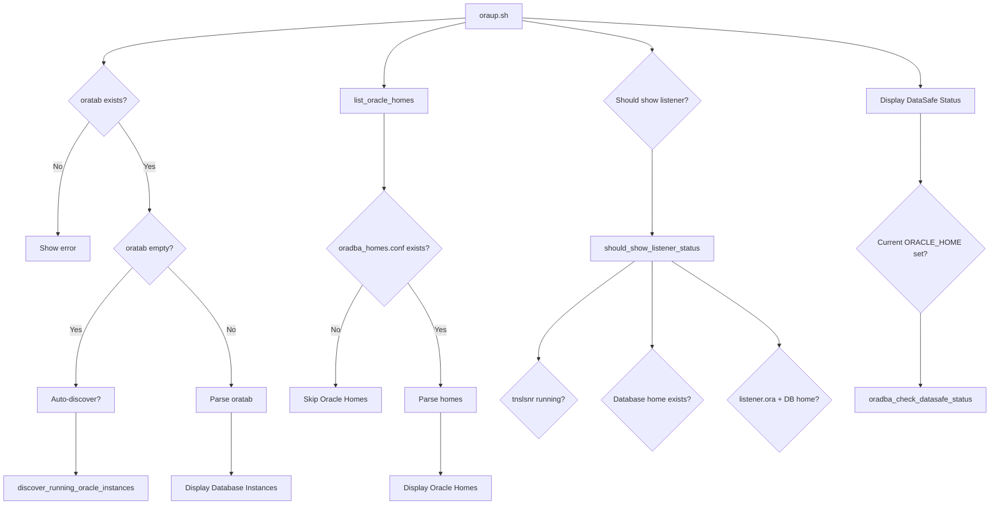

# OraDBA Architecture Review & Refactoring Plan

**Date:** January 16, 2026  
**Version:** Draft 1.0  
**Related Issues:** #83, #84, #85

## Executive Summary

Analysis of recent bugs (#83-#85) reveals fundamental architectural issues in
OraDBA's configuration and environment management. The current implementation
has overlapping responsibilities, unclear fallback logic, and inconsistent
product-specific handling (especially DataSafe). This document proposes a
comprehensive refactoring to create a robust, modular, and maintainable
configuration system.

---

## 1. Current Architecture Analysis

### 1.1 Configuration Files Overview

```
┌─────────────────────────────────────────────────────────────┐
│ Configuration Hierarchy (Current)                           │
├─────────────────────────────────────────────────────────────┤
│ 1. oradba_core.conf       ← Core system settings (read-only)│
│ 2. oradba_local.conf      ← Installation-specific           │
│ 3. oradba_standard.conf   ← Standard defaults               │
│ 4. oradba_customer.conf   ← User customizations             │
│ 5. sid.<SID>.conf         ← SID-specific overrides          │
├─────────────────────────────────────────────────────────────┤
│ Registry Files:                                             │
│ - /etc/oratab             ← Database SIDs (Oracle standard) │
│ - oradba_homes.conf       ← Oracle Homes registry           │
└─────────────────────────────────────────────────────────────┘
```

### 1.2 Current Data Flow



### 1.3 Critical Issues Identified

#### Issue 1: oraup.sh Hard Dependency on oratab (#85)

```bash
# Current code (lines 268-282):
if [[ ! -f "$ORATAB_FILE" ]]; then
    echo "  ⚠ No oratab file found"
    return 0  # Exits early - never checks oradba_homes.conf alone
fi
```

**Problem:** oraup.sh exits if oratab missing, even when oradba_homes.conf has entries.

**Impact:** Breaks environments with only clients, DataSafe, OUD (no databases).

#### Issue 2: Listener Status Logic Confusion (#84)

```bash
# Current code (lines 181-232):
should_show_listener_status() {
    # Condition 1: Check if any tnslsnr process is running
    if ps -ef | grep "tnslsnr" > /dev/null; then
        return 0  # Shows listener even if it's DataSafe tnslsnr
    fi
    # ... checks database homes ...
}
```

**Problem:** Generic `grep "tnslsnr"` matches DataSafe listeners, triggers database listener section.

**Impact:** Shows "Listener" section when only DataSafe connector running (misleading).

#### Issue 3: DataSafe Status Depends on Current Environment (#83)

```bash
# Current code (lines 600-624):
if command -v oradba_check_datasafe_status &>/dev/null; then
    ds_status=$(oradba_check_datasafe_status "$path" 2>/dev/null)
    # ...
fi

# oradba_env_status.sh (line 176):
oradba_check_datasafe_status() {
    local oracle_home="$1"
    local cmctl="${oracle_home}/oracle_cman_home/bin/cmctl"
    # Problem: Uses $ORACLE_HOME from current environment context
}
```

**Problem:** Status check may use wrong ORACLE_HOME if currently in different environment.

**Impact:** Incorrect status reporting when checking DataSafe from database environment.

#### Issue 4: Configuration Load Order Confusion

```bash
# oraenv.sh loads:
1. oradba_common.sh (provides load_config_file)
2. oradba_core.conf
3. oradba_local.conf
4. ... later loads standard/customer/SID configs ...

# oraup.sh loads:
1. oradba_common.sh (may or may not load configs)
2. oradba_env_status.sh
3. Uses get_oratab_path() but configs may not be loaded
```

**Problem:** Inconsistent config loading across scripts.

**Impact:** Different behavior depending on which script runs first.

### 1.4 Architectural Debt

| Component                  | Issue                                                | Impact                    |
|----------------------------|------------------------------------------------------|---------------------------|
| **oratab Priority**        | Hardcoded 5-level fallback in multiple places        | Maintenance nightmare     |
| **Product Type Detection** | Mixed filesystem + config detection                  | Unreliable results        |
| **DataSafe Handling**      | oracle_cman_home adjustment scattered across 6 files | High coupling             |
| **Status Checking**        | Mixes process detection with configuration           | Fragile logic             |
| **Registry Files**         | Two separate systems (oratab + oradba_homes.conf)    | No single source of truth |

---

## 2. Root Cause Analysis

### 2.1 Architectural Anti-Patterns

1. **Shotgun Surgery**: DataSafe oracle_cman_home logic duplicated in 6+ places
2. **Feature Envy**: Scripts directly accessing other script's configuration logic
3. **Primitive Obsession**: Passing strings instead of structured objects
4. **Hidden Dependencies**: Implicit assumptions about environment state

### 2.2 Design Smells

```bash
# Smell 1: God Function
show_oracle_status() {
    # 200+ lines doing:
    # - Configuration parsing
    # - Status checking
    # - Display formatting
    # - Auto-discovery
    # - Fallback logic
}

# Smell 2: Magic Strings
if [[ "$ptype" == "datasafe" ]]; then
    # Hardcoded product type checks everywhere

# Smell 3: Boolean Trap
should_show_listener_status() {
    # Returns 0/1 but logic is complex and undocumented
```

---

## 3. Proposed Architecture (v2.0)

### 3.1 Core Principles

1. **Unified Registry**: Single source of truth for all Oracle installations
2. **Product Abstraction**: Product-specific logic encapsulated in plugins
3. **Explicit Configuration**: No hidden state, clear load order
4. **Separation of Concerns**: Parse → Validate → Execute
5. **Fail-Safe Defaults**: Work without oratab or oradba_homes.conf

### 3.2 New Configuration Architecture

```text
┌──────────────────────────────────────────────────────────────┐
│ Registry System (Unified)                                    │
├──────────────────────────────────────────────────────────────┤
│                                                              │
│  ┌────────────────────┐  ┌────────────────────┐            │
│  │ Database Registry  │  │ Oracle Home        │            │
│  │ (oratab)           │  │ Registry           │            │
│  │                    │  │ (oradba_homes.conf)│            │
│  │ SID:HOME:FLAGS     │  │ NAME:PATH:TYPE:... │            │
│  └────────────────────┘  └────────────────────┘            │
│           │                       │                         │
│           └───────┬───────────────┘                         │
│                   ▼                                         │
│  ┌────────────────────────────────────────────┐            │
│  │ Unified Registry API                       │            │
│  │ - get_all_installations()                  │            │
│  │ - get_installation(name)                   │            │
│  │ - get_databases()                          │            │
│  │ - get_oracle_homes()                       │            │
│  │ - get_by_type(product_type)                │            │
│  └────────────────────────────────────────────┘            │
│                   │                                         │
│                   ▼                                         │
│  ┌────────────────────────────────────────────┐            │
│  │ Product Plugins                            │            │
│  │ - database_plugin.sh                       │            │
│  │ - datasafe_plugin.sh                       │            │
│  │ - oud_plugin.sh                            │            │
│  │ - client_plugin.sh                         │            │
│  └────────────────────────────────────────────┘            │
└──────────────────────────────────────────────────────────────┘
```

### 3.3 Product Plugin Architecture

Each product type has a plugin implementing standard interface:

```bash
# Template: product_plugin.sh
plugin_name="database"
plugin_version="1.0.0"

# Required functions:
plugin_detect_installation() { :; }      # Auto-detect installations
plugin_validate_home() { :; }            # Validate ORACLE_HOME
plugin_adjust_environment() { :; }       # Adjust env vars (e.g., oracle_cman_home)
plugin_check_status() { :; }             # Check if running
plugin_get_metadata() { :; }             # Get product info
plugin_should_show_listener() { :; }     # Product-specific listener logic
```

**Example:** DataSafe Plugin

```bash
# plugins/datasafe_plugin.sh
plugin_name="datasafe"

plugin_adjust_environment() {
    local oracle_home="$1"
    
    # DataSafe-specific: adjust to oracle_cman_home
    if [[ -d "${oracle_home}/oracle_cman_home" ]]; then
        echo "${oracle_home}/oracle_cman_home"
    else
        echo "${oracle_home}"
    fi
}

plugin_check_status() {
    local oracle_home="$1"
    local cman_home="${oracle_home}/oracle_cman_home"
    local cmctl="${cman_home}/bin/cmctl"
    
    [[ ! -x "$cmctl" ]] && echo "unavailable" && return 1
    
    # Direct status check (no current env dependency)
    ORACLE_HOME="$cman_home" "$cmctl" status 2>/dev/null | grep -q "READY" \
        && echo "running" || echo "stopped"
}

plugin_should_show_listener() {
    # DataSafe uses tnslsnr but it's NOT a database listener
    return 1  # Don't show in "Listener" section
}
```

### 3.4 Instance-to-Home Relationships

#### Design Decision: Instance Discovery vs. Metadata Registry

**Challenge:** Not all products have a 1:1 relationship between Oracle Home and instances:

- **RAC Database**: Multiple instances → One database home
- **WebLogic**: Multiple managed servers → One WebLogic home
- **OUD**: Multiple instances → One OUD home
- **Grid Infrastructure**: Multiple nodes → One Grid home

**BasEnv Approach:** Additional registry files with detailed metadata:

```text
sidtab:
- Maps SID to HOME with rich metadata (position, type, standby, cluster, instances)
- Example: FREE;/opt/oracle/product/26ai;10;I;N;N;

orahometab:
- Detailed home registry (position, product, version, aliases)
- Example: /opt/oracle/product/26ai;20;rdbms;AUTO;rdbms23;...
```

**OraDBA Design Choice: Plugin-Based Discovery**

We propose **NOT** adding separate `sidtab`/`orahometab` files initially. Instead:

```text
┌────────────────────────────────────────────────────────────┐
│ Registry System (Phase 1-2)                                │
├────────────────────────────────────────────────────────────┤
│                                                            │
│ Data Sources (unchanged):                                 │
│   • oratab           → SID:HOME:FLAGS                      │
│   • oradba_homes.conf → NAME:PATH:TYPE:ORDER...            │
│                                                            │
│ Registry API:                                              │
│   • Provides unified installation objects                 │
│   • No complex metadata (keep it simple)                  │
│                                                            │
│ Plugins (instance discovery):                             │
│   • database_plugin.sh → Discovers RAC instances          │
│   • weblogic_plugin.sh → Finds managed servers            │
│   • oud_plugin.sh → Lists OUD instances                   │
│   • grid_plugin.sh → Detects cluster nodes                │
│                                                            │
│ Benefits:                                                  │
│   ✅ Keep core registry clean and light                    │
│   ✅ Product-specific logic in plugins                     │
│   ✅ No new config files to maintain                       │
│   ✅ Dynamic discovery (no manual updates)                 │
│   ✅ Backward compatible with existing files               │
└────────────────────────────────────────────────────────────┘
```

**Plugin Interface for Instance Discovery:**

```bash
# Template: product_plugin.sh

# ------------------------------------------------------------------------------
# Function: plugin_discover_instances
# Purpose.: Discover all instances for this Oracle Home
# Args....: $1 - ORACLE_HOME path
# Returns.: 0 on success
# Output..: List of instances (one per line)
# ------------------------------------------------------------------------------
plugin_discover_instances() {
    local oracle_home="$1"
    
    # Product-specific discovery logic
    # Examples:
    # - Database: List all pmon processes, check ORACLE_HOME
    # - RAC: Query cluster registry (crsctl stat res ora.*.db)
    # - WebLogic: Parse domain configs
    # - OUD: Check running OUD instances
}

# Example: database_plugin.sh
plugin_discover_instances() {
    local oracle_home="$1"
    
    # Find all running database instances for this home
    ps -ef | grep "[p]mon_" | while read -r line; do
        local sid=$(echo "$line" | grep -oP 'pmon_\K\w+')
        local proc_home=$(get_oracle_home_from_process "$sid")
        
        if [[ "$proc_home" == "$oracle_home" ]]; then
            echo "$sid"
        fi
    done
    
    # For RAC, also check cluster registry
    if [[ -x "$oracle_home/bin/crsctl" ]]; then
        "$oracle_home/bin/crsctl" stat res -t | grep "ora\..*\.db" | \
            grep -oP 'ora\.\K[^.]+(?=\.db)'
    fi
}
```

**Why This Approach?**

1. **YAGNI Principle**: We don't need all BasEnv's metadata yet
2. **Dynamic Discovery**: Plugins can discover instances on-the-fly
3. **Keep Core Light**: Registry stays simple, plugins handle complexity
4. **Extensible**: Easy to add `sidtab`/`orahometab` later if needed
5. **No Duplication**: Avoid maintaining metadata in multiple places

**Future Consideration (Phase 3+):**

If richer metadata is needed, we can introduce:

```text
oradba_sidtab (optional):
- Position, type, standby, cluster configuration
- Only needed if discovery proves insufficient
- Plugins check sidtab first, fall back to discovery

oradba_hometab (optional):
- Detailed version, aliases, long names
- Only if version detection is unreliable
- Registry checks hometab first, falls back to detection
```

**Decision:**
- ✅ Phase 1-2: Plugin-based instance discovery
- ⏸️ Phase 3: Evaluate need for sidtab/hometab based on real usage
- 📝 Keep core libs clean and light as requested

### 3.6 Unified Registry API

```bash
# lib/oradba_registry.sh

# ------------------------------------------------------------------------------
# Function: oradba_registry_get_all
# Purpose.: Get all Oracle installations (databases + homes)
# Returns.: Array of installation objects
# ------------------------------------------------------------------------------
oradba_registry_get_all() {
    local -a installations=()
    
    # 1. Parse oratab (if exists)
    if [[ -f "$(get_oratab_path)" ]]; then
        while IFS=: read -r sid home flags; do
            [[ "$sid" =~ ^# ]] && continue
            installations+=("type=database,name=$sid,home=$home,flags=$flags")
        done < "$(get_oratab_path)"
    fi
    
    # 2. Parse oradba_homes.conf (if exists)
    if [[ -f "$(get_oracle_homes_path)" ]]; then
        while IFS=: read -r name path ptype order alias desc version; do
            [[ "$name" =~ ^# ]] && continue
            installations+=("type=$ptype,name=$name,home=$path,alias=$alias,order=$order,desc=$desc,version=$version")
        done < "$(get_oracle_homes_path)"
    fi
    
    # 3. Auto-discover (if enabled and no entries found)
    if [[ ${#installations[@]} -eq 0 ]] && [[ "${ORADBA_AUTO_DISCOVER:-true}" == "true" ]]; then
        mapfile -t discovered < <(oradba_registry_discover_all)
        installations+=("${discovered[@]}")
    fi
    
    printf '%s\n' "${installations[@]}"
}

# ------------------------------------------------------------------------------
# Function: oradba_registry_get_by_name
# Purpose.: Get installation by name (SID or home name)
# ------------------------------------------------------------------------------
oradba_registry_get_by_name() {
    local name="$1"
    oradba_registry_get_all | grep "name=$name"
}

# ------------------------------------------------------------------------------
# Function: oradba_registry_get_by_type
# Purpose.: Get all installations of specific product type
# ------------------------------------------------------------------------------
oradba_registry_get_by_type() {
    local ptype="$1"
    oradba_registry_get_all | grep "type=$ptype"
}
```

### 3.7 Refactored oraup.sh Architecture

```bash
# New oraup.sh structure:

main() {
    # 1. Initialize
    oradba_init_environment
    
    # 2. Get all installations (unified registry)
    local -a installations
    mapfile -t installations < <(oradba_registry_get_all)
    
    # 3. Group by product type
    local -a databases=()
    local -a oracle_homes=()
    
    for inst in "${installations[@]}"; do
        local type=$(echo "$inst" | grep -oP 'type=\K[^,]+')
        case "$type" in
            database) databases+=("$inst") ;;
            *) oracle_homes+=("$inst") ;;
        esac
    done
    
    # 4. Display sections (modular)
    display_oracle_homes "${oracle_homes[@]}"
    display_databases "${databases[@]}"
    display_listeners "${databases[@]}" "${oracle_homes[@]}"
    display_datasafe_connectors "${oracle_homes[@]}"
}

display_datasafe_connectors() {
    local -a homes=("$@")
    local -a datasafe_homes=()
    
    # Filter DataSafe homes
    for home in "${homes[@]}"; do
        [[ "$home" =~ type=datasafe ]] && datasafe_homes+=("$home")
    done
    
    [[ ${#datasafe_homes[@]} -eq 0 ]] && return 0
    
    echo "Data Safe Status"
    echo "-----------------------------------------------------------"
    
    for ds_home in "${datasafe_homes[@]}"; do
        local name=$(echo "$ds_home" | grep -oP 'name=\K[^,]+')
        local path=$(echo "$ds_home" | grep -oP 'home=\K[^,]+')
        
        # Load DataSafe plugin
        local plugin_status=$(plugin_check_status "$path")
        
        printf "%-17s : %-12s %-11s %s\n" \
            "Connector" "$name" "$plugin_status" "$path"
    done
}
```

---

## 4. Refactoring Plan

### Phase 1: Foundation (v1.2.3 - v1.3.0)

**Goal:** Establish unified registry without breaking existing functionality.

#### 1.1 Create Registry Abstraction (Week 1)

- [ ] Create `lib/oradba_registry.sh`
- [ ] Implement `oradba_registry_get_all()`
- [ ] Implement `oradba_registry_get_by_name()`
- [ ] Implement `oradba_registry_get_by_type()`
- [ ] Add unit tests for registry functions

#### 1.2 Create Plugin System (Week 1-2)

- [ ] Create `lib/plugins/plugin_interface.sh` (template)
- [ ] Implement `plugins/database_plugin.sh`
- [ ] Implement `plugins/datasafe_plugin.sh`
- [ ] Implement `plugins/client_plugin.sh`
- [ ] Implement `plugins/oud_plugin.sh`
- [ ] Add plugin discovery and loading

#### 1.3 Fix Critical Bugs (Week 2)

- [ ] **Fix #85**: Make oraup.sh work without oratab
  - Modify `show_oracle_status()` to use unified registry
  - Remove hard dependency on `ORATAB_FILE`
  - Fall back to `oradba_homes.conf` gracefully

- [ ] **Fix #84**: Listener status logic
  - Add `plugin_should_show_listener()` to product plugins
  - Update `should_show_listener_status()` to use plugins
  - Exclude DataSafe tnslsnr from database listener section

- [ ] **Fix #83**: DataSafe status independence
  - Move `oradba_check_datasafe_status()` to DataSafe plugin
  - Pass explicit ORACLE_HOME to plugin functions
  - Remove dependency on current environment

### Phase 2: Consolidation (v1.3.1 - v1.4.0)

**Goal:** Refactor existing code to use new architecture.

#### 2.1 Refactor oraup.sh (Week 3)

- [ ] Split `show_oracle_status()` into modular display functions
- [ ] Use registry API instead of direct file parsing
- [ ] Delegate product-specific logic to plugins
- [ ] Add proper error handling and fallbacks

#### 2.2 Refactor oraenv.sh (Week 3-4)

- [ ] Update environment switching to use registry API
- [ ] Remove hardcoded oracle_cman_home logic (use plugin)
- [ ] Improve configuration load order clarity

#### 2.3 Consolidate DataSafe Handling (Week 4)

- [ ] Identify all locations with oracle_cman_home logic
  - `oradba_common.sh` (line 1647)
  - `oraenv.sh` (line 473)
  - `oradba_env_builder.sh` (lines 149, 249, 359)
  - `oradba_env_parser.sh` (line 342)
  - `oradba_env_status.sh` (line 176)
  - `oradba_env.sh` (validate command)
- [ ] Replace all with `plugin_adjust_environment()` calls
- [ ] Remove duplicated logic

### Phase 3: Enhancement (v1.5.0 - v2.0.0)

**Goal:** Add advanced features and improve user experience.

#### 3.1 Configuration Management (Week 5-6)

- [ ] Create `lib/oradba_config_loader.sh`
- [ ] Implement explicit config load order:

  ```bash
  1. oradba_core.conf (always)
  2. oradba_local.conf (installation)
  3. oradba_standard.conf (defaults)
  4. oradba_customer.conf (site customizations)
  5. sid.<SID>.conf (instance-specific)
  ```

- [ ] Add config validation and error reporting
- [ ] Document configuration precedence

#### 3.2 Instance Registry (Optional)

- [ ] Consider `oradba_instances.conf` for SID metadata:

  ```ini
  # SID:HOME:TYPE:ROLE:DESCRIPTION
  FREE:/u01/app/oracle/product/23ai:database:PRIMARY:Development DB
  PROD:/u01/app/oracle/product/19c:database:PRIMARY:Production
  ```

- [ ] Evaluate benefits vs oratab compatibility

#### 3.3 Auto-Discovery Enhancement (Week 7)

- [ ] Improve `discover_running_oracle_instances()`
- [ ] Add process-based detection for all product types
- [ ] Implement filesystem scanning as fallback
- [ ] Add discovery result caching

---

## 5. Implementation Guidelines

### 5.1 Coding Standards

```bash
# Plugin naming convention
plugins/<product>_plugin.sh

# Function naming
plugin_<action>()           # Plugin interface functions
oradba_registry_<action>()  # Registry API functions
oradba_config_<action>()    # Config management functions

# Error handling
set -euo pipefail           # All scripts
|| return 1                 # All functions

# Logging
oradba_log DEBUG "message"  # Use unified logging
oradba_log INFO "message"
oradba_log WARN "message"
oradba_log ERROR "message"
```

### 5.2 Testing Requirements

Each phase requires:

1. **Unit tests** (BATS) for new functions
2. **Integration tests** (Docker) for real environments
3. **Backward compatibility tests** (existing functionality)
4. **Manual testing** against bugs #83-#85

### 5.3 Documentation Updates

- [ ] Update architecture.md with new design
- [ ] Create plugin development guide
- [ ] Update configuration guide
- [ ] Add migration guide for v1.x → v2.0

### 5.4 Backward Compatibility

**Requirements:**

- All existing scripts must continue to work
- Configuration files remain compatible
- Deprecate old functions gradually (3 release cycle)
- Provide migration helpers

**Deprecation Strategy:**

```bash
# Old function
list_oracle_homes() {
    oradba_log WARN "list_oracle_homes() is deprecated, use oradba_registry_get_by_type('database')"
    oradba_registry_get_by_type "database"
}
```

---

## 6. Risk Assessment

| Risk                            | Likelihood | Impact | Mitigation                           |
|---------------------------------|------------|--------|--------------------------------------|
| Breaking existing installations | Medium     | High   | Phased rollout, extensive testing    |
| Performance regression          | Low        | Medium | Benchmark critical paths             |
| Plugin complexity               | Medium     | Medium | Simple template, clear documentation |
| Scope creep                     | High       | Medium | Strict phase boundaries, MVP focus   |
| User confusion                  | Low        | High   | Clear migration guide, release notes |

---

## 7. Success Criteria

### 7.1 Functional Requirements

- [ ] oraup.sh works without oratab file
- [ ] Listener status only shows DB listeners (not DataSafe)
- [ ] DataSafe status independent of current environment
- [ ] All product types supported equally
- [ ] Clear configuration precedence
- [ ] Auto-discovery works reliably

### 7.2 Quality Requirements

- [ ] 90%+ test coverage for new code
- [ ] No shellcheck warnings
- [ ] All critical bugs (#83-#85) resolved
- [ ] Performance: < 1s for oraup.sh execution
- [ ] Documentation complete and accurate

### 7.3 User Experience

- [ ] Works "out of the box" for all scenarios
- [ ] Clear error messages with actionable guidance
- [ ] Predictable behavior across all scripts
- [ ] Easy to extend with custom product types

---

## 8. Timeline

| Phase     | Duration | Target Release | Deliverables                   |
|-----------|----------|----------------|--------------------------------|
| Phase 1.1 | 1 week   | v1.2.3         | Registry API, Plugin system    |
| Phase 1.2 | 1 week   | v1.2.4         | Bug fixes #83-#85              |
| Phase 2.1 | 2 weeks  | v1.3.0         | Refactored oraup.sh, oraenv.sh |
| Phase 2.2 | 1 week   | v1.3.1         | Consolidated DataSafe handling |
| Phase 3.1 | 2 weeks  | v1.4.0         | Config management, discovery   |
| Phase 3.2 | 2 weeks  | v2.0.0         | Final polish, documentation    |

**Total:** ~9 weeks (2.5 months)

---

## 9. Next Steps

### Immediate Actions (Next 2 Days)

1. Review this plan with stakeholders
2. Create GitHub issues for each Phase 1 task
3. Set up feature branch `feature/unified-registry`
4. Begin implementing registry API (Phase 1.1)

### Short Term (This Week)

1. Implement basic registry API
2. Create DataSafe plugin proof-of-concept
3. Fix bug #85 (oraup.sh without oratab)

### Medium Term (This Month)

1. Complete Phase 1 (Foundation)
2. Fix all critical bugs (#83-#85)
3. Release v1.2.3 and v1.2.4 with bug fixes

---

## 10. Questions for Discussion

1. **Registry Format**: Should we introduce a new unified registry file, or keep oratab + oradba_homes.conf separate?
   - **Decision**: Keep separate for backward compatibility. Registry API abstracts both.

2. **Instance-to-Home Relationships**: Do we need BasEnv-style `sidtab`/`orahometab` for complex relationships (RAC, WebLogic, OUD)?
   - **Decision**: Use plugin-based instance discovery (Phase 1-2). Evaluate need for additional registry files in Phase 3+ based on real usage.
   - **Rationale**: Keep core libs clean and light. Plugins handle product-specific complexity. Dynamic discovery avoids manual maintenance.

3. **Plugin Distribution**: Should plugins be:
   - Part of core OraDBA? ✅ **Yes for core products** (database, client, datasafe, oud, weblogic, grid)
   - External/downloadable? ✅ **Yes for custom products**
   - Both (core plugins + extensible)? ✅ **This approach**

4. **Breaking Changes**: Are we willing to introduce breaking changes in v2.0, or must we maintain 100% backward compatibility?

5. **Configuration Consolidation**: Should we merge oradba_standard.conf into oradba_core.conf?

6. **Auto-Discovery**: How aggressive should auto-discovery be? Should it scan filesystems or only check running processes?

---

## Appendix A: Current File Locations

### Files with DataSafe oracle_cman_home Logic

```text
src/lib/oradba_common.sh:1647           (get_oracle_home_for_sid)
src/bin/oraenv.sh:473                   (main environment setup)
src/lib/oradba_env_builder.sh:149       (build_path)
src/lib/oradba_env_builder.sh:249       (build_ld_library_path)
src/lib/oradba_env_builder.sh:359       (build_oracle_environment)
src/lib/oradba_env_parser.sh:342        (detect_product_type)
src/lib/oradba_env_status.sh:176        (oradba_check_datasafe_status)
src/bin/oradba_env.sh:292               (cmd_validate)
```

### Files with oratab Access

```text
src/bin/oraup.sh:34                     (get_oratab_path)
src/bin/oraenv.sh:54                    (get_oratab_path)
src/lib/oradba_common.sh:426            (get_oratab_path)
src/lib/oradba_common.sh:487            (is_dummy_sid)
src/lib/oradba_common.sh:635            (various functions)
```

### Files with oradba_homes.conf Access

```text
src/lib/oradba_common.sh:1289           (list_oracle_homes)
src/lib/oradba_common.sh:1335           (get_oracle_home_path)
src/lib/oradba_common.sh:1352           (get_oracle_home_alias)
src/lib/oradba_common.sh:1369           (get_oracle_home_type)
src/bin/oraup.sh:206                    (show_oracle_status)
src/bin/oraenv.sh:250                   (prompt_sid)
```

---

## Appendix B: Plugin Interface Specification

```bash
# Plugin Interface v1.0

# Required metadata
plugin_name=""              # Product type identifier (database, datasafe, etc.)
plugin_version=""           # Plugin version (semantic)
plugin_description=""       # Human-readable description

# Required functions
plugin_detect_installation() {
    # Auto-detect installations of this product type
    # Returns: Array of installation paths
    :
}

plugin_validate_home() {
    # Validate that ORACLE_HOME is valid for this product
    # Args: $1 - ORACLE_HOME path
    # Returns: 0 if valid, 1 if invalid
    :
}

plugin_adjust_environment() {
    # Adjust ORACLE_HOME for product-specific requirements
    # Args: $1 - ORACLE_HOME path
    # Returns: Adjusted ORACLE_HOME path
    # Example: DataSafe appends /oracle_cman_home
    :
}

plugin_check_status() {
    # Check if product instance is running
    # Args: $1 - Installation path
    # Returns: Status string (running|stopped|unavailable)
    :
}

plugin_get_metadata() {
    # Get product metadata (version, installed features, etc.)
    # Args: $1 - Installation path
    # Returns: Key=value pairs (one per line)
    :
}

plugin_should_show_listener() {
    # Determine if this product's tnslsnr should appear in listener section
    # Args: $1 - Installation path
    # Returns: 0 if should show, 1 if should not
    :
}

plugin_discover_instances() {
    # Discover all instances for this Oracle Home
    # Handles 1:many relationships (RAC, WebLogic, OUD)
    # Args: $1 - ORACLE_HOME path
    # Returns: List of instances (one per line)
    # Format: instance_name|status|additional_metadata
    # Example: PROD1|running|node1
    :
}

# Optional functions
plugin_get_display_name() {
    # Custom display name for instances
    # Args: $1 - Installation name
    # Returns: Display name
    :
}

plugin_supports_aliases() {
    # Whether this product supports SID-like aliases
    # Returns: 0 if supports, 1 if not
    :
}
```

---

**Document Status:** Draft for Review  
**Next Review:** After stakeholder feedback  
**Contact:** Stefan Oehrli (oes) <stefan.oehrli@oradba.ch>
