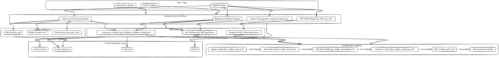
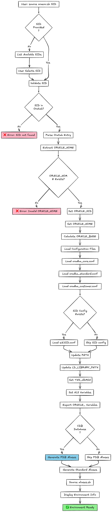
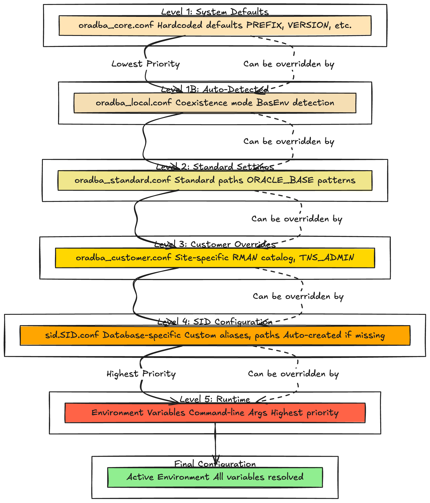
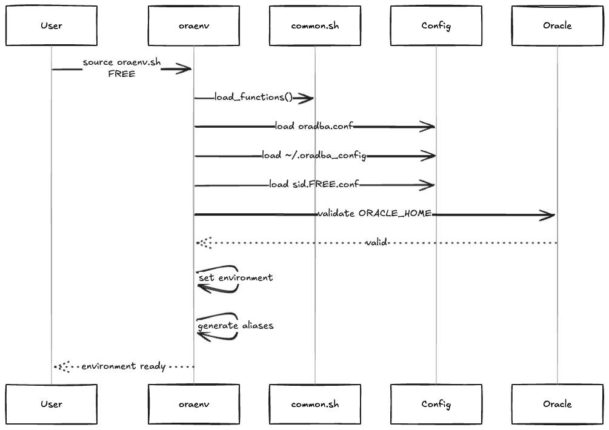

<!-- markdownlint-disable MD013 -->
# oradba Architecture

## Overview

oradba is a professional Oracle Database administration toolset built on a modular, library-based architecture. The Phase 1-4 implementation (v0.19.0-v0.22.0) introduced a sophisticated configuration system with parsing, validation, and management capabilities.

## System Architecture



The OraDBA system consists of multiple layers working together:

- **Entry Points**: oraenv.sh wrapper, oradba_env.sh builder, oradba_homes.sh manager
- **Environment Management Libraries**: Parser, Builder, Validator, Config Manager, Status Display, Change Tracker
- **Core Libraries**: common.sh (logging/utilities), db_functions.sh, aliases.sh
- **Configuration System**: 6-level hierarchical configuration (core → standard → local → customer → SID → runtime)
- **Oracle Integration**: oratab, oradba_homes.conf, Oracle instances, listeners, PDBs

## Core Components

### 1. Environment Management

#### oraenv.sh Wrapper

**Purpose**: Lightweight wrapper that calls oradba_env.sh for environment setup.

**Key Features**:

- Argument parsing and validation
- Calls oradba_env.sh with SID or Oracle Home name
- Minimal logic - delegates to main builder
- Maintains compatibility with existing workflows

#### oradba_env.sh - Main Environment Builder

**Purpose**: Build complete Oracle environment using Environment Management libraries.

**Key Features**:

- Load and coordinate Environment Management libraries
- Parse hierarchical configuration files
- Build Oracle environment (PATH, LD_LIBRARY_PATH, etc.)
- Validate Oracle installations
- Generate aliases with coexistence mode support
- Display environment status

**Flow**:



The execution flow shows:

1. Wrapper receives SID/Home name
2. Load Environment Management libraries
3. Parser merges 6 configuration levels
4. Builder constructs environment variables
5. Validator checks Oracle installation
6. Status display shows summary

### 2. Environment Management Library System


#### Phase 1: Configuration Parser (oradba_env_parser.sh)

**Purpose**: Parse and merge hierarchical configuration files.

**Key Functions**:

- `parse_config_file` - Parse individual config file
- `merge_configs` - Merge multiple configurations
- `resolve_variables` - Resolve variable references

**Configuration Hierarchy**:

1. oradba_core.conf (core system settings)
2. oradba_standard.conf (standard Oracle paths)
3. oradba_local.conf (auto-detected local settings)
4. oradba_customer.conf (site-specific customizations)
5. sid.SID.conf or sid._DEFAULT_.conf (database-specific)
6. Environment variables (highest priority)

#### Phase 2: Environment Builder (oradba_env_builder.sh)

**Purpose**: Build Oracle environment from parsed configuration.

**Key Functions**:

- `build_oracle_env` - Construct complete environment
- `derive_oracle_base` - Auto-derive ORACLE_BASE from ORACLE_HOME
- `construct_path` - Build PATH with Oracle binaries
- `set_tns_admin` - Configure TNS_ADMIN

#### Phase 3: Validation & Management

**oradba_env_validator.sh**:

- `validate_oracle_home` - Check ORACLE_HOME exists and is valid
- `detect_product_type` - Identify database, client, OUD, WebLogic, etc.
- `detect_version` - Determine Oracle version

**oradba_env_config.sh**:

- `get_config_value` - Retrieve configuration setting
- `set_config_value` - Update configuration

**oradba_env_status.sh**:

- `show_environment` - Display current environment
- `show_config_sources` - Show which configs were loaded
- `oradba_check_db_status` - Check database status (OPEN/MOUNTED/etc.)
- `oradba_check_listener_status` - Check listener status

**oradba_env_changes.sh**:

- `oradba_check_config_changes` - Detect configuration changes
- `oradba_auto_reload_on_change` - Auto-reload on changes

### 3. Oracle Homes Management (oradba_homes.sh)

**Purpose**: Manage multiple Oracle installations through oradba_homes.conf.

**Key Features**:

- Register Oracle Homes with metadata (name, path, type, version, alias)
- List and query registered homes  
- Export/import configuration for backup and migration
- Support for different product types (database, client, OUD, WebLogic, OMS, etc.)

**Configuration File** (`oradba_homes.conf`):

```text
# NAME:PATH:TYPE:ORDER:ALIAS_NAME:DESCRIPTION:VERSION
DBHOMEFREE:/u01/app/oracle/product/23/dbhomeFree:database:1:rdbms23:Oracle 23ai Free:2326
DBHOME19:/u01/app/oracle/product/19/dbhome_1:database:2:rdbms19:Oracle 19c:1920
```

### 4. Common Libraries

**common.sh** - Core utilities (1800+ lines, 130+ functions):

- **Logging**: `oradba_log()` with levels (DEBUG, INFO, WARN, ERROR)
- **Validation**: `verify_oracle_env()`, `command_exists()`
- **Oracle Utilities**: `parse_oratab()`, `detect_oracle_version()`, `derive_oracle_base()`
- **Configuration**: `get_oratab_path()`, `get_oracle_homes_path()`
- **Display**: `show_config()`, `show_sqlpath()`, `show_path()`

**db_functions.sh** - Database operations:

- Database start/stop/status
- Listener management
- Session management
- Query execution helpers

**aliases.sh** - Safe alias generation:

- `safe_alias()` - Respects coexistence mode
- Standard aliases (sq, rmanc, cdh, taa, via, etc.)
- PDB-specific aliases for multitenant databases
- Coexistence with TVD BasEnv

### 5. Configuration System

**Hierarchy**:



Configuration flows through six levels, processed by Environment Management libraries:

1. **Core** (`oradba_core.conf`) - System defaults, installation paths
2. **Standard** (`oradba_standard.conf`) - Standard Oracle paths and settings
3. **Local** (`oradba_local.conf`) - Auto-detected local settings, coexistence mode
4. **Customer** (`oradba_customer.conf`) - Site-specific customizations
5. **SID** (`sid.SID.conf` or `sid._DEFAULT_.conf`) - Database-specific settings
6. **Runtime** - Environment variables and command-line arguments (highest priority)

**Processing Flow**:

1. Parser (oradba_env_parser.sh) reads and merges all 6 levels
2. Builder (oradba_env_builder.sh) constructs environment from merged config
3. Validator (oradba_env_validator.sh) verifies Oracle installation

### 6. Installation System

**Build Process**:


The installation system creates a self-contained, self-extracting installer with embedded source files.

## Directory Structure

```text
oradba/
├── src/                    # Distribution files
│   ├── bin/               # Executable scripts
│   ├── lib/               # Libraries
│   ├── etc/               # Configuration
│   ├── sql/               # SQL scripts
│   ├── rcv/               # RMAN scripts
│   ├── templates/         # Templates
│   └── doc/               # User documentation
├── scripts/               # Build and utility scripts
├── tests/                 # Test suite
├── doc/                   # Developer documentation
└── .github/               # CI/CD workflows
```

## Data Flow

### Environment Setup Sequence



The environment setup follows a structured, library-based sequence:

1. **Wrapper** (oraenv.sh) receives SID or Oracle Home name
2. **Main Builder** (oradba_env.sh) coordinates the process
3. **Parser** (oradba_env_parser.sh) loads and merges 6 configuration levels
4. **Builder** (oradba_env_builder.sh) queries oratab or oradba_homes.conf, derives paths, constructs environment
5. **Validator** (oradba_env_validator.sh) checks ORACLE_HOME, detects type/version
6. **Status** (oradba_env_status.sh) displays environment summary
7. **Aliases** (aliases.sh) generates database and PDB shortcuts

### Configuration Processing Pipeline

```text
Config Files → Parser → Merged Config → Builder → Environment Variables → Validator → Active Environment
```

The parser reads from multiple sources (6 config files), resolves variable references, and produces a single merged configuration. The builder uses this to construct the Oracle environment, which the validator then verifies.

## Design Principles

1. **Library-Based Architecture**: Environment Management libraries provide modular, testable components
2. **Separation of Concerns**: Parser, Builder, Validator have distinct responsibilities
3. **Hierarchical Configuration**: 6-level override system provides flexibility without complexity
4. **Auto-Detection**: Intelligently derives ORACLE_BASE, product type, version
5. **Validation First**: Extensive checking before environment activation
6. **Coexistence**: Safe operation alongside TVD BasEnv via safe_alias()
7. **Comprehensive Testing**: 892 BATS tests ensure reliability
8. **Professional Logging**: Structured logging with oradba_log() throughout

## Key Features

- **Oracle Homes Management**: Track multiple Oracle installations with metadata
- **Export/Import**: Backup and migrate Oracle Homes configuration  
- **Status Checking**: Query database, listener, ASM, OUD, WebLogic status
- **Change Detection**: Auto-reload on configuration file changes
- **PDB Support**: Auto-generate aliases for multitenant databases
- **Smart Test Selection**: Fast CI with 60-second test runs
- **Self-Extracting Installer**: Single-file distribution with embedded payload

## References

- [development.md](development.md) - Development guide
- [README.md](README.md) - Developer documentation index
- [../README.md](../README.md) - Main project documentation
- [Environment Management Design](oradba-env-design.md) - Detailed Environment Management library architecture
