<!-- markdownlint-disable MD013 -->
# oradba Architecture

## Overview

oradba is a professional Oracle Database administration toolset built on a modular, library-based architecture. The current architecture (v0.19.0+) features:

- **Registry API** (v0.19.0+): Unified interface for Oracle installation metadata (oratab + oradba_homes.conf)
- **Plugin System** (v0.20.0): Product-specific plugins with 13-function universal core interface for 9 Oracle product types
- **Environment Management Libraries** (v0.19.0+): Modular libraries for parsing, building, and validating Oracle environments
- **Oracle Homes Management**: Central registry (oradba_homes.conf) with comprehensive metadata
- **Hierarchical Configuration**: 6-level configuration system with override capabilities

## System Architecture

The OraDBA system consists of multiple layers working together:


- **Entry Points**: oraenv.sh wrapper, oradba_env.sh builder, oradba_homes.sh manager
- **Registry API** (v1.2.2+): Unified access to oratab and oradba_homes.conf with consistent interface
- **Plugin System** (v1.2.2+): Product-specific plugins for database, datasafe, client, iclient, oud
- **Environment Management Libraries**: Parser, Builder, Validator, Config Manager, Status Display, Change Tracker
- **Core Libraries**: oradba_common.sh (logging/utilities), oradba_db_functions.sh, oradba_aliases.sh
- **Configuration System**: 6-level hierarchical configuration (core → standard → local → customer → SID → runtime)
- **Oracle Integration**: oratab, oradba_homes.conf, Oracle instances, listeners, PDBs

### Interactive Architecture Diagrams

For detailed visual documentation of workflows and component interactions, see the **[Architecture Diagrams Index](images/README.md)**:

- **[Configuration System](images/config-workflow-highlevel.md)** - 5-layer hierarchy and loading flow
- **[oraenv Workflow](images/oraenv-workflow-highlevel.md)** - Environment setup (interactive/non-interactive)
- **[oraup Workflow](images/oraup-workflow-highlevel.md)** - Status display with Registry API integration
- **[Plugin System](images/plugin-system.md)** - 11-function interface and lifecycle

These Mermaid diagrams are interactive and render automatically in VS Code, GitHub, and modern documentation sites.

## Core Components

### Registry API and Plugin System (v0.19.0+)

#### Registry API (oradba_registry.sh)

**Purpose**: Unified interface for accessing Oracle installation metadata from both oratab and oradba_homes.conf.

**Key Features**:

- Single API for all Oracle installations regardless of source
- Consistent colon-delimited format: `type:name:home:version:flags:order:alias:desc`
- Efficient querying by name, type, or all entries
- Product type detection with plugin integration
- Automatic synchronization with oratab
- Supports 6 product types (database, datasafe, client, iclient, oud, java)

**Core Functions**:

```bash
# Get all Oracle installations (databases + other products)
oradba_registry_get_all

# Get specific installation by name (SID or Home name)
oradba_registry_get_by_name "ORCLCDB"

# Get all installations of a specific type
oradba_registry_get_by_type "database"

# Get only database entries (from oratab)
oradba_registry_get_databases

# Extract specific field from entry
oradba_registry_get_field "ORCLCDB" "home"

# Synchronize database entries from oratab
oradba_registry_sync_oratab
```

**Output Format**:

```text
database:ORCLCDB:/u01/app/oracle/product/23/dbhomeFree:23.6.0:N:1::Oracle 23ai Database
client:client19:/u01/app/oracle/product/19/client:19.0.0::2:client19:Oracle 19c Client
datasafe:dsconn1:/u01/app/oracle/dsconn1:N/A::3::Data Safe Connector
java:jdk17:/opt/oracle/product/jdk-17.0.17:17.0.0::4::Oracle Java 17
```

**Benefits**:

- Eliminates duplicate parsing logic across multiple files
- Single source of truth for Oracle installation data
- Easy to query and filter installations
- Consistent format regardless of source (oratab vs oradba_homes.conf)
- Auto-synchronization ensures databases from oratab are always available

#### Plugin System

**Purpose**: Product-specific behavior encapsulation with consistent interface.

**Supported Products** (9 plugins):

1. **database_plugin.sh** - Oracle Database (RDBMS)
2. **datasafe_plugin.sh** - Data Safe On-Premises Connectors
3. **client_plugin.sh** - Oracle Full Client
4. **iclient_plugin.sh** - Oracle Instant Client
5. **oud_plugin.sh** - Oracle Unified Directory
6. **java_plugin.sh** - Oracle Java/JDK
7. **weblogic_plugin.sh** - WebLogic Server (stub)
8. **oms_plugin.sh** - Enterprise Manager OMS (stub)
9. **emagent_plugin.sh** - Enterprise Manager Agent (stub)

**Plugin Interface** (13 universal core functions):

```bash
# 1. Auto-detect installations of this product type
plugin_detect_installation()

# 2. Validate that a path is a valid installation
plugin_validate_home "$oracle_home"

# 3. Adjust ORACLE_HOME if needed (e.g., DataSafe oracle_cman_home)
plugin_adjust_environment "$oracle_home"

# 4. Resolve ORACLE_BASE_HOME vs ORACLE_HOME
plugin_build_base_path "$oracle_home"

# 5. Build environment variables for product/instance
plugin_build_env "$oracle_home" "$instance_name"

# 6. Check if instance/service is running
plugin_check_status "$oracle_home" "$instance_name"

# 7. Get product metadata (version, edition, etc.)
plugin_get_metadata "$oracle_home"

# 8. Discover instances for this Oracle Home
plugin_discover_instances "$oracle_home"

# 9. Enumerate instances/domains (multi-instance products)
plugin_get_instance_list "$oracle_home"

# 10. Does this product support SID aliases?
plugin_supports_aliases  # Returns 0 (yes) or 1 (no)

# 11. Build PATH components for this product
plugin_build_bin_path "$oracle_home"

# 12. Build LD_LIBRARY_PATH components for this product
plugin_build_lib_path "$oracle_home"

# 13. Get configuration section name for this product
plugin_get_config_section
```

**Category-Specific Functions** (mandatory when applicable):

```bash
# Should this product show listener status?
plugin_should_show_listener  # Returns 0 (yes) or 1 (no)

# Check listener status per Oracle Home
plugin_check_listener_status "$oracle_home"
```

> **📖 Full Specification**: See [Plugin Standards](plugin-standards.md) and [Plugin Development Guide](plugin-development.md)

**Plugin Architecture Benefits**:

- **Encapsulation**: Product-specific logic in dedicated plugins
- **Consistency**: All plugins implement same 13-function interface (+ category-specific)
- **Extensibility**: Easy to add new product types (e.g., Java plugin in v0.19.0)
- **Testability**: Each plugin independently tested (108+ plugin tests total)
- **Maintainability**: Changes to one product don't affect others

**Example - DataSafe Plugin**:

The DataSafe plugin handles oracle_cman_home subdirectory logic:

```bash
# Adjusts ORACLE_HOME from base path to oracle_cman_home
plugin_adjust_environment() {
    local base_path="$1"
    if [[ -d "${base_path}/oracle_cman_home" ]]; then
        echo "${base_path}/oracle_cman_home"
    else
        echo "${base_path}"
    fi
}

# Uses explicit environment for cmctl
plugin_check_status() {
    local cman_home=$(plugin_adjust_environment "$1")
    ORACLE_HOME="${cman_home}" \
    LD_LIBRARY_PATH="${cman_home}/lib:${LD_LIBRARY_PATH:-}" \
    "${cman_home}/bin/cmctl" status 2>/dev/null
}
```

**Example - Java Plugin** (v0.19.0+):

The Java plugin supports Oracle Java/JDK installations:

```bash
# Detect Java installations under $ORACLE_BASE/product
plugin_detect_installation() {
    local base="${ORACLE_BASE:-/opt/oracle}"
    find "${base}/product" -maxdepth 1 -type d \
        \( -name "java*" -o -name "jdk*" \) 2>/dev/null
}

# Validate Java home has bin/java executable
plugin_validate_home() {
    local oracle_home="$1"
    [[ -x "${oracle_home}/bin/java" ]]
}

# Get Java version with normalization (1.8.0_291 → 8.0.291)
plugin_get_version() {
    local oracle_home="$1"
    "${oracle_home}/bin/java" -version 2>&1 | \
        awk '/version/ {gsub(/"/, ""); print $3}' | \
        sed 's/^1\.8\./8./'
}
```

**Integration Points**:

- Registry API uses plugins for product type detection via `detect_product_type()`
- oraenv.sh uses registry API + plugins for unified installation lookup
- Environment builder uses plugins for product-specific adjustments (PATH, LD_LIBRARY_PATH)
- Status checker uses plugins for service status verification
- oradba_homes.sh uses plugins for validation when adding Oracle Homes

### Environment Management

#### oraenv.sh Wrapper

**Purpose**: Lightweight wrapper that calls oradba_env.sh for environment setup.

**Key Features**:

- Argument parsing and validation
- Calls oradba_env.sh with SID or Oracle Home name
- Minimal logic - delegates to main builder
- Maintains compatibility with existing workflows

#### oradba_env.sh - Main Environment Builder

**Purpose**: Build complete Oracle environment using Environment Management libraries.

**Key Features**:

- Load and coordinate Environment Management libraries
- Parse hierarchical configuration files
- Build Oracle environment (PATH, LD_LIBRARY_PATH, etc.)
- Validate Oracle installations
- Generate aliases with coexistence mode support
- Display environment status

**Flow**:

The execution flow shows:

```mermaid
flowchart TD
    A[User: source oraenv.sh SID] --> B[oraenv.sh Wrapper]
    
    B --> C{SID/Name<br/>Provided?}
    
    C -->|No| D[List Available<br/>SIDs/Homes]
    D --> E[User Selects]
    E --> F[Call oradba_env.sh]
    
    C -->|Yes| F
    
    F --> G[oradba_env.sh<br/>Main Builder]
    
    G --> H[Load Environment<br/>Management Libraries]
    
    H --> I[Parser: Load Configs]
    I --> J[Merge 6 Levels:<br/>1. core 2. standard<br/>3. local 4. customer<br/>5. SID 6. runtime]
    
    J --> K[Builder: Query Registry]
    
    K --> L{SID or<br/>Home Name?}
    
    L -->|SID| M[Query oratab]
    L -->|Home Name| N[Query oradba_homes.conf]
    
    M --> O[Get ORACLE_HOME]
    N --> O
    
    O --> P{Valid<br/>ORACLE_HOME?}
    
    P -->|No| Q[❌ Error:<br/>Invalid Home]
    
    P -->|Yes| R[Set Base Environment<br/>ORACLE_SID, ORACLE_HOME<br/>Auto-derive ORACLE_BASE]
    
    R --> S[Validator: Check Installation]
    
    S --> T[Plugin System:<br/>Detect Type & Version<br/>Validate Home]
    
    T --> U{Validation<br/>Pass?}
    
    U -->|No| V[❌ Error:<br/>Validation Failed]
    
    U -->|Yes| W[Builder: Construct Environment<br/>PATH, LD_LIBRARY_PATH<br/>TNS_ADMIN, SQLPATH]
    
    W --> X[Alias Generator:<br/>Generate Shortcuts]
    
    X --> Y{CDB<br/>Database?}
    
    Y -->|Yes| Z[Detect & Create<br/>PDB Aliases]
    Y -->|No| AA[Skip PDB Aliases]
    
    Z --> AB[Generate Aliases]
    AA --> AB
    
    AB --> AC[Status Display:<br/>Show Environment Summary]
    
    AC --> AD[✅ Environment Ready]
    
    style AD fill:#90EE90
    style Q fill:#FFB6C6
    style V fill:#FFB6C6
    style I fill:#87CEEB
    style K fill:#FFD700
    style S fill:#DDA0DD
    style T fill:#FFD700
```



1. Wrapper receives SID/Home name
2. Load Environment Management libraries
3. Parser merges 6 configuration levels
4. Builder constructs environment variables
5. Validator checks Oracle installation
6. Status display shows summary

### Environment Management Library System


#### Phase 1: Configuration Parser (oradba_env_parser.sh)

**Purpose**: Parse and merge hierarchical configuration files.

**Key Functions**:

- `parse_config_file` - Parse individual config file
- `merge_configs` - Merge multiple configurations
- `resolve_variables` - Resolve variable references

**Configuration Hierarchy**:

1. oradba_core.conf (core system settings)
2. oradba_standard.conf (standard Oracle paths)
3. oradba_local.conf (auto-detected local settings)
4. oradba_customer.conf (site-specific customizations)
5. sid.SID.conf or sid._DEFAULT_.conf (database-specific)
6. Environment variables (highest priority)

#### Phase 2: Environment Builder (oradba_env_builder.sh)

**Purpose**: Build Oracle environment from parsed configuration.

**Key Functions**:

- `build_oracle_env` - Construct complete environment
- `derive_oracle_base` - Auto-derive ORACLE_BASE from ORACLE_HOME
- `construct_path` - Build PATH with Oracle binaries
- `set_tns_admin` - Configure TNS_ADMIN

#### Phase 3: Validation & Management

**oradba_env_validator.sh**:

- `validate_oracle_home` - Check ORACLE_HOME exists and is valid
- `detect_product_type` - Identify product types (delegates to plugin system):
  - **database**: Oracle Database (rdbms/ directory, oracle binary)
  - **datasafe**: Data Safe Connector (oracle_cman_home/, cmctl)
  - **client**: Full Client (sqlplus, network/admin, no rdbms/)
  - **iclient**: Instant Client (libclntsh.so, no bin/ directory)
  - **oud**: Oracle Unified Directory (setup, oudBase, OpenDJ.jar)
  - **grid**: Grid Infrastructure (crsctl, asmcmd)
  - **wls**: WebLogic Server
- `detect_version` - Determine Oracle version
- Uses **plugin system** for product-specific validation and detection

**oradba_env_config.sh**:

- `get_config_value` - Retrieve configuration setting
- `set_config_value` - Update configuration

**oradba_env_status.sh**:

- `show_environment` - Display current environment
- `show_config_sources` - Show which configs were loaded
- `oradba_check_db_status` - Check database status (OPEN/MOUNTED/etc.)
- `oradba_check_listener_status` - Check listener status
- `oradba_check_datasafe_status` - Check Data Safe connector status (cmctl)

**oradba_env_changes.sh**:

- `oradba_check_config_changes` - Detect configuration changes
- `oradba_auto_reload_on_change` - Auto-reload on changes

### Oracle Homes Management (oradba_homes.sh)

**Purpose**: Manage multiple Oracle installations through oradba_homes.conf.

**Key Features**:

- Register Oracle Homes with metadata (name, path, type, version, alias)
- List and query registered homes  
- Export/import configuration for backup and migration
- Support for different product types:
  - **RDBMS**: Oracle Database (Standard/Enterprise Edition)
  - **CLIENT**: Full Oracle Client with admin tools
  - **ICLIENT**: Oracle Instant Client (lightweight, no bin directory)
  - **GRID**: Grid Infrastructure (CRS/ASM)
  - **ASM**: Automatic Storage Management
  - **DATASAFE**: Data Safe On-Premises Connectors (uses oracle_cman_home)
  - **OUD**: Oracle Unified Directory
  - **WLS**: WebLogic Server
  - **OMS**: Oracle Management Server

**Configuration File** (`oradba_homes.conf`):

```text
# NAME:PATH:TYPE:ORDER:ALIAS_NAME:DESCRIPTION:VERSION
DBHOMEFREE:/u01/app/oracle/product/23/dbhomeFree:database:1:rdbms23:Oracle 23ai Free:2326
DBHOME19:/u01/app/oracle/product/19/dbhome_1:database:2:rdbms19:Oracle 19c:1920
```

### Common Libraries

**oradba_common.sh** - Core utilities (1800+ lines, 130+ functions):

- **Logging**: `oradba_log()` with levels (DEBUG, INFO, WARN, ERROR)
- **Validation**: `verify_oracle_env()`, `command_exists()`
- **Oracle Utilities**: `parse_oratab()`, `detect_oracle_version()`, `derive_oracle_base()`
- **Configuration**: `get_oratab_path()`, `get_oracle_homes_path()`
- **Display**: `show_config()`, `show_sqlpath()`, `show_path()`

**oradba_db_functions.sh** - Database operations:

- Database start/stop/status
- Listener management
- Session management
- Query execution helpers

**oradba_aliases.sh** - Safe alias generation:

- `safe_alias()` - Respects coexistence mode
- Standard aliases (sq, rmanc, cdh, taa, via, etc.)
- PDB-specific aliases for multitenant databases
- Coexistence with TVD BasEnv

### Configuration System

**Hierarchy**:

Configuration flows through six levels, processed by Environment Management libraries:


1. **Core** (`oradba_core.conf`) - System defaults, installation paths
2. **Standard** (`oradba_standard.conf`) - Standard Oracle paths and settings
3. **Local** (`oradba_local.conf`) - Auto-detected local settings, coexistence mode
4. **Customer** (`oradba_customer.conf`) - Site-specific customizations
5. **SID** (`sid.SID.conf` or `sid._DEFAULT_.conf`) - Database-specific settings
6. **Runtime** - Environment variables and command-line arguments (highest priority)

**Processing Flow**:

1. Parser (oradba_env_parser.sh) reads and merges all 6 levels
2. Builder (oradba_env_builder.sh) constructs environment from merged config
3. Validator (oradba_env_validator.sh) verifies Oracle installation

### Installation System

**Build Process**:

The installation system creates a self-contained, self-extracting installer with embedded source files.

```mermaid
flowchart TD
    A[User Downloads<br/>oradba_install.sh] --> B[Execute Installer]
    
    B --> C{Installation<br/>Mode?}
    
    C -->|Default| D[Embedded Payload<br/>base64 in Script]
    C -->|--local FILE| E[Local Tarball<br/>File Path]
    C -->|--github| F[GitHub Download<br/>Latest Release]
    
    D --> G[Extract base64 Payload]
    E --> H[Read Local File]
    F --> I[Download from GitHub]
    
    G --> J[Decode & Verify]
    H --> J
    I --> J
    
    J --> K{Valid<br/>Checksum?}
    
    K -->|No| M[❌ Installation Failed<br/>Invalid Tarball]
    
    K -->|Yes| N{Update<br/>Mode?}
    
    N -->|Yes| O[Check Installed Version]
    O --> P{Version<br/>Newer?}
    P -->|No| Q[❌ No Update Needed<br/>Same/Older Version]
    P -->|Yes| R[Backup Existing Install]
    
    N -->|No| S{Prefix<br/>Exists?}
    S -->|Yes| T[❌ Already Installed<br/>Use --update]
    S -->|No| U[Create Directories]
    
    R --> V[Preserve Config Files]
    V --> W[Remove Old Installation]
    W --> U
    
    U --> X[Extract Tarball]
    
    X --> Y[Create Structure:<br/>bin/ lib/ etc/<br/>sql/ rcv/ log/]
    
    Y --> Z[Set Permissions]
    
    Z --> AA{--user<br/>Specified?}
    
    AA -->|Yes| AB[chown to User:Group]
    AA -->|No| AC[Keep Current Owner]
    
    AB --> AD[Integrity Check]
    AC --> AD
    
    AD --> AE{Verification<br/>Pass?}
    
    AE -->|No| AF[Rollback to Backup]
    AF --> AG[❌ Installation Failed<br/>Verification Error]
    
    AE -->|Yes| AH[Create .install_info]
    
    AH --> AI[Generate<br/>oradba_local.conf]
    
    AI --> AJ[Create Uninstall Script]
    
    AJ --> AK[Display Success Message]
    
    AK --> AL[✅ Installation Complete]
    
    style AL fill:#90EE90
    style M fill:#FFB6C6
    style Q fill:#FFB6C6
    style T fill:#FFB6C6
    style AG fill:#FFB6C6
    style R fill:#FFD700
    style AD fill:#87CEEB
```



## Directory Structure

```text
oradba/
├── src/                    # Distribution files
│   ├── bin/               # Executable scripts
│   ├── lib/               # Libraries
│   │   ├── plugins/       # Product-specific plugins (v0.19.0+)
│   │   │   ├── plugin_interface.sh    # Plugin interface definition
│   │   │   ├── database_plugin.sh     # Oracle Database
│   │   │   ├── datasafe_plugin.sh     # Data Safe Connectors
│   │   │   ├── client_plugin.sh       # Full Client
│   │   │   ├── iclient_plugin.sh      # Instant Client
│   │   │   ├── oud_plugin.sh          # Oracle Unified Directory
│   │   │   └── java_plugin.sh         # Oracle Java/JDK (v0.19.0+)
│   │   ├── oradba_registry.sh         # Registry API (v0.19.0+)
│   │   ├── oradba_common.sh           # Core utilities
│   │   ├── oradba_env_parser.sh       # Configuration parser
│   │   ├── oradba_env_builder.sh      # Environment builder
│   │   ├── oradba_env_validator.sh    # Validation
│   │   └── ... (other libraries)
│   ├── etc/               # Configuration
│   ├── sql/               # SQL scripts
│   ├── rcv/               # RMAN scripts
│   ├── templates/         # Templates
│   └── doc/               # User documentation
├── scripts/               # Build and utility scripts
├── tests/                 # Test suite
│   ├── test_database_plugin.bats      # Database plugin tests (16 tests)
│   ├── test_datasafe_plugin.bats      # DataSafe plugin tests (17 tests)
│   ├── test_client_plugin.bats        # Client plugin tests (12 tests)
│   ├── test_iclient_plugin.bats       # Instant Client plugin tests (15 tests)
│   ├── test_oud_plugin.bats           # OUD plugin tests (15 tests)
│   ├── test_java_plugin.bats          # Java plugin tests (22 tests)
│   ├── test_plugin_interface.bats     # Interface compliance (24 tests)
│   └── ... (other tests)
├── doc/                   # Developer documentation
└── .github/               # CI/CD workflows
```

## Data Flow

### Registry API and Plugin Integration


The Registry API provides a unified interface for accessing Oracle installation metadata, integrating with the plugin system for product type detection and validation.

**Key Flow**:

1. **User Request**: Specify SID name or Oracle Home name
2. **Registry Query**: API queries oratab and oradba_homes.conf
3. **Auto-Synchronization**: Databases from oratab automatically synced to registry
4. **Plugin Detection**: Product type detected using appropriate plugin
5. **Validation**: Plugin validates Oracle Home is valid installation
6. **Formatted Output**: Colon-delimited format for easy parsing
7. **Consumers**: Used by oraenv.sh, oradba_env.sh, oradba_homes.sh, oraup.sh

**Output Format**:

```text
type:name:home:version:flags:order:alias:desc
```

**Example Entries**:

```text
database:FREE:/u01/app/oracle/product/23/dbhomeFree:23.0:N:1::Oracle 23ai
client:client19:/u01/app/oracle/product/19/client:19.0::2:c19:Oracle Client 19c
datasafe:dsconn:/u01/app/oracle/dsconn:N/A::3::Data Safe Connector
iclient:ic21:/opt/oracle/instantclient_21_13:21.13::4::Instant Client 21.13
oud:oud12c:/u01/app/oracle/product/oud12c:12.2::5::OUD 12c
java:jdk17:/opt/oracle/product/jdk-17.0.17:17.0::6::Oracle Java 17
```

### Environment Setup Sequence

The environment setup follows a structured, library-based sequence:

1. **Wrapper** (oraenv.sh) receives SID or Oracle Home name
2. **Registry API** (oradba_registry.sh) queries oratab and oradba_homes.conf for unified installation data
3. **Plugin System** detects product type and validates Oracle Home
4. **Main Builder** (oradba_env.sh) coordinates the process
5. **Parser** (oradba_env_parser.sh) loads and merges 6 configuration levels
6. **Builder** (oradba_env_builder.sh) constructs environment with plugin adjustments
7. **Validator** (oradba_env_validator.sh) checks ORACLE_HOME using plugins
8. **Status** (oradba_env_status.sh) displays environment summary with plugin status checks
9. **Aliases** (oradba_aliases.sh) generates database and PDB shortcuts

### Configuration Processing Pipeline

The parser reads from multiple sources (6 config files), resolves variable references, and produces a single merged configuration. The builder uses this to construct the Oracle environment, which the validator then verifies.

```mermaid
sequenceDiagram
    participant User
    participant oraenv as oraenv.sh<br/>(Wrapper)
    participant oradba_env as oradba_env.sh<br/>(Main Builder)
    participant Registry as Registry API
    participant Parser as oradba_env_parser.sh
    participant Builder as oradba_env_builder.sh
    participant Validator as oradba_env_validator.sh
    participant Plugins as Plugin System
    participant Config as Config Files
    participant Homes as oradba_homes.conf
    participant Oratab
    participant Aliases as oradba_aliases.sh
    participant Status as oradba_env_status.sh
    
    User->>oraenv: source oraenv.sh FREE
    oraenv->>oraenv: Parse arguments
    oraenv->>oradba_env: Call oradba_env.sh FREE
    
    oradba_env->>Parser: Load parser library
    
    Parser->>Config: Parse oradba_core.conf
    Config-->>Parser: Level 1: Core settings
    
    Parser->>Config: Parse oradba_standard.conf
    Config-->>Parser: Level 2: Standard settings
    
    Parser->>Config: Parse oradba_local.conf
    Config-->>Parser: Level 3: Local settings
    
    Parser->>Config: Parse oradba_customer.conf
    Config-->>Parser: Level 4: Customer overrides
    
    Parser->>Config: Parse sid.FREE.conf
    Config-->>Parser: Level 5: SID settings
    
    Parser-->>oradba_env: Merged configuration
    
    oradba_env->>Registry: Query installation
    
    alt FREE is SID
        Registry->>Oratab: Query oratab for FREE
        Oratab-->>Registry: ORACLE_HOME path
    else FREE is Home Name
        Registry->>Homes: Query oradba_homes.conf
        Homes-->>Registry: ORACLE_HOME path
    end
    
    Registry-->>oradba_env: Installation metadata
    
    oradba_env->>Builder: Load builder library
    
    Builder->>Builder: Derive ORACLE_BASE
    Builder->>Builder: Build PATH
    Builder->>Builder: Build LD_LIBRARY_PATH
    Builder->>Builder: Set TNS_ADMIN, SQLPATH
    
    Builder-->>oradba_env: Environment constructed
    
    oradba_env->>Validator: Load validator library
    
    Validator->>Plugins: Detect product type
    Plugins-->>Validator: Product type identified
    
    Validator->>Plugins: Validate Oracle Home
    Plugins-->>Validator: Validation result
    
    Validator->>Plugins: Get version
    Plugins-->>Validator: Oracle version
    
    Validator-->>oradba_env: Validation complete
    
    oradba_env->>Aliases: Generate aliases
    
    Aliases->>Aliases: Check CDB status
    Aliases->>Aliases: Detect PDBs
    Aliases->>Aliases: Create safe aliases
    
    Aliases-->>oradba_env: 50+ aliases ready
    
    oradba_env->>Status: Display environment
    
    Status->>Plugins: Check database status
    Plugins-->>Status: Database running
    
    Status->>Plugins: Check listener status
    Plugins-->>Status: Listener active
    
    Status-->>User: Environment summary
    
    oradba_env-->>oraenv: Environment ready
    oraenv-->>User: ✅ Environment loaded
```



## Design Principles

1. **Library-Based Architecture**: Environment Management libraries provide modular, testable components
2. **Registry API** (v0.19.0+): Single source of truth for Oracle installation metadata
3. **Plugin System** (v0.19.0+): Product-specific logic encapsulated in dedicated plugins with 11-function interface
4. **Separation of Concerns**: Parser, Builder, Validator, Registry, Plugins have distinct responsibilities
5. **Hierarchical Configuration**: 6-level override system provides flexibility without complexity
6. **Auto-Detection**: Intelligently derives ORACLE_BASE, product type, version via plugins
7. **Validation First**: Extensive checking before environment activation using plugin validators
8. **Coexistence**: Safe operation alongside other tools via safe_alias()
9. **Comprehensive Testing**: 108+ plugin tests + 900+ core tests ensure reliability
10. **Professional Logging**: Structured logging with oradba_log() throughout

## Key Features

- **Registry API** (v0.19.0+): Unified interface for oratab and oradba_homes.conf access
- **Plugin System** (v0.19.0+): 6 product plugins (database, datasafe, client, iclient, oud, java) with consistent 11-function interface
- **Oracle Homes Management**: Track multiple Oracle installations with comprehensive metadata
- **Product Type Detection**: Automatic identification of 6 product types via plugin validation
- **Export/Import**: Backup and migrate Oracle Homes configuration  
- **Status Checking**: Query database, listener, DataSafe, OUD, Java status via plugins
- **Change Detection**: Auto-reload on configuration file changes
- **PDB Support**: Auto-generate aliases for multitenant databases
- **Smart Test Selection**: Fast CI with ~1-3 minute test runs
- **Comprehensive Plugin Tests**: 108+ plugin tests validate all product types
- **Self-Extracting Installer**: Single-file distribution with embedded payload

## References

- [development.md](development.md) - Development guide
- [README.md](README.md) - Developer documentation index
- [../README.md](../README.md) - Main project documentation
- [Environment Management Design](oradba-env-design.md) - Detailed Environment Management library architecture
