# DataSafe Status Reporting Workflow

## Overview

This document describes the workflow for checking DataSafe On-Premises Connector status in OraDBA. The implementation uses a plugin-based architecture with multiple fallback methods to ensure robust status detection.

## Architecture

The DataSafe status checking system consists of three main layers:

1. **Entry Point Layer** (`oraup.sh`) - User-facing script that displays status
2. **Orchestration Layer** (`oradba_env_status.sh`) - Coordinates status checks and format conversion
3. **Plugin Layer** (`datasafe_plugin.sh`) - Implements DataSafe-specific status detection with fallbacks

## Complete Workflow

```mermaid
flowchart TD
    Start([oraup.sh displays DataSafe section]) --> GetRegistry[Get DataSafe homes from registry]
    GetRegistry --> LoopStart{For each DataSafe connector}
    
    LoopStart --> CheckExists{Home directory exists?}
    CheckExists -->|No| ReturnUnavailable[Return: unavailable]
    CheckExists -->|Yes| CheckEmpty{Directory empty?}
    CheckEmpty -->|Yes| ReturnEmpty[Return: empty]
    CheckEmpty -->|No| CallStatus[Call oradba_get_product_status]
    
    CallStatus --> GetProductStatus[oradba_get_product_status<br/>datasafe, name, home]
    GetProductStatus --> CheckDataSafe{Product type = DATASAFE?}
    CheckDataSafe -->|Yes| CallDataSafeCheck[Call oradba_check_datasafe_status<br/>home, instance_name]
    
    CallDataSafeCheck --> ApplyPlugin[oradba_apply_oracle_plugin<br/>check_status, datasafe, home, instance_name]
    ApplyPlugin --> LoadPlugin{Plugin already loaded?}
    LoadPlugin -->|No| SourcePlugin[Source datasafe_plugin.sh<br/>from lib/plugins/]
    LoadPlugin -->|Yes| PluginLoaded
    SourcePlugin --> PluginLoaded[Plugin loaded]
    
    PluginLoaded --> CallPluginCheck[Call plugin_check_status<br/>base_path, connector_name]
    
    CallPluginCheck --> AdjustEnv[Adjust to oracle_cman_home<br/>if needed]
    AdjustEnv --> Method1{Method 1: cmctl available?}
    
    Method1 -->|Yes| ExtractInstance[Extract instance name<br/>from cman.ora or use provided]
    ExtractInstance --> RunCmctl[Execute: cmctl show services -c instance_name<br/>with ORACLE_HOME and LD_LIBRARY_PATH]
    RunCmctl --> CheckOutput{Check cmctl output}
    
    CheckOutput -->|Contains: READY, running, started| ReturnRunning1[Return: running]
    CheckOutput -->|Contains: stopped, TNS-, not running| ReturnStopped1[Return: stopped]
    CheckOutput -->|Unclear/Error| Method2
    
    Method1 -->|No cmctl| Method2{Method 2: Check processes}
    Method2 --> CheckCmadmin{Process cmadmin running?}
    CheckCmadmin -->|Yes| ReturnRunning2[Return: running]
    CheckCmadmin -->|No| CheckCmgw{Process cmgw running?}
    CheckCmgw -->|Yes| ReturnRunning3[Return: running]
    CheckCmgw -->|No| Method3
    
    Method3{Method 3: Python setup.py?}
    Method3 -->|setup.py exists| RunPython[Execute: python3 setup.py status]
    RunPython --> CheckPython{Check output}
    CheckPython -->|Contains: already started| ReturnRunning4[Return: running]
    CheckPython -->|Contains: not running, stopped| ReturnStopped2[Return: stopped]
    CheckPython -->|Unclear| CheckAvailable
    
    Method3 -->|No setup.py| CheckAvailable{cmctl executable?}
    CheckAvailable -->|No| ReturnUnavailable2[Return: unavailable]
    CheckAvailable -->|Yes| ReturnStopped3[Return: stopped]
    
    ReturnRunning1 --> ConvertCase
    ReturnRunning2 --> ConvertCase
    ReturnRunning3 --> ConvertCase
    ReturnRunning4 --> ConvertCase
    ReturnStopped1 --> ConvertCase
    ReturnStopped2 --> ConvertCase
    ReturnStopped3 --> ConvertCase
    ReturnUnavailable2 --> ConvertCase
    
    ConvertCase[Convert to uppercase<br/>running → RUNNING<br/>stopped → STOPPED<br/>unavailable → UNKNOWN]
    
    ConvertCase --> Display[Display in oraup.sh output]
    Display --> LoopStart
    
    ReturnUnavailable --> Display
    ReturnEmpty --> Display
    
    style Start fill:#e1f5ff
    style Display fill:#e1f5ff
    style Method1 fill:#fff4e1
    style Method2 fill:#fff4e1
    style Method3 fill:#fff4e1
    style ReturnRunning1 fill:#d4edda
    style ReturnRunning2 fill:#d4edda
    style ReturnRunning3 fill:#d4edda
    style ReturnRunning4 fill:#d4edda
    style ReturnStopped1 fill:#f8d7da
    style ReturnStopped2 fill:#f8d7da
    style ReturnStopped3 fill:#f8d7da
    style ReturnUnavailable fill:#fff3cd
    style ReturnUnavailable2 fill:#fff3cd
```



## Detailed Component Description

### 1. Entry Point: oraup.sh

**Location:** `src/bin/oraup.sh`

**Responsibilities:**
- Retrieves DataSafe connector installations from the registry
- Iterates through each connector
- Calls the status checking function
- Formats and displays the output

**Key Code:**
```bash
status=$(oradba_get_product_status "datasafe" "$name" "$home" 2>/dev/null | tr '[:upper:]' '[:lower:]')
```

### 2. Orchestration Layer: oradba_env_status.sh

**Location:** `src/lib/oradba_env_status.sh`

**Functions:**
- `oradba_get_product_status()` - Routes to product-specific status functions
- `oradba_check_datasafe_status()` - DataSafe-specific status wrapper

**Responsibilities:**
- Product type routing
- Parameter passing (home path, instance name)
- Plugin invocation
- Case conversion (lowercase → UPPERCASE)

**Key Features:**
- Accepts optional instance name parameter
- Converts plugin output to standardized uppercase format
- Handles plugin loading failures gracefully

### 3. Plugin Layer: datasafe_plugin.sh

**Location:** `src/lib/plugins/datasafe_plugin.sh`

**Function:** `plugin_check_status()`

**Three-Tier Detection Strategy:**

#### Method 1: cmctl Command (Primary - Most Accurate)
- **What:** Uses Oracle Connection Manager control utility
- **Command:** `cmctl show services -c <instance_name>`
- **Requirements:**
  - Executable `cmctl` at `oracle_cman_home/bin/cmctl`
  - Proper `ORACLE_HOME` and `LD_LIBRARY_PATH` set
  - Valid instance name (from parameter or extracted from `cman.ora`)
- **Detection Logic:**
  - **RUNNING:** Output contains "READY", "running", "started", "Services Summary", or "Instance"
  - **STOPPED:** Output contains "stopped", "not running", "TNS-", or "No services"
- **Advantages:**
  - Most accurate - reflects actual service state
  - Provides detailed service information
  - Official Oracle utility

#### Method 2: Process Detection (Secondary - Reliable Fallback)
- **What:** Checks for running DataSafe processes
- **Processes Checked:**
  - `cmadmin` - Connection Manager admin process
  - `cmgw` - Connection Manager gateway process
- **Command:** `ps -ef | grep <base_path>.*[c]madmin`
- **Detection Logic:**
  - **RUNNING:** If either process is found
  - **Continue to Method 3:** If no processes found
- **Advantages:**
  - Works when cmctl is unavailable or misconfigured
  - No environment variables required
  - Fast and reliable

#### Method 3: Python Setup (Tertiary - Last Resort)
- **What:** Uses DataSafe Python setup script
- **Command:** `python3 setup.py status`
- **Requirements:**
  - File `setup.py` exists in base path
  - Python3 available
- **Detection Logic:**
  - **RUNNING:** Output contains "already started"
  - **STOPPED:** Output contains "not running" or "stopped"
- **Advantages:**
  - Works for installations without cmctl
  - Vendor-provided status method

#### Final Fallback
- **UNAVAILABLE:** cmctl doesn't exist or isn't executable
- **STOPPED:** cmctl exists but all methods failed to detect running state

## Instance Name Resolution

The instance name is resolved in the following priority order:

1. **Explicit Parameter:** If provided by caller (e.g., from `oradba_homes.conf` entry name)
2. **Extracted from cman.ora:** Parse the configuration file for instance definition
3. **Default Value:** Falls back to "cust_cman" (common DataSafe default)

**Extraction Logic:**
```bash
# From cman.ora, extract line like: instance_name = (configuration...)
grep -E '^[[:space:]]*[A-Za-z0-9_]+[[:space:]]*=[[:space:]]*\(' cman.ora | 
  head -1 | 
  cut -d'=' -f1 | 
  tr -d ' '
```

## Path Adjustment

DataSafe connectors have a unique directory structure:
```
/path/to/datasafe/
├── oracle_cman_home/          ← Actual ORACLE_HOME
│   ├── bin/
│   │   └── cmctl
│   ├── lib/
│   └── network/admin/
│       └── cman.ora
└── setup.py
```

The plugin automatically adjusts paths:
- **Input:** Base path (`/path/to/datasafe`)
- **Adjusted:** `oracle_cman_home` path (`/path/to/datasafe/oracle_cman_home`)
- **Used for:** `ORACLE_HOME`, `LD_LIBRARY_PATH`, `cmctl` execution

## Status Output Mapping

| Plugin Output | oradba_env_status Output | oraup.sh Display | Meaning |
|--------------|-------------------------|------------------|---------|
| `running` | `RUNNING` | `running` | Service is active and responding |
| `stopped` | `STOPPED` | `stopped` | Service is installed but not running |
| `unavailable` | `UNKNOWN` | `unknown` | Cannot determine status (cmctl missing) |
| (plugin fails) | `UNKNOWN` | `unknown` | Plugin loading or execution failed |

## Error Handling

### Plugin Loading Failures
- **Cause:** Plugin file not found, syntax error, missing functions
- **Behavior:** Returns `UNKNOWN` status
- **Logging:** Debug message logged via `oradba_log DEBUG`

### cmctl Execution Failures
- **Cause:** Wrong instance name, TNS errors, permission issues
- **Behavior:** Falls back to process detection
- **Detection:** Checks for TNS error codes in output

### Environment Issues
- **Missing ORACLE_HOME:** Set by plugin before cmctl execution
- **Missing LD_LIBRARY_PATH:** Constructed from `oracle_cman_home/lib`
- **Wrong instance name:** Auto-extracted from `cman.ora`

## Call Chain Example

**Scenario:** Check status of DataSafe connector "dscon1" at `/appl/oracle/product/exacc-wob-vwg-ha1`

```
1. oraup.sh
   └─ oradba_get_product_status("datasafe", "dscon1", "/appl/oracle/product/exacc-wob-vwg-ha1")

2. oradba_env_status.sh :: oradba_get_product_status()
   └─ oradba_check_datasafe_status("/appl/oracle/product/exacc-wob-vwg-ha1", "dscon1")

3. oradba_env_status.sh :: oradba_check_datasafe_status()
   └─ oradba_apply_oracle_plugin("check_status", "datasafe", "/appl/.../ha1", "dscon1", "status_result")

4. oradba_common.sh :: oradba_apply_oracle_plugin()
   ├─ Load: /path/to/oradba/lib/plugins/datasafe_plugin.sh
   └─ Call: plugin_check_status("/appl/oracle/product/exacc-wob-vwg-ha1", "dscon1")

5. datasafe_plugin.sh :: plugin_check_status()
   ├─ Adjust path: /appl/oracle/product/exacc-wob-vwg-ha1/oracle_cman_home
   ├─ Set environment: ORACLE_HOME, LD_LIBRARY_PATH
   ├─ Execute: cmctl show services -c dscon1
   ├─ Parse output: "Instance \"dscon1\", status READY"
   └─ Return: "running"

6. Back through the chain:
   ├─ plugin_check_status returns: "running" (exit 0)
   ├─ oradba_apply_oracle_plugin stores in: status_result="running"
   ├─ oradba_check_datasafe_status converts to: "RUNNING"
   └─ oraup.sh converts to: "running" (lowercase for display)
```

## Configuration Files

### oradba_homes.conf

DataSafe connectors are registered in the homes configuration:
```properties
# NAME:TYPE:ORACLE_HOME:VERSION:EDITION:DESCRIPTION
dscon1:datasafe:/appl/oracle/product/exacc-wob-vwg-ha1:N/A:N/A:DataSafe Connector 1
dscon2:datasafe:/appl/oracle/product/exacc-wob-vwg-ha2:N/A:N/A:DataSafe Connector 2
```

### cman.ora

Instance name is extracted from the Connection Manager configuration:
```
dscon1 = (
  configuration = (
    address = (protocol=tcp)(host=localhost)(port=1521)
  )
)
```

## Debugging

### Debug Script: oradba_datasafe_debug.sh

**Location:** `src/bin/oradba_datasafe_debug.sh`

**Usage:**
```bash
# General diagnostics
./oradba_datasafe_debug.sh

# Full diagnostics for specific instance
./oradba_datasafe_debug.sh /appl/oracle/product/exacc-wob-vwg-ha1 dscon1
```

**Output Sections:**
1. Environment variables check
2. Plugin file location and loading test
3. Library availability
4. DataSafe installation discovery
5. Specific instance testing (if provided)
6. cmctl command testing
7. Plugin function direct testing
8. OraDBA function testing
9. Summary and recommendations

### Manual Status Check

```bash
# Source the environment
source /path/to/oradba/src/lib/oradba_common.sh
source /path/to/oradba/src/lib/oradba_env_status.sh

# Check status
oradba_get_product_status "datasafe" "dscon1" "/appl/oracle/product/exacc-wob-vwg-ha1"
```

### Enable Debug Logging

```bash
export ORADBA_LOG_LEVEL=DEBUG
oraup.sh
```

## Troubleshooting

### Status Shows "unknown" or "n/a"

**Possible Causes:**
1. Plugin file not found at `lib/plugins/datasafe_plugin.sh`
2. Instance name not being passed correctly
3. cmctl can't connect to service (wrong instance name)
4. TNS errors in cmctl output

**Solutions:**
1. Verify `ORADBA_BASE` is set correctly
2. Check instance name in `cman.ora` matches parameter
3. Run debug script for detailed diagnostics
4. Check cmctl can be executed manually

### cmctl Commands Fail

**Possible Causes:**
1. `ORACLE_HOME` not pointing to `oracle_cman_home`
2. `LD_LIBRARY_PATH` doesn't include `oracle_cman_home/lib`
3. Instance name incorrect
4. Service not configured

**Solutions:**
1. Verify path adjustment logic in plugin
2. Check environment variables in debug output
3. Extract instance name from `cman.ora`
4. Verify service configuration with manual cmctl execution

### Process Detection Returns False Positives

**Possible Causes:**
1. Multiple DataSafe installations
2. Old processes from different installation
3. Process grep pattern too broad

**Solutions:**
1. Process detection includes base path in grep pattern
2. Use cmctl method when possible (more accurate)
3. Verify processes belong to correct installation path

## Performance Considerations

- **cmctl execution:** ~100-300ms (most accurate but slowest)
- **Process detection:** ~10-50ms (fast and reliable)
- **Python setup.py:** ~500ms-1s (slowest, least reliable)

**Optimization:** Use cmctl when available, fall back to process detection for quick checks.

## Security Considerations

- cmctl requires proper Oracle environment but not elevated privileges
- Process detection uses `ps -ef` (safe, no privilege escalation)
- Python setup.py should only be used as last resort
- All methods sanitize input (base path, instance name)

## Future Enhancements

1. **Port Detection:** Extract listener port from `cman.ora` configuration
2. **Health Metrics:** Parse detailed service statistics from cmctl output
3. **Auto-remediation:** Automatically attempt restart for stopped services
4. **Caching:** Cache status for performance in frequent checks
5. **Alert Integration:** Hook into monitoring systems for status changes

## Related Documentation

- Plugin Interface: `src/lib/plugins/plugin_interface.sh`
- Environment Status Library: `src/lib/oradba_env_status.sh`
- DataSafe Plugin: `src/lib/plugins/datasafe_plugin.sh`
- Debug Script: `src/bin/oradba_datasafe_debug.sh`

## Version History

- **v1.0.0** (2026-01-23): Initial implementation with three-tier detection and instance name parameter support
