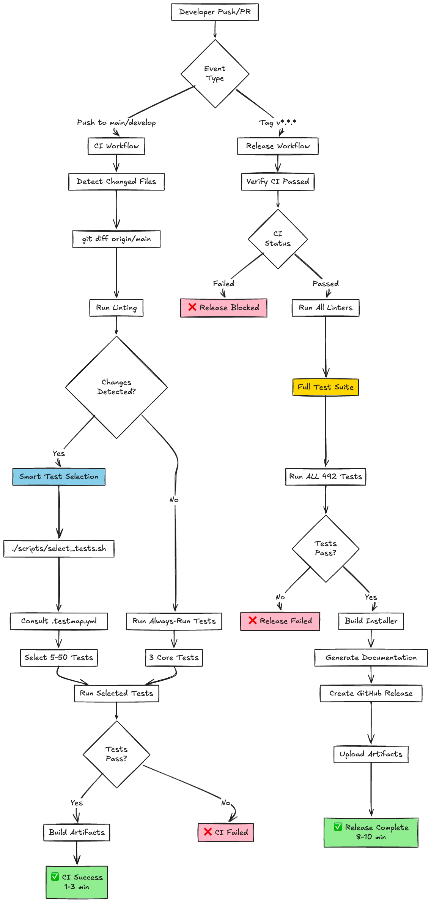
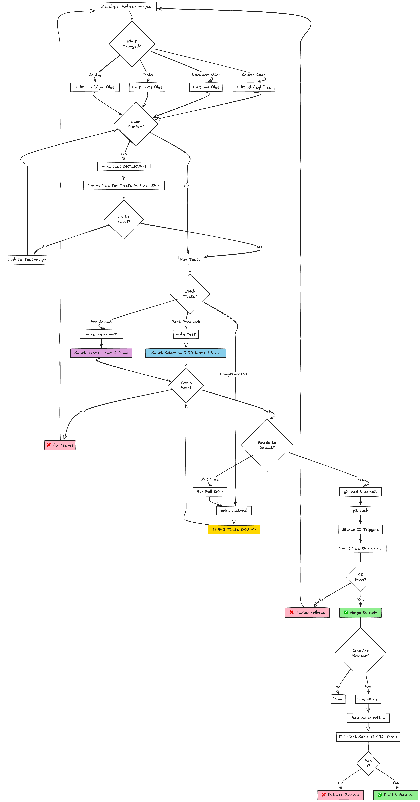
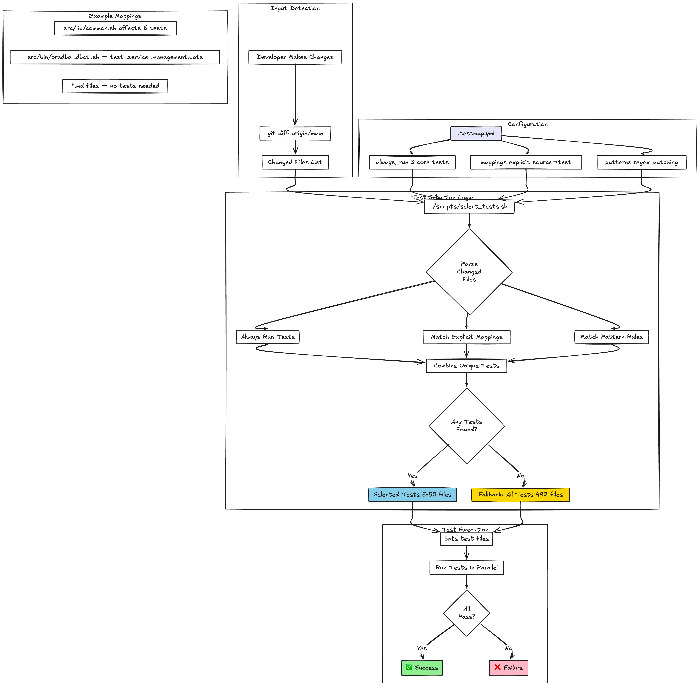

# Development Guide

This guide provides detailed information for developers working on oradba.

## CI/CD Pipeline



The project uses GitHub Actions for continuous integration and automated releases.
The CI workflow runs on every push and pull request, while the release workflow
triggers on version tags.

## Git Workflow



The project follows a feature branch workflow with pull requests for code review and automated testing before
merging to main.

## Project Structure

```text
oradba/
├── .github/
│   └── workflows/        # GitHub Actions CI/CD workflows
│       ├── ci.yml        # Continuous integration
│       ├── release.yml   # Release automation
│       └── dependency-review.yml
├── src/                  # Server/service files
│   ├── bin/             # Executable scripts
│   │   └── oraenv.sh    # Core environment setup script
│   ├── lib/             # Library functions
│   │   └── common.sh    # Common utility functions
│   ├── etc/             # Configuration files
│   │   └── oradba.conf  # Main configuration
│   ├── sql/             # SQL scripts
│   │   ├── db_info.sql  # Database information
│   │   └── login.sql    # SQL*Plus login script
│   ├── rcv/             # RMAN recovery scripts
│   │   └── backup_full.rman
│   └── templates/       # Template files
│       └── script_template.sh
├── test/                # BATS test files
│   ├── test_common.bats
│   ├── test_oraenv.bats
│   ├── test_installer.bats
│   └── run_tests.sh     # Test runner
├── build/               # Build artifacts (gitignored)
├── dist/                # Distribution files (gitignored)
├── build_installer.sh   # Installer builder
├── VERSION              # Semantic version
├── README.md
├── CHANGELOG.md
├── CONTRIBUTING.md
├── LICENSE
└── .gitignore
```

## Core Components

### oraenv.sh

The core script that sets up Oracle environment variables based on oratab configuration.

**Key Features:**

- Reads oratab file
- Sets ORACLE_SID, ORACLE_HOME, ORACLE_BASE
- Updates PATH and LD_LIBRARY_PATH
- Handles TNS_ADMIN and NLS settings
- Must be sourced, not executed

**Usage:**

```bash
source oraenv.sh FREE
```

### common.sh

Library of common functions used across scripts.

**Key Functions:**

- `log_info()`, `log_error()`, `log_warn()`, `log_debug()`
- `command_exists()` - Check command availability
- `verify_oracle_env()` - Validate Oracle environment
- `parse_oratab()` - Parse oratab entries
- `export_oracle_base_env()` - Set common Oracle variables

### Configuration

Main configuration file: [src/etc/oradba.conf](src/etc/oradba.conf)

**Key Settings:**

- `ORADBA_PREFIX` - Installation directory
- `ORATAB_FILE` - Path to oratab
- `DEBUG` - Debug mode toggle
- `LOG_DIR` - Log directory
- `BACKUP_DIR` - Backup location

## Development Workflow

### 1. Making Changes

```bash
# Create feature branch
git checkout -b feature/my-feature

# Make changes
vim src/bin/oraenv.sh

# Test changes
./test/run_tests.sh
```

### 2. Testing

```bash
# Run all tests
./tests/run_tests.sh

# Run specific test file
bats tests/test_common.bats

# Run with debug output
DEBUG=1 bats tests/test_common.bats
```

### 3. Linting

```bash
# Install shellcheck
brew install shellcheck  # macOS
sudo apt-get install shellcheck  # Ubuntu

# Lint all scripts
find . -name "*.sh" -not -path "./dist/*" -not -path "./build/*" | xargs shellcheck
```

### 4. Building

```bash
# Build self-extracting installer
./scripts/build_installer.sh

# Output files:
# - build/oradba-X.Y.Z.tar.gz  (tarball payload)
# - dist/oradba_install.sh     (self-extracting installer with embedded payload)

# Test installer locally
./dist/oradba_install.sh --prefix /tmp/oradba-test

# Test specific installation modes
./dist/oradba_install.sh --local build/oradba-X.Y.Z.tar.gz --prefix /tmp/test-local
./dist/oradba_install.sh --github --version X.Y.Z --prefix /tmp/test-github
```

## Build Process

### Installer Architecture

The installer uses a two-component architecture:

1. **Standalone Installer**: `src/bin/oradba_install.sh`
   - Contains all installation logic
   - Part of the distribution (installed to `$PREFIX/bin/`)
   - Can be used post-installation for updates and additional installs
   - Supports multiple installation modes: embedded, local, github

2. **Build Script**: `scripts/build_installer.sh`
   - Creates tarball payload from `src/` directory
   - Copies standalone installer to `dist/`
   - Injects VERSION number
   - Appends base64-encoded payload
   - Produces self-extracting installer

### Build Steps

```bash
# 1. Create tarball payload
tar -czf build/oradba-X.Y.Z.tar.gz src/*

# 2. Generate checksums
find src -type f | sha256sum > .oradba.checksum

# 3. Copy installer script
cp src/bin/oradba_install.sh dist/

# 4. Inject version
sed 's/__VERSION__/X.Y.Z/g' dist/oradba_install.sh

# 5. Append base64 payload
base64 < build/oradba-X.Y.Z.tar.gz >> dist/oradba_install.sh
```

### Installation Modes

The installer supports three modes:

1. **Embedded Mode** (default with payload):

   ```bash
   # Extracts base64 payload from installer itself
   ./dist/oradba_install.sh
   ```

2. **Local Mode** (air-gapped):

   ```bash
   # Uses local tarball file
   ./oradba_install.sh --local /path/to/oradba-X.Y.Z.tar.gz
   ```

3. **GitHub Mode**:

   ```bash
   # Downloads from GitHub releases
   ./oradba_install.sh --github [--version X.Y.Z]
   ```

### Post-Installation Usage

After installation, `$PREFIX/bin/oradba_install.sh` (without payload) can be used:

```bash
# Install to another location from local tarball
/opt/oradba/bin/oradba_install.sh --local /downloads/oradba.tar.gz --prefix /new/location

# Update existing installation
/opt/oradba/bin/oradba_install.sh --update --github

# Update from local tarball
/opt/oradba/bin/oradba_install.sh --update --local /path/to/new-version.tar.gz
```

## Update Process

### Update Flow

1. **Version Check**: Compare installed vs new version
2. **Backup**: Create timestamped backup of existing installation
3. **Preserve Config**: Save user configuration files
4. **Remove Old**: Delete old installation (backup remains)
5. **Install New**: Extract and install new version
6. **Restore Config**: Restore preserved configurations
7. **Verify**: Run integrity check
8. **Rollback or Cleanup**: Restore backup if failed, remove if successful

### Update Examples

```bash
# Update to latest from GitHub
./oradba_install.sh --update --github

# Update from local tarball
./oradba_install.sh --update --local oradba-0.7.0.tar.gz

# Force reinstall same version
./oradba_install.sh --update --force

# Update with specific GitHub version
./oradba_install.sh --update --github --version 0.7.0
```

### Configuration Preservation

The following files are preserved during updates:

- `.install_info` - Installation metadata
- `etc/oradba.conf` - Main configuration
- `etc/oratab.example` - Custom oratab examples

### Rollback

If integrity verification fails, the installer automatically:

1. Removes failed installation
2. Restores backup
3. Exits with error code 1

Backup location: `$PREFIX.backup.YYYYMMDD_HHMMSS`

## Testing Guide



The project uses BATS (Bash Automated Testing System) for comprehensive testing,
with unit tests for individual functions and integration tests for end-to-end workflows.

### BATS Testing Framework

BATS (Bash Automated Testing System) is used for all tests.

**Test Structure:**

```bash
#!/usr/bin/env bats

setup() {
    # Setup before each test
}

teardown() {
    # Cleanup after each test
}

@test "test description" {
    run command_to_test
    [ "$status" -eq 0 ]
    [[ "$output" =~ "expected output" ]]
}
```

**Common Assertions:**

- `[ "$status" -eq 0 ]` - Command succeeded
- `[ "$status" -ne 0 ]` - Command failed
- `[[ "$output" =~ "pattern" ]]` - Output matches pattern
- `[ -f "file" ]` - File exists
- `[ -d "dir" ]` - Directory exists

### Writing Tests

1. **Unit Tests** - Test individual functions

   ```bash
   @test "log_info outputs correct format" {
       run log_info "Test message"
       [ "$status" -eq 0 ]
       [[ "$output" =~ \[INFO\] ]]
   }
   ```

2. **Integration Tests** - Test script interactions

   ```bash
   @test "oraenv sets environment correctly" {
       source oraenv.sh TESTDB
       [ "$ORACLE_SID" = "TESTDB" ]
   }
   ```

3. **Mock Data** - Create temporary test data

   ```bash
   setup() {
       TEST_DIR=$(mktemp -d)
       cat > "$TEST_DIR/oratab" <<EOF
   TESTDB:/oracle/19c:N
   EOF
   }
   ```

## GitHub Actions Workflows

### CI Workflow

1. **CI Workflow** ([.github/workflows/ci.yml](.github/workflows/ci.yml))
   - Triggered on push/PR to main/develop
   - Runs shellcheck linting
   - Executes BATS tests
   - Builds installer
   - Validates installation

2. **Release Workflow** ([.github/workflows/release.yml](.github/workflows/release.yml))
   - Triggered on version tags (v*.*.*)
   - Builds installer
   - Creates GitHub release
   - Uploads artifacts

3. **Dependency Review**
   - Runs on pull requests
   - Security scanning

### Creating a Release

```bash
# Update version
echo "0.2.0" > VERSION

# Update changelog
vim CHANGELOG.md

# Commit changes
git add VERSION CHANGELOG.md
git commit -m "chore: Bump version to 0.2.0"

# Create and push tag
git tag -a v0.2.0 -m "Release v0.2.0"
git push origin main --tags
```

## Installer Architecture

### Build Process

The installer is created by `build_installer.sh`:

1. Creates tarball of src/ directory and documentation
2. Generates installer script with embedded base64 payload
3. Appends base64-encoded tarball to installer script
4. Makes installer executable

### Installer Features

- Self-contained (no external dependencies)
- Base64-encoded payload
- Customizable installation prefix
- Permission handling
- User ownership support
- Symbolic link creation

### Installer Usage

```bash
# Basic installation
./oradba_install.sh

# Custom prefix
./oradba_install.sh --prefix /usr/local/oradba

# As specific user
sudo ./oradba_install.sh --user oracle
```

## Versioning

This project follows [Semantic Versioning](https://semver.org/):

- **MAJOR** version: Incompatible API changes
- **MINOR** version: Backward-compatible functionality
- **PATCH** version: Backward-compatible bug fixes

Version is stored in `VERSION` file and used by:

- Installer script
- Release workflow
- Documentation

## Makefile Development Workflow

The project includes a comprehensive Makefile for automating development tasks.

### Available Targets

View all available targets with organized sections:

```bash
make help
```

### Development Tasks

**Testing:**

```bash
# Run all tests
make test

# Run unit tests only
make test-unit

# Run integration tests only
make test-integration

# Quick shortcut
make t
```

**Linting:**

```bash
# Run all linters (shell, markdown, scripts)
make lint

# Lint shell scripts with shellcheck
make lint-shell

# Check for common script issues
make lint-scripts

# Lint Markdown files
make lint-markdown

# Quick shortcut
make l
```

**Formatting:**

```bash
# Format all shell scripts with shfmt
make format

# Check if scripts are properly formatted
make format-check

# Quick shortcut
make f
```

**Validation:**

```bash
# Run all checks (lint + test)
make check

# Validate configuration files
make validate

# Run full CI pipeline locally
make ci
```

### Build & Distribution

```bash
# Build distribution archive
make build

# Install OraDBA locally
make install

# Uninstall OraDBA
make uninstall

# Clean build artifacts
make clean

# Deep clean (including caches)
make clean-all

# Quick shortcut for build
make b
```

### Version Management

**Bump Version:**

```bash
# Bump patch version (0.2.1 → 0.2.2)
make version-bump-patch

# Bump minor version (0.2.1 → 0.3.0)
make version-bump-minor

# Bump major version (0.2.1 → 1.0.0)
make version-bump-major

# Show current version
make version
```

**Git Operations:**

```bash
# Create git tag from VERSION file
make tag

# Show git status and current version
make status
```

### Release Process

**1. Check Release Readiness:**

```bash
make release-check
```

This command verifies:

- Working directory is clean (no uncommitted changes)
- Version tag doesn't already exist
- All tests pass
- All linting passes

**2. Prepare for Release:**

Before running release commands:

```bash
# Bump the version (choose appropriate level)
make version-bump-patch  # or minor/major

# Update CHANGELOG.md manually
vim CHANGELOG.md
# - Move [Unreleased] items to new version section
# - Add release date
# - Create new empty [Unreleased] section

# Commit version and changelog changes
git add VERSION CHANGELOG.md
git commit -m "chore: Release v$(cat VERSION)"
```

**3. Run Release Check:**

```bash
# Verify everything is ready
make release-check
```

If successful, you'll see:

```text
✓ Working directory clean
✓ Version tag available
✓ All checks passed
✓ Ready for release
```

**4. Create Release:**

```bash
# Create git tag
make tag

# Push to remote with tags
git push origin main --tags
```

**5. Automated GitHub Release:**

Once the tag is pushed, GitHub Actions will automatically:

- Build the distribution archive
- Create a GitHub release
- Upload artifacts
- Generate release notes

### Complete Release Example

```bash
# 1. Ensure working directory is clean
git status

# 2. Bump version
make version-bump-patch
# Updates VERSION file: 0.2.1 → 0.2.2

# 3. Update CHANGELOG.md
vim CHANGELOG.md
# Move [Unreleased] changes to [0.2.2] section
# Add release date
# Create new [Unreleased] section

# 4. Commit changes
git add VERSION CHANGELOG.md
git commit -m "chore: Release v0.2.2"

# 5. Verify release readiness
make release-check
# ✓ All checks passed

# 6. Create and push tag
make tag
git push origin main --tags

# 7. GitHub Actions creates the release automatically
# Monitor at: https://github.com/oehrlis/oradba/actions
```

### Pre-commit Checks

Run before committing code:

```bash
# Format code and run linters
make pre-commit
```

This runs:

1. Format all shell scripts
2. Lint shell scripts
3. Lint Markdown files
4. Check for common issues

### Pre-push Checks

Run before pushing to remote:

```bash
# Run full validation
make pre-push
```

This runs:

1. All linting
2. All tests

### Development Tools

**Check installed tools:**

```bash
make tools
```

Shows status of:

- shellcheck
- shfmt
- markdownlint
- bats
- git

**Setup development environment:**

```bash
# Install all required tools (macOS with Homebrew)
make setup-dev
```

### Project Information

```bash
# Show comprehensive project info
make info
```

Displays:

- Project name and version
- Directory structure
- File counts (scripts, libraries, SQL, tests)

### Quick Shortcuts

For faster development:

```bash
make t    # Test
make l    # Lint
make f    # Format
make b    # Build
make c    # Clean
```

## Running Tests and CI Locally

### Run All Tests

```bash
# Run complete test suite
make test

# Or directly with BATS
./tests/run_tests.sh

# Run specific test file
bats tests/test_common.bats
bats tests/test_installer.bats
```

### Run Linters (CI Checks)

```bash
# Run all linters (what CI runs)
make lint

# Or individually
make lint-shell      # ShellCheck on bash scripts
make lint-markdown   # Markdownlint on .md files
```

### Build Locally

```bash
# Build distribution and installer
make build

# Output files:
# - dist/oradba-X.Y.Z.tar.gz
# - dist/oradba_install.sh
```

### Generate Documentation

```bash
# Build PDF and HTML documentation
make docs

# Or individually
make docs-pdf        # Creates dist/oradba-user-guide.pdf
make docs-html       # Creates dist/oradba-user-guide.html
```

### Complete CI Pipeline Locally

```bash
# Run everything CI runs
make ci

# This runs:
# 1. Linting (shellcheck, markdownlint)
# 2. Tests (BATS)
# 3. Build (installer and docs)
```

## Release Process

### Overview

The release workflow ensures CI passes before creating releases. Releases are
triggered by pushing version tags and can also be manually dispatched.

**Workflow Triggers:**

1. **Tag Push** - Automatic release when version tag pushed (e.g., `v0.8.1`)
2. **Manual Dispatch** - Manual trigger via GitHub Actions UI

### Prerequisites

Before creating a release, ensure:

- [ ] All changes merged to `main` branch
- [ ] Local `main` branch is up to date: `git pull origin main`
- [ ] All tests pass locally: `make ci`
- [ ] CHANGELOG.md is updated with release notes

### Release Steps

#### 1. Update Version Files

```bash
# Update VERSION file
echo "0.8.2" > VERSION

# Update CHANGELOG.md with new version entry
# Add [0.8.2] - YYYY-MM-DD section with changes
```

#### 2. Commit Release Changes

```bash
git add VERSION CHANGELOG.md
git commit -m "chore: Release v0.8.2

Version bump: 0.8.1 → 0.8.2

Changes:
- Feature 1
- Bug fix 2
- Enhancement 3"
```

#### 3. Push and Wait for CI

```bash
# Push release commit to trigger CI
git push origin main

# ⏳ WAIT for CI to complete (2-3 minutes)
# Check: https://github.com/oehrlis/oradba/actions/workflows/ci.yml
# ✅ Wait for green checkmark before proceeding
```

**Why wait?** The release workflow verifies that CI passed for the tagged
commit. If you push the tag before CI completes, the release will fail.

#### 4. Create and Push Tag

Only after CI passes:

```bash
# Create annotated tag with release notes
git tag -a v0.8.2 -m "OraDBA v0.8.2

Summary of changes:
- Feature 1
- Bug fix 2  
- Enhancement 3

Full changelog: https://github.com/oehrlis/oradba/compare/v0.8.1...v0.8.2"

# Push tag to trigger release workflow
git push origin v0.8.2
```

#### 5. Verify Release

```bash
# Check release workflow status
gh run list --workflow=release.yml --limit 1

# View release when complete
gh release view v0.8.2

# Or visit:
# https://github.com/oehrlis/oradba/releases
```

**Expected artifacts:**

- `oradba-X.Y.Z.tar.gz` - Distribution tarball
- `oradba_install.sh` - Self-contained installer
- `oradba-user-guide.pdf` - PDF documentation
- `oradba-user-guide.html` - HTML documentation

**Download URLs:**

```bash
# Latest release (recommended for users)
https://github.com/oehrlis/oradba/releases/latest/download/oradba_install.sh
https://github.com/oehrlis/oradba/releases/latest/download/oradba-user-guide.pdf
https://github.com/oehrlis/oradba/releases/latest/download/oradba-user-guide.html

# Specific version
https://github.com/oehrlis/oradba/releases/download/v0.8.2/oradba_install.sh
https://github.com/oehrlis/oradba/releases/download/v0.8.2/oradba-0.8.2.tar.gz
```

### Manual Release (Alternative)

If automatic release fails or you prefer manual control:

```bash
# 1. Ensure commit is pushed and CI passed
git push origin main
# Wait for CI ✅

# 2. Create and push tag
git tag -a v0.8.2 -m "Release message..."
git push origin v0.8.2

# 3. Manually trigger release workflow
gh workflow run release.yml -f version=0.8.2

# 4. Monitor execution
gh run watch
```

### Build Release Locally

To test release artifacts before pushing:

```bash
# Build everything locally
make clean
make build

# Check artifacts
ls -lh dist/

# Expected files:
# - dist/oradba-X.Y.Z.tar.gz
# - dist/oradba_install.sh
# - dist/oradba-user-guide.pdf
# - dist/oradba-user-guide.html

# Test installer
./dist/oradba_install.sh --help
```

### Version Bumping

Quick version bump commands:

```bash
# Patch release (0.8.1 → 0.8.2)
make version-bump-patch

# Minor release (0.8.2 → 0.9.0)
make version-bump-minor

# Major release (0.9.0 → 1.0.0)
make version-bump-major

# View current version
make version
```

### Release Checklist

- [ ] All tests passing locally (`make ci`)
- [ ] VERSION file updated
- [ ] CHANGELOG.md updated with release notes
- [ ] Release commit created and pushed
- [ ] CI workflow completed successfully ✅
- [ ] Version tag created and pushed
- [ ] Release workflow completed successfully ✅
- [ ] Release artifacts verified (tarball, installer, docs)
- [ ] Release notes reviewed on GitHub

### Troubleshooting Releases

**Release failed:** "No CI run found"

Cause: Tag was pushed before CI completed.

```bash
# Delete and recreate tag after CI passes
git tag -d v0.8.2
git push origin :refs/tags/v0.8.2
# Wait for CI to pass ✅
git tag -a v0.8.2 -m "..."
git push origin v0.8.2
```

**Documentation missing** from release

The workflow generates documentation after building. If missing, check:

```bash
# Verify local build includes docs
make clean
make build
make docs
ls -lh dist/*.pdf dist/*.html

# Then manually upload to release
gh release upload v0.8.2 dist/oradba-user-guide.pdf dist/oradba-user-guide.html
```

**Manual release** needed

```bash
# Trigger workflow manually with specific version
gh workflow run release.yml -f version=0.8.2
```

## Best Practices

### Bash Scripting

1. **Use strict** mode

   ```bash
   set -e  # Exit on error
   set -u  # Exit on undefined variable
   set -o pipefail  # Exit on pipe failure
   ```

2. **Quote** variables

   ```bash
   # Good
   echo "$variable"
   
   # Bad
   echo $variable
   ```

3. **Use local** variables in functions

   ```bash
   my_function() {
       local var="value"
       # Function body
   }
   ```

4. **Check command** existence

   ```bash
   if command_exists "oracle"; then
       # Use command
   fi
   ```

### Documentation

1. Add header comments to all scripts
2. Document function parameters and return values
3. Update README.md for user-visible changes
4. Keep CHANGELOG.md updated

### Testing

1. Write tests for new functionality
2. Test error conditions
3. Use meaningful test descriptions
4. Clean up test artifacts in teardown

## Troubleshooting

### Common Issues

**BATS not found:**

```bash
# macOS
brew install bats-core

# Ubuntu
sudo apt-get install bats
```

**Permission denied:**

```bash
chmod +x script.sh
```

**Tests failing:**

```bash
# Run with debug
DEBUG=1 ./test/run_tests.sh

# Run specific test
bats -t test/test_common.bats
```

## Resources

- [Bash Manual](https://www.gnu.org/software/bash/manual/)
- [BATS Documentation](https://bats-core.readthedocs.io/)
- [ShellCheck](https://www.shellcheck.net/)
- [Semantic Versioning](https://semver.org/)
- [Keep a Changelog](https://keepachangelog.com/)

## Getting Help

- Open an issue on GitHub
- Review existing documentation
- Check closed issues for solutions
- Read the test files for examples
