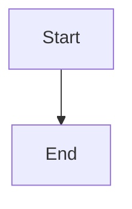

# OraDBA Documentation Images & Diagrams

This directory contains diagrams and images for OraDBA documentation, including
both static PNG images and dynamic Mermaid diagrams.

## Quick Navigation

- **[Mermaid Diagrams](#mermaid-diagrams)** - Interactive architecture and workflow diagrams (NEW)
- **[PNG Images](#png-images)** - Static diagrams exported from Excalidraw
- **[Directory Structure](#directory-structure)** - File organization
- **[Image Workflow](#image-workflow)** - Build and reference process

## Mermaid Diagrams

Interactive diagrams documenting OraDBA architecture and workflows. These render
automatically in VS Code, GitHub, and modern documentation sites.

### Architecture & Core Systems

| Diagram                   | Description                                          | File                                                         |
|---------------------------|------------------------------------------------------|--------------------------------------------------------------|
| **Configuration System**  | 5-layer hierarchy (core→standard→local→customer→sid) | [config-workflow-highlevel.md](config-workflow-highlevel.md) |
| **Configuration Details** | Internal function calls, variable export, cleanup    | [config-workflow-detailed.md](config-workflow-detailed.md)   |
| **Plugin System**         | Plugin lifecycle, 8-function interface, integration  | [plugin-system.md](plugin-system.md)                         |

### Workflows & Operations

| Diagram             | Description                                      | File                                                         |
|---------------------|--------------------------------------------------|--------------------------------------------------------------|
| **oraenv Workflow** | Environment setup (interactive/non-interactive)  | [oraenv-workflow-highlevel.md](oraenv-workflow-highlevel.md) |
| **oraenv Details**  | Complete function call flow                      | [oraenv-workflow-detailed.md](oraenv-workflow-detailed.md)   |
| **oraup Workflow**  | Status display (registry query, type separation) | [oraup-workflow-highlevel.md](oraup-workflow-highlevel.md)   |
| **oraup Details**   | Detailed status checking and formatting          | [oraup-workflow-detailed.md](oraup-workflow-detailed.md)     |

**Viewing Mermaid Diagrams:**

- **VS Code**: Install [Mermaid Preview](https://marketplace.visualstudio.com/items?itemName=bierner.markdown-mermaid),
  open any `.md` file, use preview (Ctrl/Cmd+Shift+V)
- **GitHub**: Native rendering in browser
- **Live Editor**: [mermaid.live](https://mermaid.live/) for editing/exporting

## PNG Images

Static diagrams for architecture documentation, exported from Excalidraw.

| Image                              | Description                   | Usage                 |
|------------------------------------|-------------------------------|-----------------------|
| `architecture-system.png`          | System architecture overview  | Main architecture doc |
| `config-hierarchy.png`             | Configuration layer hierarchy | Config documentation  |
| `config-sequence.png`              | Config loading sequence       | Config documentation  |
| `oraenv-flow.png`                  | oraenv execution flow         | Environment setup     |
| `alias-generation.png`             | Alias generation logic        | Alias documentation   |
| `sid-auto-creation.png`            | SID config auto-creation      | Config documentation  |
| `dev-workflow.png`                 | Development workflow          | Contributing guide    |
| `cicd-pipeline.png`                | CI/CD pipeline overview       | Development doc       |
| `test-strategy.png`                | Testing strategy              | Testing documentation |
| `test-selection-decision-tree.png` | Smart test selection logic    | Testing documentation |
| `performance-comparsion.png`       | Performance benchmarks        | Performance analysis  |
| `installation-flow.png`            | Installation process          | Installation guide    |

## Directory Structure

```text
doc/images/                  # Images and diagrams (tracked in git)
├── *.png                    # Exported PNG diagrams (Excalidraw)
├── *-workflow-*.md          # Mermaid workflow diagrams (NEW)
├── plugin-system.md         # Mermaid plugin system diagram (NEW)
├── config-workflow-*.md     # Mermaid config diagrams (NEW)
├── source/                  # Excalidraw source files
│   └── *.excalidraw         # Editable diagram sources
└── README.md                # This file

src/doc/images/              # Build artifact (NOT tracked, copied during build)
```

## Image Workflow

**Source Location (tracked in git):**

- `doc/images/` - PNG exports, Mermaid diagrams, and this README
- `doc/images/source/` - Excalidraw source files (.excalidraw)

**Build Process:**

- During `make docs-html` or `make docs-pdf`:
  1. Images copied from `doc/images/` → `src/doc/images/`
  2. Documentation built with images in place
  3. Mermaid diagrams rendered by documentation generator
- Build artifacts cleaned with `make docs-clean-images`

**References in Documentation:**

- User docs (`src/doc/*.md`) use relative path: `images/diagram-name.png`
- Developer docs (`doc/*.md`) use relative path: `images/diagram-name.png`
- Mermaid diagrams linked directly: `[Diagram](images/config-workflow-highlevel.md)`

## Usage

### PNG Images

Referenced in markdown using image syntax:

```markdown

```

### Mermaid Diagrams

Referenced in markdown using link syntax:

```markdown
See the [Configuration Workflow](images/config-workflow-highlevel.md) for details.
```

Or embedded directly (if supported by renderer):

```markdown


## Export Settings

### Excalidraw (PNG Images)

All PNG images exported from Excalidraw with:

- **Format**: PNG
- **Scale**: 2x (for retina displays)
- **Background**: Transparent or white
- **Export location**: `doc/images/`

### Mermaid Diagrams

Mermaid diagrams use consistent formatting:

- **Direction**: `flowchart TD` (top-down) or `LR` (left-right)
- **Color coding**: Consistent across all diagrams
  - Blue (#e1f5ff): Start/Entry points
  - Orange (#fff3e0): Initialization
  - Purple (#e1bee7): Registry operations
  - Green (#c8e6c9): Database operations
  - Yellow (#fff9c4): Listener operations
- **Node types**:
  - Rounded `([text])`: Start/End
  - Rectangle `[text]`: Process steps
  - Diamond `{text?}`: Decisions
- **Documentation**: Each diagram includes comprehensive tables and usage guidance

## Creating New Diagrams

### Mermaid Diagrams

1. Use [Mermaid Live Editor](https://mermaid.live/) for drafting
2. Follow existing diagram patterns for consistency
3. Apply standard color coding
4. Add comprehensive documentation sections
5. Validate syntax before committing
6. Update this README with new diagram entry

### PNG Images

1. Create/edit in [Excalidraw](https://excalidraw.com/)
2. Save source file to `doc/images/source/`
3. Export PNG to `doc/images/` (2x scale, transparent/white background)
4. Update this README with image description
5. Reference in relevant documentation

## Diagram Statistics

- **Total diagrams**: 19 (12 PNG + 7 Mermaid)
- **Mermaid diagrams**: 7 (new in v1.2.2+)
- **Architecture diagrams**: 3 Mermaid + 4 PNG
- **Workflow diagrams**: 4 Mermaid + 3 PNG
- **Development diagrams**: 5 PNG

## Related Documentation

- **[Architecture](../architecture.md)** - Main architecture document
- **[Development Guide](../development.md)** - Development workflow
- **[Code Analysis](../code_analysis_report.md)** - Code quality report
- **[Function Inventory](../functions_inventory.md)** - Function catalog
- Embed scene: Yes (includes source data in PNG)

## File Naming Convention

- Lowercase with hyphens
- Descriptive names
- Component prefix when applicable
- Example: `architecture-system.png`, `config-hierarchy.png`
