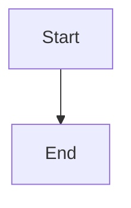

# OraDBA Documentation Images & Diagrams

This directory contains Mermaid diagrams for OraDBA documentation. All diagrams
are text-based Mermaid code that renders automatically in VS Code, GitHub, and
modern documentation sites.

## Mermaid-Only Workflow (v0.19.0+)

OraDBA uses a **Mermaid-first approach** for all diagrams:

- **Phase 1 (COMPLETE)**: Source Mermaid files in `source/` directory
- **Phase 2 (CURRENT)**: Embedded Mermaid in architecture.md, development.md, and user docs
- **Phase 3 (PLANNED)**: Automated Mermaid rendering for PDF generation (Pandoc integration)

**Benefits**:
- ✅ Native rendering in GitHub and VS Code
- ✅ Version control friendly (text-based, clear diffs)
- ✅ Easy to maintain and update
- ✅ No build step required for viewing
- ✅ Interactive and zoomable
- ✅ Single source of truth per diagram

## Quick Navigation

- **[Architecture & Core Systems](#architecture--core-systems)** - System architecture, libraries, config
- **[Workflows & Operations](#workflows--operations)** - Environment setup, status display, installation
- **[Directory Structure](#directory-structure)** - File organization
- **[Legacy Files](#legacy-files)** - Archived PNG and Excalidraw files

## Mermaid Diagrams

### Architecture & Core Systems

| Diagram                         | Description                                          | File                                                         |
|---------------------------------|------------------------------------------------------|--------------------------------------------------------------|
| **System Architecture**         | Complete layered architecture with Registry API & plugins | [source/architecture-system.md](source/architecture-system.md) |
| **Environment Libraries**       | Modular library system (parser, builder, validator) | [source/phase1-3-libraries.md](source/phase1-3-libraries.md) |
| **Configuration System**        | 5-layer hierarchy (core→standard→local→customer→sid) | [config-workflow-highlevel.md](config-workflow-highlevel.md) |
| **Configuration Hierarchy**     | 6-level config with processing libraries             | [source/config-hierarchy.md](source/config-hierarchy.md)     |
| **Configuration Details**       | Internal function calls, variable export, cleanup    | [config-workflow-detailed.md](config-workflow-detailed.md)   |
| **Configuration Sequence**      | Library-based config loading sequence diagram        | [source/config-sequence.md](source/config-sequence.md)       |
| **Plugin System**               | Plugin lifecycle, 8-function interface, integration  | [plugin-system.md](plugin-system.md)                         |
| **Registry API Flow**           | Unified installation metadata access                 | [registry-api-flow.md](registry-api-flow.md)                 |

### Workflows & Operations

| Diagram                  | Description                                      | File                                                         |
|--------------------------|--------------------------------------------------|--------------------------------------------------------------|
| **oraenv Workflow**      | Environment setup (interactive/non-interactive)  | [oraenv-workflow-highlevel.md](oraenv-workflow-highlevel.md) |
| **oraenv Execution Flow** | Complete environment setup process              | [source/oraenv-flow.md](source/oraenv-flow.md)               |
| **oraenv Details**       | Complete function call flow                      | [oraenv-workflow-detailed.md](oraenv-workflow-detailed.md)   |
| **oraup Workflow**       | Status display (registry query, type separation) | [oraup-workflow-highlevel.md](oraup-workflow-highlevel.md)   |
| **oraup Details**        | Detailed status checking and formatting          | [oraup-workflow-detailed.md](oraup-workflow-detailed.md)     |
| **Installation Flow**    | Self-extracting installer with integrity check   | [source/installation-flow.md](source/installation-flow.md)   |

**Viewing Mermaid Diagrams:**

- **VS Code**: Install [Mermaid Preview](https://marketplace.visualstudio.com/items?itemName=bierner.markdown-mermaid)
- **GitHub**: Native rendering in browser
- **Live Editor**: [mermaid.live](https://mermaid.live/) for editing/exporting

## Directory Structure

```text
doc/images/                  # Mermaid diagrams only
├── *.md                     # Workflow Mermaid diagrams (developer docs)
├── source/                  # Source Mermaid files (architecture.md diagrams)
│   ├── architecture-system.md    # System architecture
│   ├── oraenv-flow.md            # Environment setup flow
│   ├── phase1-3-libraries.md     # Library architecture
│   ├── config-hierarchy.md       # 6-level configuration
│   ├── installation-flow.md      # Installer process
│   └── config-sequence.md        # Config loading sequence
├── toberemoved/             # Legacy PNG and Excalidraw files (archived)
│   ├── *.png                # Old PNG exports
│   ├── *.excalidraw         # Old Excalidraw sources
│   └── diagrams-mermaid.md  # Legacy: All diagrams in one file
└── README.md                # This file
```

**Phase 2 Status**:
- ✅ Source files created in `source/` directory
- ✅ Embedded Mermaid in architecture.md (6 diagrams)
- ✅ Workflow Mermaid in root directory (8 diagrams)
- ✅ Legacy files moved to `toberemoved/`
- 🔄 TODO: Embed in development.md and user docs
- 🔄 TODO: Update MkDocs/GitHub Pages configuration

## Legacy Files

All PNG and Excalidraw files have been moved to `toberemoved/` directory:
- PNG exports (*.png) - No longer used, replaced by Mermaid
- Excalidraw sources (*.excalidraw) - No longer maintained
- diagrams-mermaid.md - Superseded by individual source files

These files are kept temporarily for reference and will be removed in a future release.

## Usage in Documentation

### Developer Docs (doc/*.md)

Embed Mermaid directly in markdown files:

\`\`\`markdown
## System Architecture

\`\`\`mermaid
graph TB
    A[Component A] --> B[Component B]
\`\`\`
\`\`\`

### User Docs (src/doc/*.md)

Same approach - embed Mermaid code blocks directly in documentation.

### PDF Generation (Phase 3)

Planned integration with Pandoc for automatic Mermaid rendering in PDF output.

Referenced in markdown using image syntax:

```markdown

```

### Mermaid Diagrams

Referenced in markdown using link syntax:

```markdown
See the [Configuration Workflow](images/config-workflow-highlevel.md) for details.
```

Or embedded directly (if supported by renderer):

```markdown


## Export Settings

### Excalidraw (PNG Images)

All PNG images exported from Excalidraw with:

- **Format**: PNG
- **Scale**: 2x (for retina displays)
- **Background**: Transparent or white
- **Export location**: `doc/images/`

### Mermaid Diagrams

Mermaid diagrams use consistent formatting:

- **Direction**: `flowchart TD` (top-down) or `LR` (left-right)
- **Color coding**: Consistent across all diagrams
  - Blue (#e1f5ff): Start/Entry points
  - Orange (#fff3e0): Initialization
  - Purple (#e1bee7): Registry operations
  - Green (#c8e6c9): Database operations
  - Yellow (#fff9c4): Listener operations
- **Node types**:
  - Rounded `([text])`: Start/End
  - Rectangle `[text]`: Process steps
  - Diamond `{text?}`: Decisions
- **Documentation**: Each diagram includes comprehensive tables and usage guidance

## Creating New Diagrams

### Mermaid Diagrams

1. Use [Mermaid Live Editor](https://mermaid.live/) for drafting
2. Follow existing diagram patterns for consistency
3. Apply standard color coding
4. Add comprehensive documentation sections
5. Validate syntax before committing
6. Update this README with new diagram entry

### PNG Images

1. Create/edit in [Excalidraw](https://excalidraw.com/)
2. Save source file to `doc/images/source/`
3. Export PNG to `doc/images/` (2x scale, transparent/white background)
4. Update this README with image description
5. Reference in relevant documentation

## Diagram Statistics

- **Total diagrams**: 19 (12 PNG + 7 Mermaid)
- **Mermaid diagrams**: 7 (new in v1.2.2+)
- **Architecture diagrams**: 3 Mermaid + 4 PNG
- **Workflow diagrams**: 4 Mermaid + 3 PNG
- **Development diagrams**: 5 PNG

## Related Documentation

- **[Architecture](../architecture.md)** - Main architecture document
- **[Development Guide](../development.md)** - Development workflow
- **[Code Analysis](../code_analysis_report.md)** - Code quality report
- **[Function Inventory](../functions_inventory.md)** - Function catalog
- Embed scene: Yes (includes source data in PNG)

## File Naming Convention

- Lowercase with hyphens
- Descriptive names
- Component prefix when applicable
- Example: `architecture-system.png`, `config-hierarchy.png`
