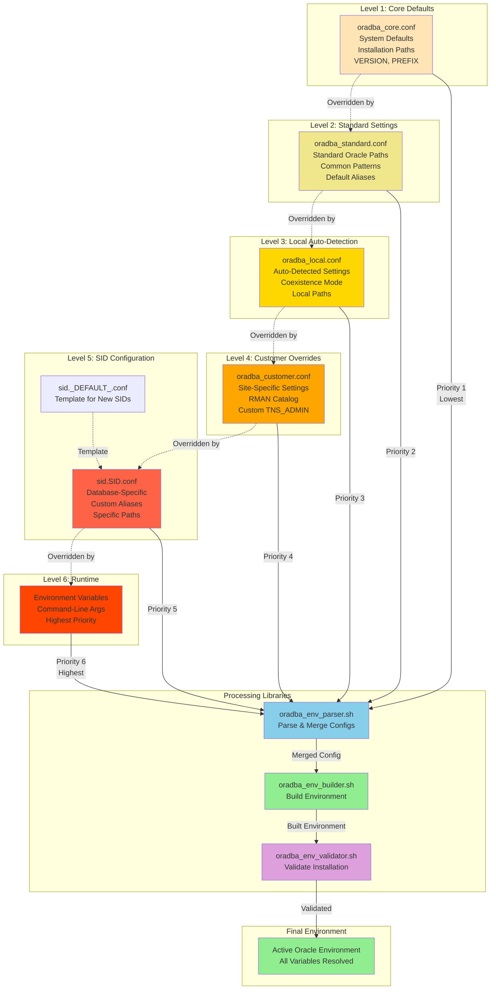

# Configuration Hierarchy

6-level configuration override system with library-based processing.

## Description

The configuration hierarchy provides flexible override system:

1. **Level 1 - Core**: System defaults, installation paths (read-only)
2. **Level 2 - Standard**: Standard Oracle paths and patterns
3. **Level 3 - Local**: Auto-detected settings, coexistence mode
4. **Level 4 - Customer**: Site-specific customizations (recommended)
5. **Level 5 - SID**: Database-specific settings (optional)
6. **Level 6 - Runtime**: Environment variables (highest priority)

## Processing Flow

1. **Parser** (oradba_env_parser.sh) reads all 6 levels in order
2. **Merge** combines configurations with later levels overriding earlier
3. **Builder** (oradba_env_builder.sh) constructs environment variables
4. **Validator** (oradba_env_validator.sh) verifies Oracle installation
5. **Result** is complete, validated Oracle environment

## Key Features

- **Flexible Overrides**: Each level can override previous levels
- **Auto-Detection**: Level 3 automatically detects local settings
- **SID Templates**: sid._DEFAULT_.conf provides template
- **Runtime Priority**: Environment variables always win
- **Library Processing**: Modular, testable components
