# Configuration Loading Sequence

Complete sequence diagram showing library-based configuration loading and environment setup.

```mermaid
sequenceDiagram
    participant User
    participant oraenv as oraenv.sh<br/>(Wrapper)
    participant oradba_env as oradba_env.sh<br/>(Main Builder)
    participant Registry as Registry API
    participant Parser as oradba_env_parser.sh
    participant Builder as oradba_env_builder.sh
    participant Validator as oradba_env_validator.sh
    participant Plugins as Plugin System
    participant Config as Config Files
    participant Homes as oradba_homes.conf
    participant Oratab
    participant Aliases as oradba_aliases.sh
    participant Status as oradba_env_status.sh
    
    User->>oraenv: source oraenv.sh FREE
    oraenv->>oraenv: Parse arguments
    oraenv->>oradba_env: Call oradba_env.sh FREE
    
    oradba_env->>Parser: Load parser library
    
    Parser->>Config: Parse oradba_core.conf
    Config-->>Parser: Level 1: Core settings
    
    Parser->>Config: Parse oradba_standard.conf
    Config-->>Parser: Level 2: Standard settings
    
    Parser->>Config: Parse oradba_local.conf
    Config-->>Parser: Level 3: Local settings
    
    Parser->>Config: Parse oradba_customer.conf
    Config-->>Parser: Level 4: Customer overrides
    
    Parser->>Config: Parse sid.FREE.conf
    Config-->>Parser: Level 5: SID settings
    
    Parser-->>oradba_env: Merged configuration
    
    oradba_env->>Registry: Query installation
    
    alt FREE is SID
        Registry->>Oratab: Query oratab for FREE
        Oratab-->>Registry: ORACLE_HOME path
    else FREE is Home Name
        Registry->>Homes: Query oradba_homes.conf
        Homes-->>Registry: ORACLE_HOME path
    end
    
    Registry-->>oradba_env: Installation metadata
    
    oradba_env->>Builder: Load builder library
    
    Builder->>Builder: Derive ORACLE_BASE
    Builder->>Builder: Build PATH
    Builder->>Builder: Build LD_LIBRARY_PATH
    Builder->>Builder: Set TNS_ADMIN, SQLPATH
    
    Builder-->>oradba_env: Environment constructed
    
    oradba_env->>Validator: Load validator library
    
    Validator->>Plugins: Detect product type
    Plugins-->>Validator: Product type identified
    
    Validator->>Plugins: Validate Oracle Home
    Plugins-->>Validator: Validation result
    
    Validator->>Plugins: Get version
    Plugins-->>Validator: Oracle version
    
    Validator-->>oradba_env: Validation complete
    
    oradba_env->>Aliases: Generate aliases
    
    Aliases->>Aliases: Check CDB status
    Aliases->>Aliases: Detect PDBs
    Aliases->>Aliases: Create safe aliases
    
    Aliases-->>oradba_env: 50+ aliases ready
    
    oradba_env->>Status: Display environment
    
    Status->>Plugins: Check database status
    Plugins-->>Status: Database running
    
    Status->>Plugins: Check listener status
    Plugins-->>Status: Listener active
    
    Status-->>User: Environment summary
    
    oradba_env-->>oraenv: Environment ready
    oraenv-->>User: ✅ Environment loaded
```

## Description

The configuration loading sequence shows:

1. **User Input**: Sources oraenv.sh with SID or Home name
2. **Wrapper**: oraenv.sh validates and delegates to oradba_env.sh
3. **Parser**: Loads 6 configuration levels in order
4. **Registry API**: Queries oratab or oradba_homes.conf
5. **Builder**: Constructs complete environment variables
6. **Validator**: Uses plugins to validate installation
7. **Plugins**: Provide product-specific validation
8. **Aliases**: Generates database and PDB shortcuts
9. **Status**: Displays environment summary with plugin checks

## Key Components

- **Registry API**: Unified installation access
- **Plugin System**: Product-specific operations
- **Configuration Levels**: 6 levels with override priority
- **Library Coordination**: Modular components work together
- **Validation**: Plugins ensure valid Oracle installation
- **Status Checks**: Real-time database/listener status
