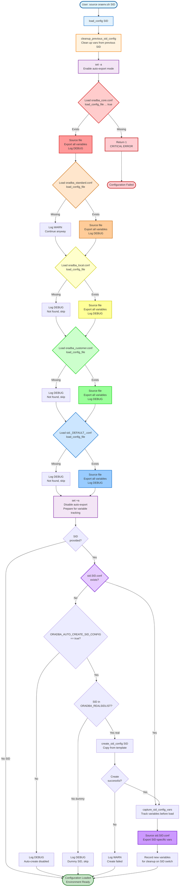

```mermaid
flowchart TD
    Start([User: source oraenv.sh SID])
    
    Start --> LoadConfig[load_config SID]
    
    LoadConfig --> CleanupPrev[cleanup_previous_sid_config<br/>Clean up vars from previous SID]
    
    CleanupPrev --> SetAutoExport[set -a<br/>Enable auto-export mode]
    
    SetAutoExport --> Core{Load oradba_core.conf<br/>load_config_file ... true}
    
    Core -->|Missing| CoreError[Return 1<br/>CRITICAL ERROR]
    Core -->|Exists| CoreLoad[Source file<br/>Export all variables<br/>Log DEBUG]
    
    CoreLoad --> Standard{Load oradba_standard.conf<br/>load_config_file}
    
    Standard -->|Missing| StandardWarn[Log WARN<br/>Continue anyway]
    Standard -->|Exists| StandardLoad[Source file<br/>Export all variables<br/>Log DEBUG]
    
    StandardWarn --> Local
    StandardLoad --> Local{Load oradba_local.conf<br/>load_config_file}
    
    Local -->|Missing| LocalSkip[Log DEBUG<br/>Not found, skip]
    Local -->|Exists| LocalLoad[Source file<br/>Export all variables<br/>Log DEBUG]
    
    LocalSkip --> Customer
    LocalLoad --> Customer{Load oradba_customer.conf<br/>load_config_file}
    
    Customer -->|Missing| CustomerSkip[Log DEBUG<br/>Not found, skip]
    Customer -->|Exists| CustomerLoad[Source file<br/>Export all variables<br/>Log DEBUG]
    
    CustomerSkip --> Default
    CustomerLoad --> Default{Load sid._DEFAULT_.conf<br/>load_config_file}
    
    Default -->|Missing| DefaultSkip[Log DEBUG<br/>Not found, skip]
    Default -->|Exists| DefaultLoad[Source file<br/>Export all variables<br/>Log DEBUG]
    
    DefaultSkip --> DisableExport
    DefaultLoad --> DisableExport[set +a<br/>Disable auto-export<br/>Prepare for variable tracking]
    
    DisableExport --> CheckSID{SID<br/>provided?}
    
    CheckSID -->|No SID| Done
    CheckSID -->|Yes| SIDExists{sid.SID.conf<br/>exists?}
    
    SIDExists -->|Yes| CaptureVars[capture_sid_config_vars<br/>Track variables before load]
    CaptureVars --> LoadSIDConfig[Source sid.SID.conf<br/>Export SID-specific vars]
    LoadSIDConfig --> TrackNewVars[Record new variables<br/>for cleanup on SID switch]
    
    SIDExists -->|No| AutoCreate{ORADBA_AUTO_CREATE_SID_CONFIG<br/>== true?}
    
    AutoCreate -->|No| AutoSkip[Log DEBUG<br/>Auto-create disabled]
    AutoCreate -->|Yes| RealSID{SID in<br/>ORADBA_REALSIDLIST?}
    
    RealSID -->|No dummy| RealSkip[Log DEBUG<br/>Dummy SID, skip]
    RealSID -->|Yes real| CreateConfig[create_sid_config SID<br/>Copy from template]
    
    CreateConfig --> CreateSuccess{Create<br/>successful?}
    
    CreateSuccess -->|No| CreateFail[Log WARN<br/>Create failed]
    CreateSuccess -->|Yes| CaptureVars
    
    AutoSkip --> Done
    RealSkip --> Done
    CreateFail --> Done
    TrackNewVars --> Done
    
    Done([Configuration Loaded<br/>Environment Ready])
    
    CoreError --> Failed([Configuration Failed])
    
    style LoadConfig fill:#e3f2fd,stroke:#1976d2,stroke-width:2px
    style CleanupPrev fill:#fff3e0,stroke:#f57c00,stroke-width:2px
    style SetAutoExport fill:#f3e5f5,stroke:#7b1fa2,stroke-width:2px
    style DisableExport fill:#f3e5f5,stroke:#7b1fa2,stroke-width:2px
    
    style CoreLoad fill:#ff9999,stroke:#cc0000,stroke-width:2px
    style StandardLoad fill:#ffcc99,stroke:#cc6600,stroke-width:2px
    style LocalLoad fill:#ffff99,stroke:#cccc00,stroke-width:2px
    style CustomerLoad fill:#99ff99,stroke:#00cc00,stroke-width:2px
    style DefaultLoad fill:#99ccff,stroke:#0066cc,stroke-width:2px
    style LoadSIDConfig fill:#cc99ff,stroke:#6600cc,stroke-width:2px
    
    style Core fill:#ffcccc,stroke:#cc0000,stroke-width:2px
    style Standard fill:#ffe6cc,stroke:#cc6600,stroke-width:2px
    style Local fill:#ffffcc,stroke:#cccc00,stroke-width:2px
    style Customer fill:#ccffcc,stroke:#00cc00,stroke-width:2px
    style Default fill:#cce6ff,stroke:#0066cc,stroke-width:2px
    style SIDExists fill:#e6ccff,stroke:#6600cc,stroke-width:2px
    
    style Start fill:#e1f5ff,stroke:#01579b,stroke-width:3px
    style Done fill:#c8e6c9,stroke:#2e7d32,stroke-width:3px
    style Failed fill:#ffcdd2,stroke:#c62828,stroke-width:3px
    style CoreError fill:#ffcdd2,stroke:#c62828,stroke-width:3px
```
