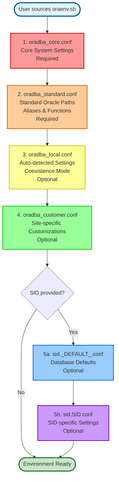

```mermaid
flowchart TD
    Start([User sources oraenv.sh])
    
    Start --> Layer1[1. oradba_core.conf<br/>Core System Settings<br/>Required]
    
    Layer1 --> Layer2[2. oradba_standard.conf<br/>Standard Oracle Paths<br/>Aliases & Functions<br/>Required]
    
    Layer2 --> Layer3[3. oradba_local.conf<br/>Auto-detected Settings<br/>Coexistence Mode<br/>Optional]
    
    Layer3 --> Layer4[4. oradba_customer.conf<br/>Site-specific Customizations<br/>Optional]
    
    Layer4 --> Layer5{SID provided?}
    
    Layer5 -->|Yes| Layer5a[5a. sid._DEFAULT_.conf<br/>Database Defaults<br/>Optional]
    Layer5a --> Layer5b[5b. sid.SID.conf<br/>SID-specific Settings<br/>Optional]
    
    Layer5 -->|No| EnvReady
    Layer5b --> EnvReady
    
    EnvReady([Environment Ready])
    
    style Layer1 fill:#ff9999,stroke:#cc0000,stroke-width:2px
    style Layer2 fill:#ffcc99,stroke:#cc6600,stroke-width:2px
    style Layer3 fill:#ffff99,stroke:#cccc00,stroke-width:2px
    style Layer4 fill:#99ff99,stroke:#00cc00,stroke-width:2px
    style Layer5a fill:#99ccff,stroke:#0066cc,stroke-width:2px
    style Layer5b fill:#cc99ff,stroke:#6600cc,stroke-width:2px
    style Start fill:#e1f5ff,stroke:#01579b,stroke-width:3px
    style EnvReady fill:#c8e6c9,stroke:#2e7d32,stroke-width:3px
```
