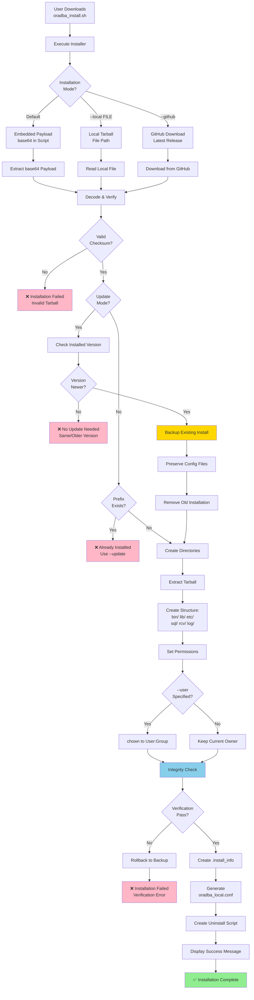

# Installation Flow

Self-extracting installer with embedded payload and integrity verification.

## Description

The installation process provides:

1. **Multiple Sources**: Embedded payload, local file, or GitHub download
2. **Integrity Verification**: SHA256 checksum validation
3. **Update Support**: Preserves configs when updating
4. **Backup & Rollback**: Automatic backup with rollback on failure
5. **Permission Handling**: Optional user/group ownership
6. **Auto-Configuration**: Generates oradba_local.conf
7. **Uninstall Script**: Creates removal script

## Installation Modes

- **Default**: Uses embedded base64-encoded tarball
- **--local FILE**: Uses local tarball file
- **--github**: Downloads latest release from GitHub

## Safety Features

- Checksum verification before extraction
- Version check to prevent downgrades
- Backup existing installation before update
- Integrity check after extraction
- Rollback on verification failure
- Uninstall script for clean removal
