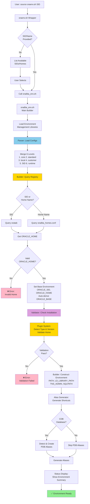

# oraenv.sh Execution Flow

Complete environment setup process from user request to active environment.

## Description

The oraenv.sh execution flow shows:

1. **User Input**: SID or Oracle Home name
2. **Wrapper**: oraenv.sh validates input
3. **Main Builder**: oradba_env.sh coordinates process
4. **Parser**: Loads and merges 6 configuration levels
5. **Registry API**: Queries oratab or oradba_homes.conf
6. **Plugin System**: Validates installation and detects type
7. **Builder**: Constructs complete environment
8. **Aliases**: Generates database and PDB shortcuts
9. **Status**: Displays environment summary

## Key Features

- Interactive or non-interactive mode
- Registry API provides unified installation access
- Plugin system handles product-specific logic
- Automatic ORACLE_BASE derivation
- PDB alias generation for multitenant databases
- Comprehensive validation before activation
