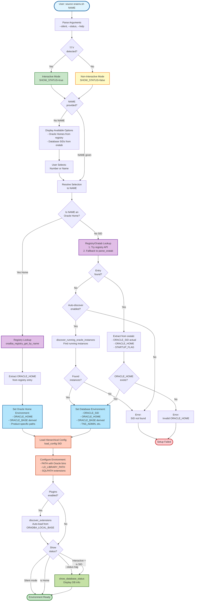

```mermaid
flowchart TD
    Start([User: source oraenv.sh NAME])
    
    Start --> ParseArgs[Parse Arguments<br/>--silent, --status, --help]
    
    ParseArgs --> DetectTTY{TTY<br/>detected?}
    
    DetectTTY -->|Yes| Interactive[Interactive Mode<br/>SHOW_STATUS=true]
    DetectTTY -->|No| NonInteractive[Non-Interactive Mode<br/>SHOW_STATUS=false]
    
    Interactive --> CheckSID
    NonInteractive --> CheckSID{NAME<br/>provided?}
    
    CheckSID -->|No NAME| PromptUser[Display Available Options<br/>- Oracle Homes from registry<br/>- Database SIDs from oratab]
    PromptUser --> UserSelect[User Selects:<br/>Number or Name]
    UserSelect --> ResolveName[Resolve Selection<br/>to NAME]
    
    CheckSID -->|NAME given| ResolveName
    
    ResolveName --> CheckType{Is NAME an<br/>Oracle Home?}
    
    CheckType -->|Yes Home| LookupRegistry[Registry Lookup<br/>oradba_registry_get_by_name]
    LookupRegistry --> GetHomePath[Extract ORACLE_HOME<br/>from registry entry]
    GetHomePath --> SetHomeEnv[Set Oracle Home Environment:<br/>- ORACLE_HOME<br/>- ORACLE_BASE derived<br/>- Product-specific paths]
    
    CheckType -->|No SID| LookupOratab[Registry/Oratab Lookup<br/>1. Try registry API<br/>2. Fallback to parse_oratab]
    
    LookupOratab --> FoundEntry{Entry<br/>found?}
    
    FoundEntry -->|No| AutoDiscover{Auto-discover<br/>enabled?}
    AutoDiscover -->|Yes| Discover[discover_running_oracle_instances<br/>Find running instances]
    Discover --> DiscoverFound{Found<br/>instances?}
    DiscoverFound -->|Yes| SetSIDEnv
    DiscoverFound -->|No| ErrorNotFound[Error:<br/>SID not found]
    
    AutoDiscover -->|No| ErrorNotFound
    
    FoundEntry -->|Yes| ExtractInfo[Extract from oratab:<br/>- ORACLE_SID actual<br/>- ORACLE_HOME<br/>- STARTUP_FLAG]
    
    ExtractInfo --> ValidateHome{ORACLE_HOME<br/>exists?}
    
    ValidateHome -->|No| ErrorInvalid[Error:<br/>Invalid ORACLE_HOME]
    ValidateHome -->|Yes| SetSIDEnv[Set Database Environment:<br/>- ORACLE_SID<br/>- ORACLE_HOME<br/>- ORACLE_BASE derived<br/>- TNS_ADMIN, etc.]
    
    SetHomeEnv --> LoadConfig
    SetSIDEnv --> LoadConfig[Load Hierarchical Config<br/>load_config SID]
    
    LoadConfig --> ConfigureEnv[Configure Environment:<br/>- PATH with Oracle bins<br/>- LD_LIBRARY_PATH<br/>- SQLPATH extensions]
    
    ConfigureEnv --> LoadPlugins{Plugins<br/>enabled?}
    
    LoadPlugins -->|Yes| DiscoverPlugins[discover_extensions<br/>Auto-load from<br/>ORADBA_LOCAL_BASE]
    DiscoverPlugins --> CheckStatus
    
    LoadPlugins -->|No| CheckStatus{Show<br/>status?}
    
    CheckStatus -->|--status flag| ShowStatus[show_database_status<br/>Display DB info]
    CheckStatus -->|Interactive +<br/>is SID| ShowStatus
    CheckStatus -->|Silent mode| Done
    CheckStatus -->|is Home| Done
    
    ShowStatus --> Done([Environment Ready])
    
    ErrorNotFound --> Failed([Setup Failed])
    ErrorInvalid --> Failed
    
    style Start fill:#e1f5ff,stroke:#01579b,stroke-width:3px
    style Interactive fill:#c8e6c9,stroke:#2e7d32,stroke-width:2px
    style NonInteractive fill:#fff9c4,stroke:#f57f17,stroke-width:2px
    
    style LookupRegistry fill:#e1bee7,stroke:#6a1b9a,stroke-width:2px
    style LookupOratab fill:#e1bee7,stroke:#6a1b9a,stroke-width:2px
    
    style SetHomeEnv fill:#b3e5fc,stroke:#01579b,stroke-width:2px
    style SetSIDEnv fill:#b3e5fc,stroke:#01579b,stroke-width:2px
    
    style LoadConfig fill:#ffccbc,stroke:#bf360c,stroke-width:2px
    style ConfigureEnv fill:#ffccbc,stroke:#bf360c,stroke-width:2px
    
    style ShowStatus fill:#c5e1a5,stroke:#33691e,stroke-width:2px
    style Done fill:#c8e6c9,stroke:#2e7d32,stroke-width:3px
    style Failed fill:#ffcdd2,stroke:#c62828,stroke-width:3px
```
