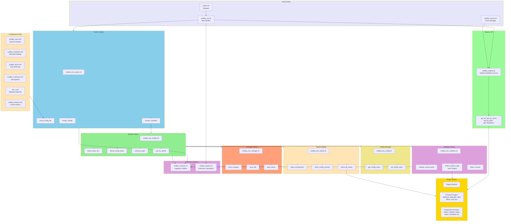

# Environment Management Library Architecture

Modular library system for parsing, building, and validating Oracle environments.

## Description

The Environment Management Library architecture provides:

1. **Registry API**: Unified interface for Oracle installation metadata
2. **Plugin System**: Product-specific logic with 11-function interface
3. **Parser Library**: Loads and merges 6 configuration levels
4. **Builder Library**: Constructs Oracle environment variables
5. **Validator Library**: Checks Oracle Home validity using plugins
6. **Config Manager**: Runtime configuration access
7. **Status Display**: Environment summary with plugin integration
8. **Change Tracker**: Detects configuration changes and auto-reloads

## Key Features

- **Modular Design**: Each library has specific responsibility
- **Plugin Integration**: Uses plugins for product-specific operations
- **Registry API**: Single source of truth for installations
- **Hierarchical Config**: 6-level configuration with override
- **Testable**: Each library independently tested
- **Extensible**: Easy to add new product types via plugins
