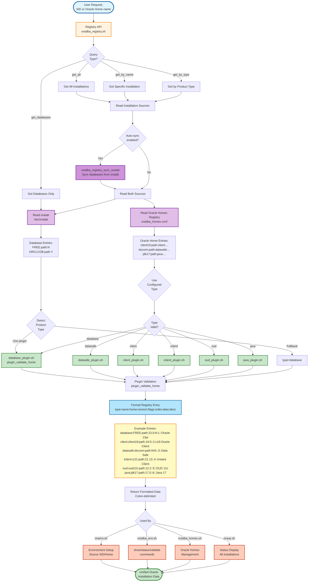

# Registry API Data Flow

This diagram shows how the Registry API (v0.19.0+) provides unified access to Oracle installation metadata from both oratab and oradba_homes.conf, with integrated plugin system for product type detection.

