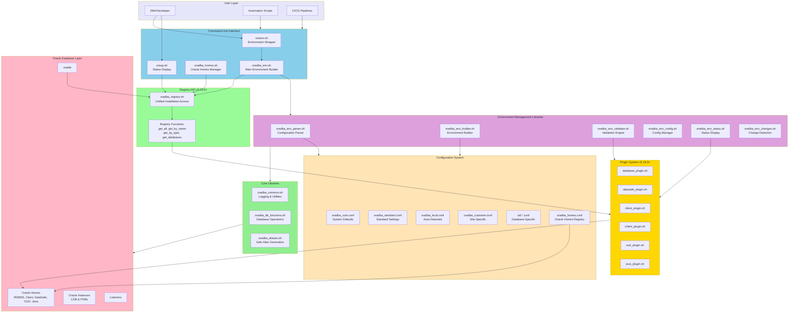

# OraDBA System Architecture

Complete layered architecture showing Registry API, Plugin System, Environment Management Libraries, and Oracle integration.

## Description

The OraDBA system architecture consists of:

1. **User Layer**: DBAs, automation scripts, CI/CD pipelines
2. **CLI Layer**: Main entry points (oraenv.sh, oradba_env.sh, oradba_homes.sh, oraup.sh)
3. **Registry API** (v0.19.0+): Unified interface for Oracle installation metadata
4. **Plugin System** (v0.19.0+): 6 product-specific plugins with 8-function interface
5. **Environment Management Libraries**: Parser, Builder, Validator, Config, Status, Changes
6. **Core Libraries**: Common utilities, database operations, alias management
7. **Configuration System**: 6-level hierarchical configuration
8. **Oracle Layer**: Integration with Oracle Homes, instances, listeners, oratab

## Key Components

- **Registry API**: Single source of truth for Oracle installations (oratab + oradba_homes.conf)
- **Plugin System**: Product-specific logic for database, datasafe, client, iclient, oud, java
- **Environment Libraries**: Modular, testable components for environment setup
- **Hierarchical Config**: 6 levels from core defaults to runtime overrides
