# OraDBA Mermaid Diagrams

This file contains Mermaid diagram definitions that can be imported into Excalidraw or rendered directly in markdown viewers.

## 1. CI/CD Pipeline

Shows the GitHub Actions workflows with smart test selection for CI, full test suite for releases, and documentation deployment.

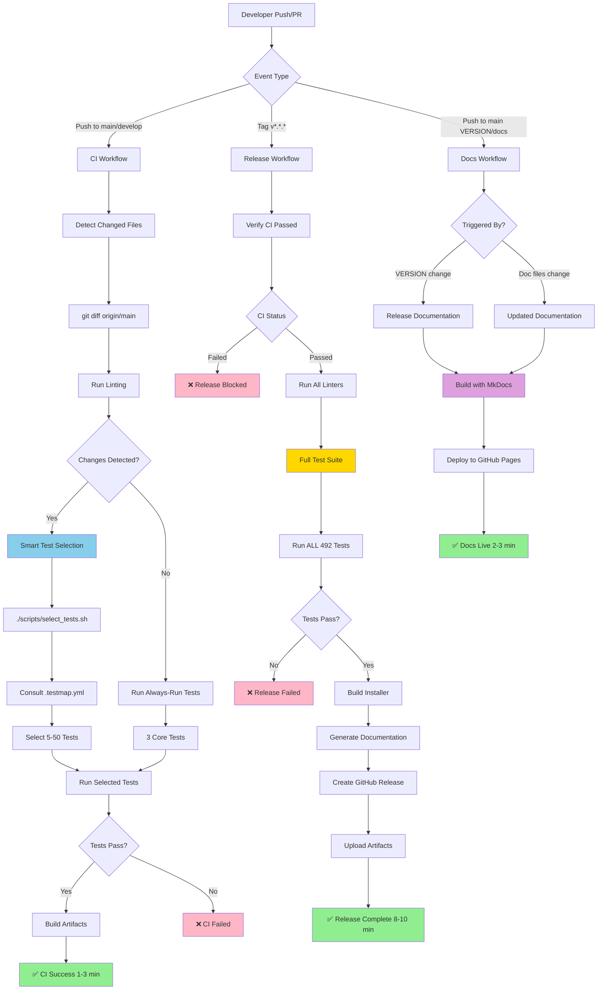

## 2. Test Strategy

Shows the smart test selection architecture with configuration-driven test mapping.

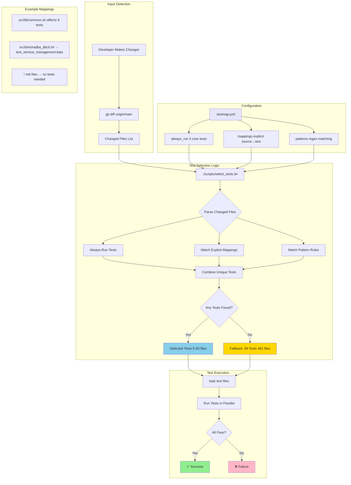

## 3. Development Workflow

Shows the developer's decision tree with smart test selection for fast iteration.

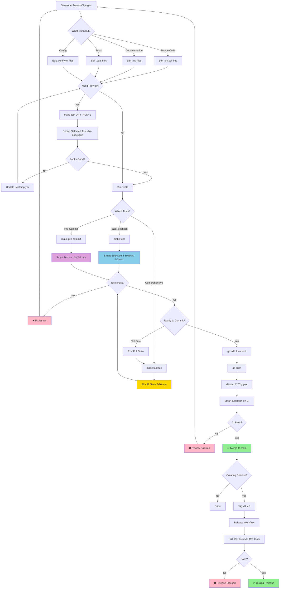

## 4. Performance Comparison

Visual representation of time savings with smart test selection.

```mermaid
gantt
    title Test Execution Time Comparison
    dateFormat X
    axisFormat %s
    
    section Full Suite
    All 492 Tests (8 min)    :done, full1, 0, 480
    
    section Smart Selection
    Typical Change (1 min)   :done, smart1, 0, 60
    Library Change (2 min)   :done, smart2, 0, 120
    Doc Only (30 sec)        :done, smart3, 0, 30
    
    section Time Saved
    7 minutes saved          :crit, save1, 60, 420
```

## 5. Test Selection Decision Tree

Simplified view of how tests are selected.

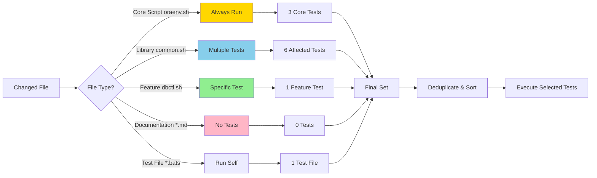

## Usage Notes

### Importing to Excalidraw

1. Copy the Mermaid code block for your desired diagram
2. In Excalidraw, use "Insert" → "Mermaid to Excalidraw"
3. Paste the Mermaid code
4. Adjust styling, colors, and layout as needed
5. Export as PNG to `doc/images/`

### Rendering in GitHub

These diagrams will render automatically in GitHub markdown viewers.

### Updating Diagrams

When the smart test selection logic changes:

1. Update the relevant Mermaid diagram here
2. Regenerate the Excalidraw version
3. Export new PNG files
4. Commit all three formats (Mermaid, .excalidraw, .png)

## 6. Architecture System

Shows the OraDBA system architecture with its layered components.

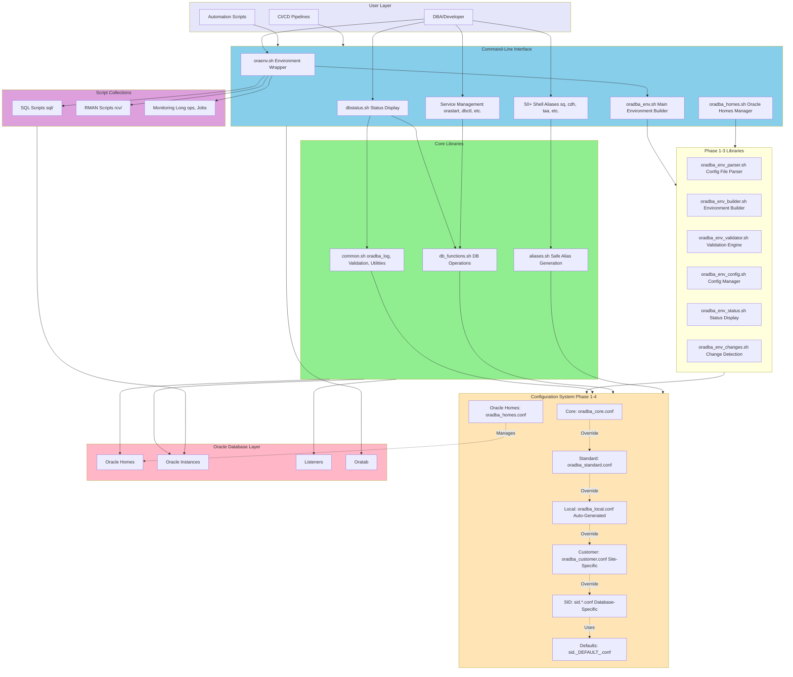

## 7. oraenv.sh Execution Flow

Shows the complete environment setup process.

```mermaid
flowchart TD
    A[User: source oraenv.sh SID] --> B[oraenv.sh Wrapper Script]
    
    B --> C{SID Provided?}
    
    C -->|No| D[List Available SIDs/Homes]
    D --> E[User Selects SID/Home]
    E --> F[Call oradba_env.sh]
    
    C -->|Yes| F
    
    F --> G[oradba_env.sh Main Builder]
    G --> H[Load Phase 1-3 Libraries]
    
    H --> I[oradba_env_parser.sh]
    I --> J[Parse Configuration Files:<br/>1. oradba_core.conf<br/>2. oradba_standard.conf<br/>3. oradba_local.conf<br/>4. oradba_customer.conf<br/>5. sid.SID.conf sid._DEFAULT_.conf]
    
    J --> K[oradba_env_builder.sh]
    K --> L{SID or Oracle Home?}
    
    L -->|SID| M[Query oratab for ORACLE_HOME]
    L -->|Home Name| N[Query oradba_homes.conf]
    
    M --> O[Resolve ORACLE_HOME path]
    N --> O
    
    O --> P{ORACLE_HOME Valid?}
    P -->|No| Q[❌ Error: Invalid ORACLE_HOME]
    P -->|Yes| R[Set Base Environment:<br/>ORACLE_SID, ORACLE_HOME<br/>ORACLE_BASE auto-derived]
    
    R --> S[oradba_env_validator.sh]
    S --> T[Validate Configuration:<br/>- Check ORACLE_HOME exists<br/>- Verify binaries present<br/>- Detect product type<br/>- Detect version]
    
    T --> U{Validation Pass?}
    U -->|No| V[❌ Error: Validation failed]
    U -->|Yes| W[Build Environment:<br/>PATH, LD_LIBRARY_PATH<br/>TNS_ADMIN, NLS_LANG<br/>SQLPATH, ORACLE_DOC_PATH]
    
    W --> X{Coexistence Mode?}
    X -->|Yes BasEnv| Y[Enable safe_alias mode]
    X -->|No| Z[Standard alias mode]
    
    Y --> AA[Generate Aliases]
    Z --> AA
    
    AA --> AB{CDB Database?}
    AB -->|Yes| AC[Detect PDBs]
    AB -->|No| AD[Skip PDB aliases]
    
    AC --> AE[Generate PDB Aliases]
    AE --> AF[Generate Standard Aliases]
    AD --> AF
    
    AF --> AG[Source aliases.sh]
    AG --> AH[oradba_env_status.sh]
    AH --> AI[Display Environment Summary:<br/>- ORACLE_SID / Home<br/>- Version & Product Type<br/>- Key Paths<br/>- Loaded Configs]
    
    AI --> AJ[✅ Environment Ready]
    
    style AJ fill:#90EE90
    style Q fill:#FFB6C6
    style V fill:#FFB6C6
    style I fill:#87CEEB
    style K fill:#FFD700
    style S fill:#DDA0DD
```

## 8. Configuration Hierarchy

Shows the 5-level configuration override system.

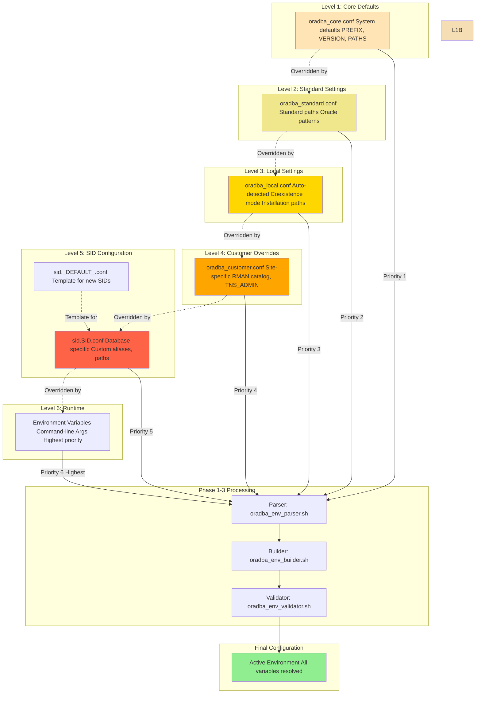

## 9. Configuration Loading Sequence

Shows the complete configuration loading and environment setup sequence.

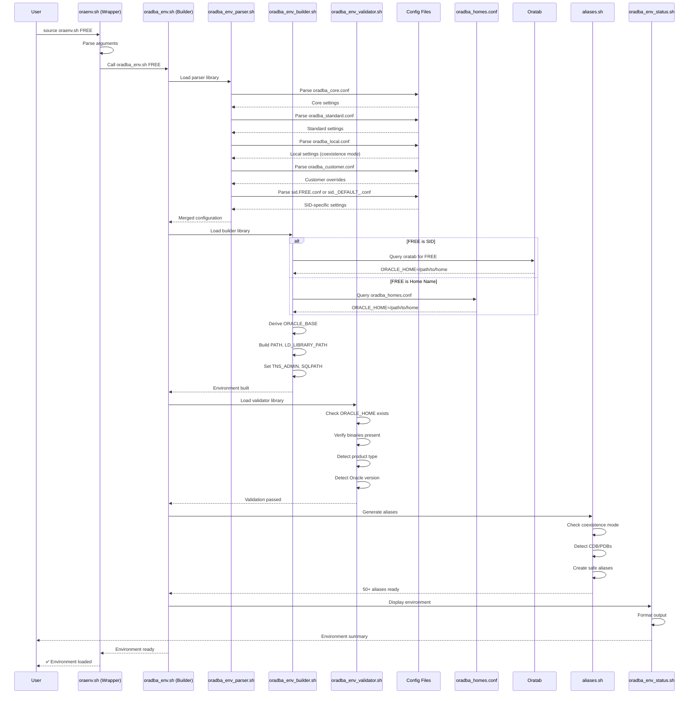

## 10. Installation Flow

Shows the self-extracting installer process.

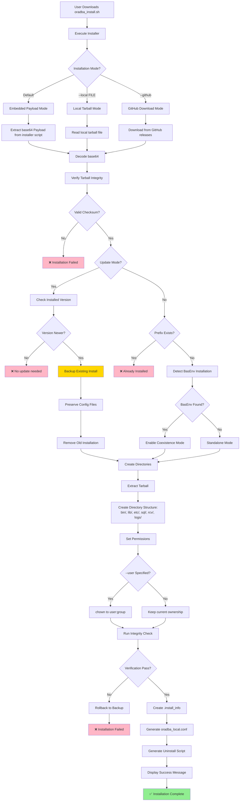

## 11. Alias Generation Flow

Shows how shell aliases are dynamically generated based on database type.

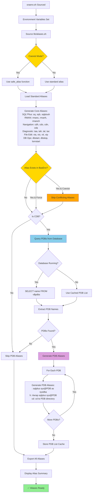

## 12. SID Config Auto-Creation Flow (v0.14.0)

Shows the automatic creation of SID-specific configuration files from templates.

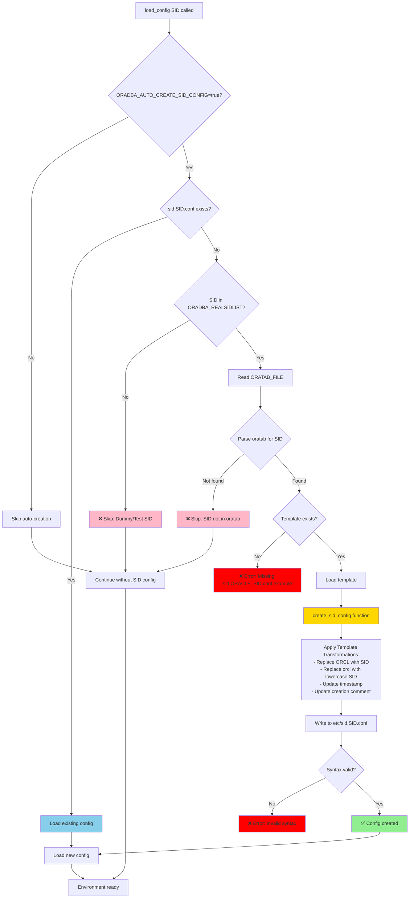

## 13. Phase 1-3 Library Architecture (v0.19.0-v0.21.0)

Shows the new library-based configuration system introduced in Phase 1-3.

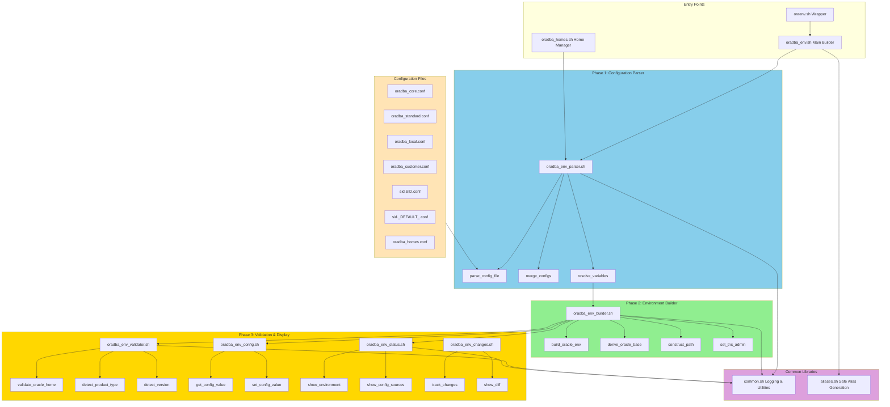

## Diagram Sources

- **CI/CD Pipeline**: Shows GitHub Actions workflows with smart vs full test selection and documentation deployment
- **Test Strategy**: Architecture of smart test selection system with .testmap.yml
- **Development Workflow**: Developer decision tree for testing and releasing
- **Performance Comparison**: Visual time savings comparison
- **Test Selection Decision**: Simplified logic for test selection
- **Architecture System**: OraDBA layered system architecture with Phase 1-3 libraries and Phase 1-4 configuration system
- **oraenv.sh Flow**: Complete environment setup with Phase 1-3 library integration and oradba_env.sh wrapper
- **Configuration Hierarchy**: 6-level configuration with Phase 1-3 processing (parser, builder, validator)
- **Configuration Sequence**: Library-based configuration loading with oradba_env_parser.sh, builder, and validator
- **Installation Flow**: Self-extracting installer with BasEnv detection and oradba_local.conf generation
- **Alias Generation**: Dynamic alias generation with safe_alias() coexistence mode
- **SID Config Auto-Creation**: Automatic config generation from sid._DEFAULT_.conf template (v0.14.0)
- **Phase 1-3 Library Architecture**: Detailed view of library relationships and function calls (v0.19.0-v0.21.0)

## Version History

- **v0.22.0**: Updated diagrams to reflect Phase 1-4 configuration system
  - Added Phase 1-3 library components to Architecture diagram
  - Updated Configuration Hierarchy to show 6 levels with Phase 1-3 processing
  - Revised oraenv.sh flow to show wrapper → oradba_env.sh → libraries pattern
  - Updated Configuration Sequence to show library-based loading
  - Added new Phase 1-3 Library Architecture diagram
- **v0.14.0**: Added SID config auto-creation diagrams
- **v0.13.x**: Initial CI/CD and test selection diagrams
