# OraDBA Mermaid Diagrams

This file contains Mermaid diagram definitions that can be imported into Excalidraw or rendered directly in markdown viewers.

## 1. CI/CD Pipeline

Shows the GitHub Actions workflows with smart test selection for CI and full test suite for releases.

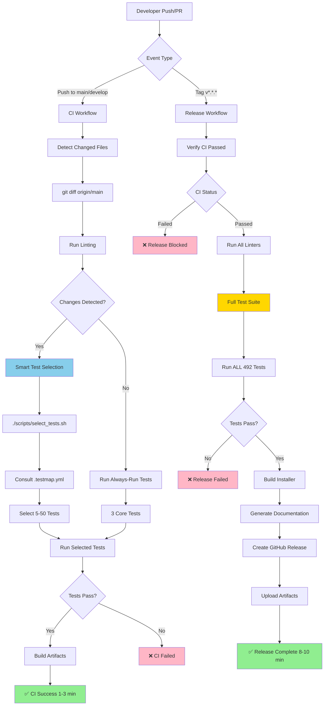

## 2. Test Strategy

Shows the smart test selection architecture with configuration-driven test mapping.

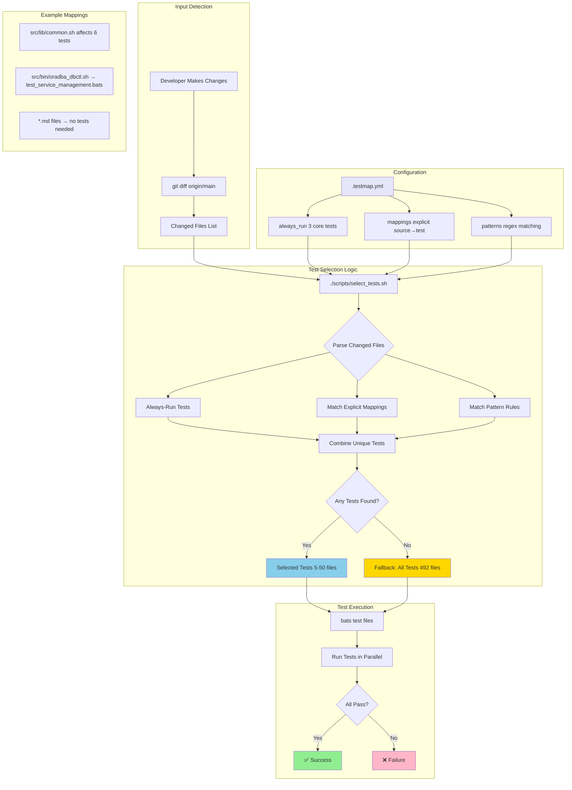

## 3. Development Workflow

Shows the developer's decision tree with smart test selection for fast iteration.

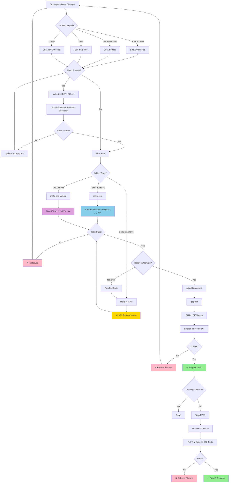

## 4. Performance Comparison

Visual representation of time savings with smart test selection.

```mermaid
gantt
    title Test Execution Time Comparison
    dateFormat X
    axisFormat %s
    
    section Full Suite
    All 492 Tests (8 min)    :done, full1, 0, 480
    
    section Smart Selection
    Typical Change (1 min)   :done, smart1, 0, 60
    Library Change (2 min)   :done, smart2, 0, 120
    Doc Only (30 sec)        :done, smart3, 0, 30
    
    section Time Saved
    7 minutes saved          :crit, save1, 60, 420
```

## 5. Test Selection Decision Tree

Simplified view of how tests are selected.

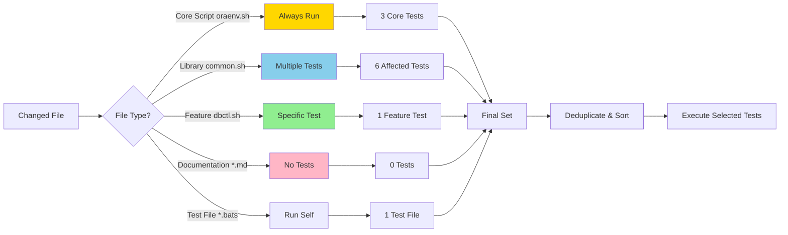

## Usage Notes

### Importing to Excalidraw

1. Copy the Mermaid code block for your desired diagram
2. In Excalidraw, use "Insert" → "Mermaid to Excalidraw"
3. Paste the Mermaid code
4. Adjust styling, colors, and layout as needed
5. Export as PNG to `doc/images/`

### Rendering in GitHub

These diagrams will render automatically in GitHub markdown viewers.

### Updating Diagrams

When the smart test selection logic changes:

1. Update the relevant Mermaid diagram here
2. Regenerate the Excalidraw version
3. Export new PNG files
4. Commit all three formats (Mermaid, .excalidraw, .png)

## 6. Architecture System

Shows the OraDBA system architecture with its layered components.

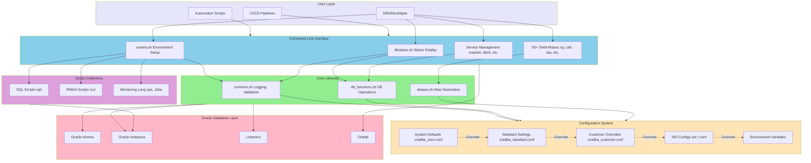

## 7. oraenv.sh Execution Flow

Shows the complete environment setup process.

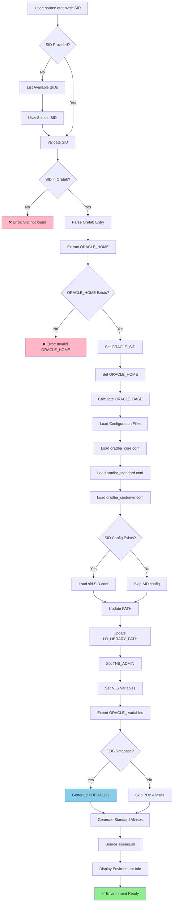

## 8. Configuration Hierarchy

Shows the 5-level configuration override system.

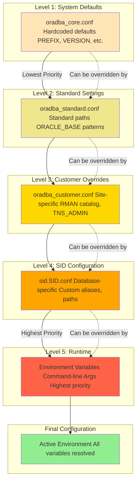

## 9. Configuration Loading Sequence

Shows the complete configuration loading and environment setup sequence.

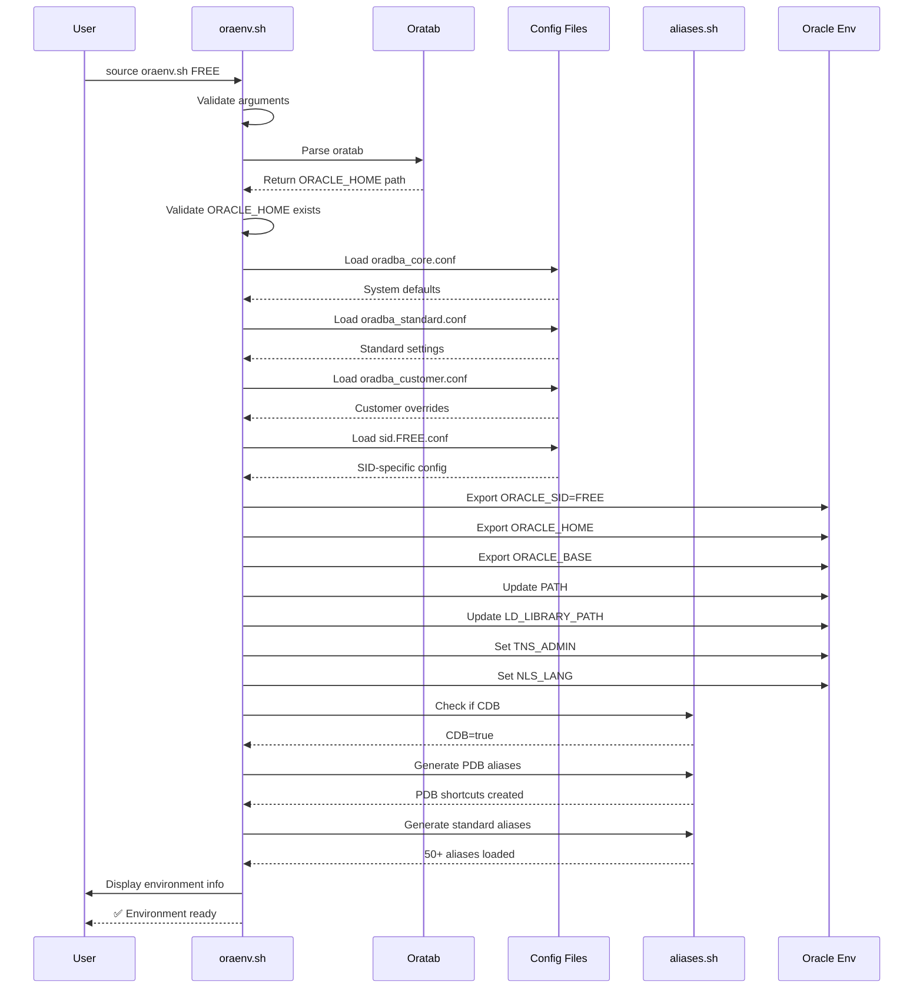

## 10. Installation Flow

Shows the self-extracting installer process.

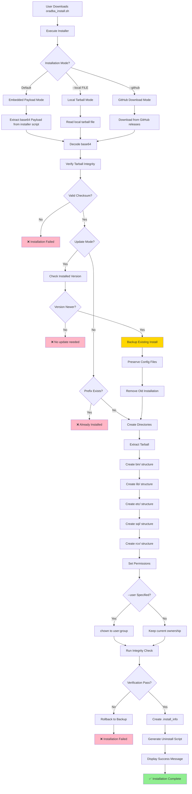

## 11. Alias Generation Flow

Shows how shell aliases are dynamically generated based on database type.

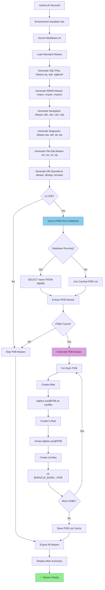

## Diagram Sources

- **CI/CD Pipeline**: Shows GitHub Actions workflows with smart vs full test selection
- **Test Strategy**: Architecture of smart test selection system with .testmap.yml
- **Development Workflow**: Developer decision tree for testing and releasing
- **Performance Comparison**: Visual time savings comparison
- **Test Selection Decision**: Simplified logic for test selection
- **Architecture System**: OraDBA layered system architecture
- **oraenv.sh Flow**: Complete environment setup process
- **Configuration Hierarchy**: 5-level configuration override system
- **Configuration Sequence**: Sequence diagram of config loading
- **Installation Flow**: Self-extracting installer process
- **Alias Generation**: Dynamic alias generation with PDB support
