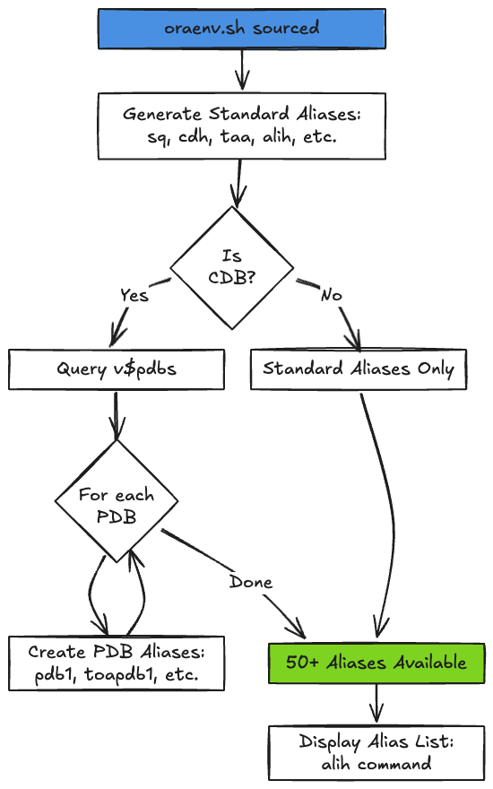

# Alias Reference

**Purpose:** Complete reference for OraDBA's 50+ shell aliases - the canonical location for all alias documentation.

**Audience:** All users who want to streamline database administration tasks.

## Introduction

OraDBA provides 50+ shell aliases to streamline Oracle database administration
tasks. Aliases are automatically loaded when you set your Oracle environment
using `oraenv.sh`, giving you convenient shortcuts for common operations.



The alias system automatically detects if your database is a CDB and generates
PDB-specific aliases accordingly.

## Alias Categories

Aliases are organized into these categories:

- **SQL*Plus & RMAN** - Database connection shortcuts
- **Directory Navigation** - Quick navigation to Oracle directories
- **Database Operations** - Status, listener, process management
- **File Editing** - Edit configuration files
- **Diagnostic** - Log file access and viewing
- **PDB Management** - Pluggable database shortcuts (auto-generated)

## SQL*Plus Aliases

Quick access to SQL*Plus with various options:

| Alias        | Description                          | Command                       |
|--------------|--------------------------------------|-------------------------------|
| `sq`         | SQL*Plus as SYSDBA (basic)           | `sqlplus / as sysdba`         |
| `sqh`        | SQL*Plus as SYSDBA (with rlwrap)     | `rlwrap sqlplus / as sysdba`  |
| `sqlplush`   | SQL*Plus /nolog (with rlwrap)        | `rlwrap sqlplus /nolog`       |
| `sqoh`       | SQL*Plus as SYSOPER (with rlwrap)    | `rlwrap sqlplus / as sysoper` |
| `sessionsql` | SQL*Plus with dynamic terminal width | `sessionsql.sh`               |

**Usage Examples:**

```bash
# Connect as SYSDBA
sq

# Connect with command history (rlwrap)
sqh

# Connect with proper terminal formatting
sessionsql

# Connect as SYSOPER
sqoh
```

**rlwrap Features:**

- Command history (up/down arrows)
- Tab completion with SQL keywords
- Line editing capabilities
- Password filtering (when `ORADBA_RLWRAP_FILTER=true`)

**sessionsql** automatically detects your terminal width and configures SQL*Plus LINESIZE and PAGESIZE for optimal display.

## RMAN Aliases

Recovery Manager connection shortcuts:

| Alias    | Description                       | Command                          |
|----------|-----------------------------------|----------------------------------|
| `rmanc`  | RMAN with catalog/fallback        | `rman target / [catalog ...]`    |
| `rmanh`  | RMAN with rlwrap (manual connect) | `rlwrap rman`                    |
| `rmanch` | RMAN with rlwrap + catalog        | `rlwrap rman target / [catalog]` |

**Note:** The `rman` command itself is not aliased to avoid conflicts with Oracle's native binary.

**Usage Examples:**

```bash
# Direct RMAN with catalog or fallback to target /
rmanc

# RMAN with rlwrap - connect manually at prompt
rmanh
RMAN> connect target /

# RMAN with rlwrap and catalog (uses ORADBA_RMAN_CATALOG if configured)
rmanch

# Standard Oracle RMAN command (not aliased)
rman target /
```

**Catalog Configuration:**
Configure `ORADBA_RMAN_CATALOG` in `oradba_customer.conf` or `sid.<SID>.conf`:

```bash
# Global catalog (in oradba_customer.conf)
ORADBA_RMAN_CATALOG="rman_user/password@catdb"

# Per-database catalog (in sid.PRODDB.conf)
ORADBA_RMAN_CATALOG="rman_user@prodcat"
```

**Connection Flexibility:**

```bash
# Use rmanh for flexible connections
rmanh
RMAN> connect target /
RMAN> connect catalog rman@catdb

# Or specify at command line
rmanh target / catalog rman@catdb
```

## Directory Navigation Aliases

Quick navigation to Oracle and OraDBA directories:

### Oracle Directories

| Alias  | Description               | Target Directory     |
|--------|---------------------------|----------------------|
| `cdob` | Change to ORACLE_BASE     | `$ORACLE_BASE`       |
| `cdh`  | Change to ORACLE_HOME     | `$ORACLE_HOME`       |
| `cdbn` | Change to bin directory   | `$ORACLE_HOME/bin`   |
| `cdn`  | Change to network parent  | `$TNS_ADMIN/..`      |
| `cdt`  | Change to TNS_ADMIN       | `$TNS_ADMIN`         |
| `cdl`  | Change to local directory | `$ORADBA_LOCAL_BASE` |

### OraDBA Directories

| Alias   | Description              | Target Directory |
|---------|--------------------------|------------------|
| `cdb`   | Change to OraDBA base    | `$ORADBA_PREFIX` |
| `etc`   | Change to OraDBA etc     | `$ORADBA_ETC`    |
| `cde`   | Change to OraDBA etc     | `$ORADBA_ETC`    |
| `log`   | Change to OraDBA log     | `$ORADBA_LOG`    |
| `cdlog` | Change to OraDBA log     | `$ORADBA_LOG`    |
| `cdtmp` | Change to temp directory | `$ORADBA_TMP`    |

### SID-Specific Directories (Dynamic)

These aliases are generated dynamically based on current `ORACLE_SID`:

| Alias  | Description                      | Target Directory                   |
|--------|----------------------------------|------------------------------------|
| `cda`  | Change to admin directory        | `$ORACLE_BASE/admin/$ORACLE_SID`   |
| `cdc`  | Change to control file directory | `$ORACLE_BASE/oradata/$ORACLE_SID` |
| `cdd`  | Change to diagnostic dest        | `$ORADBA_ORA_DIAG_SID`             |
| `cddt` | Change to trace directory        | `diagnostic_dest/trace`            |
| `cdda` | Change to alert directory        | `diagnostic_dest/alert`            |

**Usage Examples:**

```bash
# Navigate to ORACLE_HOME
cdh
pwd  # /u01/app/oracle/product/19.0.0/dbhome_1

# Navigate to database admin directory
cda
pwd  # /u01/app/oracle/admin/FREE

# Navigate to trace directory
cddt
pwd  # /u01/app/oracle/diag/rdbms/free/FREE/trace

# Navigate to OraDBA configuration
etc
pwd  # /opt/oradba/etc
```

### Convenience Variables

Short variables for use in commands or scripts:

| Variable | Description          | Value                   |
|----------|----------------------|-------------------------|
| `$cdh`   | ORACLE_HOME path     | `$ORACLE_HOME`          |
| `$cdob`  | ORACLE_BASE path     | `$ORACLE_BASE`          |
| `$cda`   | Admin directory path | `$ORADBA_ORA_ADMIN_SID` |
| `$cdd`   | Diagnostic dest path | `$ORADBA_ORA_DIAG_SID`  |
| `$etc`   | OraDBA etc path      | `$ORADBA_ETC`           |
| `$log`   | OraDBA log path      | `$ORADBA_LOG`           |

**Usage Examples:**

```bash
# Navigate using variables
cd $cdh/bin
cd $cda/scripts

# Use in commands
ls -l $etc/*.conf
vi $cda/pfile/init${ORACLE_SID}.ora

# Copy files
cp myfile.sql $cda/scripts/
```

## Database Operations Aliases

Manage databases, listeners, and view status:

### Status and Monitoring

| Alias         | Description                     | Command               |
|---------------|---------------------------------|-----------------------|
| `oraup` / `u` | Oracle environment overview     | `oraup.sh`            |
| `sta`         | Database status                 | `dbstatus.sh`         |
| `pmon`        | Show running database processes | `ps -ef \| grep pmon` |

**Usage Examples:**

```bash
# Show all Oracle databases and their status
oraup
# or
u

# Show detailed status for current ORACLE_SID
sta

# Check running Oracle instances
pmon
```

**oraup.sh** displays:

- All databases from oratab
- Database status (OPEN, MOUNTED, NOMOUNT, DOWN)
- Listener status
- Oracle Home paths
- Startup flags

### Listener Commands

| Alias    | Description                    | Command          |
|----------|--------------------------------|------------------|
| `lsnr`   | Listener control               | `lsnrctl`        |
| `lsnrh`  | Listener control (with rlwrap) | `rlwrap lsnrctl` |
| `lstat`  | Listener status                | `lsnrctl status` |
| `lstart` | Start listener                 | `lsnrctl start`  |
| `lstop`  | Stop listener                  | `lsnrctl stop`   |

**Usage Examples:**

```bash
# Check listener status
lstat

# Start listener
lstart

# Stop listener
lstop

# Interactive listener control with command history
lsnrh
```

### Configuration Viewing

| Alias    | Description          | Command                       |
|----------|----------------------|-------------------------------|
| `oratab` | Display oratab file  | `cat /etc/oratab`             |
| `tns`    | Display tnsnames.ora | `cat $TNS_ADMIN/tnsnames.ora` |

## File Editing Aliases

Quick access to edit configuration files:

### Oracle Configuration Files

| Alias    | Description       | Target File               |
|----------|-------------------|---------------------------|
| `vio`    | Edit oratab       | `/etc/oratab`             |
| `vit`    | Edit tnsnames.ora | `$TNS_ADMIN/tnsnames.ora` |
| `vil`    | Edit listener.ora | `$TNS_ADMIN/listener.ora` |
| `visql`  | Edit sqlnet.ora   | `$TNS_ADMIN/sqlnet.ora`   |
| `vildap` | Edit ldap.ora     | `$TNS_ADMIN/ldap.ora`     |

### OraDBA Configuration Files

| Alias | Description          | Target File                        |
|-------|----------------------|------------------------------------|
| `vis` | Edit standard config | `$ORADBA_ETC/oradba_standard.conf` |
| `vic` | Edit customer config | `$ORADBA_ETC/oradba_customer.conf` |
| `vii` | Edit SID config      | `$ORADBA_ETC/sid.$ORACLE_SID.conf` |

**Usage Examples:**

```bash
# Edit tnsnames.ora
vit

# Edit your customer configuration
vic

# Edit SID-specific configuration
vii
```

## Diagnostic Aliases

Access and monitor Oracle diagnostic files:

### Alert Log Access (Dynamic)

| Alias | Description             | Command                              |
|-------|-------------------------|--------------------------------------|
| `taa` | Tail alert log (follow) | `tail -f -n 50 $ORADBA_SID_ALERTLOG` |
| `vaa` | View alert log (less)   | `less $ORADBA_SID_ALERTLOG`          |
| `via` | Edit alert log (vi)     | `vi $ORADBA_SID_ALERTLOG`            |

**Usage Examples:**

```bash
# Watch alert log in real-time
taa

# Browse alert log
vaa

# Search alert log
via
/ORA-
```

**Note:** These aliases automatically point to the standard text alert log (`alert_$ORACLE_SID.log`), not the XML version.

### Diagnostic Tools

| Alias    | Description       | Command        |
|----------|-------------------|----------------|
| `adrcih` | ADRCI with rlwrap | `rlwrap adrci` |

**Usage Example:**

```bash
# Interactive ADRCI with command history
adrcih
ADRCI> show homes
ADRCI> set home diag/rdbms/free/FREE
ADRCI> show alert -tail 50
```

## PDB Aliases (Auto-Generated)

For Container Databases (CDB), OraDBA automatically generates aliases for each Pluggable Database (PDB).

Each PDB gets two aliases:

- Simple form (e.g., `pdb1`) - Connect directly to PDB1
- Prefixed form (e.g., `pdbpdb1`) - Same with 'pdb' prefix for clarity

**Quick Example:**

```bash
# List available PDBs
echo $ORADBA_PDBLIST

# Connect to PDB1
pdb1
SQL> show con_name
```

For complete PDB alias documentation, configuration options, troubleshooting, and advanced usage, see [PDB Alias Reference](07-pdb-aliases.md).

## Help and Information Aliases

| Alias     | Description         | Command                                 |
|-----------|---------------------|-----------------------------------------|
| `alih`    | Display alias help  | `cat $ORADBA_PREFIX/doc/alias_help.txt` |
| `alig`    | Search aliases      | `alias \| grep -i`                      |
| `version` | Show OraDBA version | `oradba_version.sh -i`                  |

**Usage Examples:**

```bash
# Quick alias reference
alih

# Find aliases containing "sql"
alig sql

# Show OraDBA version and installation info
version
```

## General Utility Aliases

Additional convenience aliases:

| Alias       | Description             | Command                              |
|-------------|-------------------------|--------------------------------------|
| `c`         | Clear screen            | `clear`                              |
| `m`         | More                    | `more`                               |
| `l`         | List all (long format)  | `ls -al`                             |
| `ll`        | List all (detailed)     | `ls -alb`                            |
| `lr`        | List reverse time order | `ls -ltr`                            |
| `lsl`       | List recent 20 files    | `ls -lrt \| tail -n 20`              |
| `psg`       | Search processes        | `ps -ef \| grep`                     |
| `sqa`       | Show SQLPATH            | `show_sqlpath`                       |
| `pth`       | Show PATH entries       | `show_path`                          |
| `save_cron` | Backup crontab          | `crontab -l > ~/crontab.txt.$(date)` |

## rlwrap Integration

OraDBA automatically uses [rlwrap](https://github.com/hanslub42/rlwrap) when available, providing:

- **Command history** - Navigate with up/down arrows
- **Tab completion** - Tool-specific keywords
- **Line editing** - Emacs/vi editing modes
- **Password filtering** - Hide passwords from history (optional)

### Completion Files

OraDBA includes completion files for enhanced tab completion:

- **SQL*Plus** (`rlwrap_sqlplus_completions`) - SQL commands, SET/SHOW parameters, views, privileges
- **RMAN** (`rlwrap_rman_completions`) - Backup/restore commands, keywords
- **lsnrctl** (`rlwrap_lsnrctl_completions`) - Listener commands, parameters
- **ADRCI** (`rlwrap_adrci_completions`) - Diagnostic commands

### Installing rlwrap

**RHEL/Oracle Linux/CentOS:**

```bash
sudo yum install rlwrap
```

**Ubuntu/Debian:**

```bash
sudo apt-get install rlwrap
```

**macOS:**

```bash
brew install rlwrap
```

### Password Filtering

Enable password filtering to hide passwords from command history:

```bash
# In oradba_customer.conf
export ORADBA_RLWRAP_FILTER="true"
```

**Requirements:**

- rlwrap installed
- Perl with RlwrapFilter module

**What gets filtered:**

- Password prompts (SQL*Plus, RMAN)
- CONNECT commands with passwords
- CREATE/ALTER USER statements

See [rlwrap Filter Configuration](11-rlwrap.md) for details.

## Custom Aliases

Add your own aliases in `oradba_customer.conf`:

```bash
# Custom SQL*Plus connections
alias sqdev='sqlplus user/pass@devdb'
alias sqtest='sqlplus user/pass@testdb'

# Custom directory shortcuts
alias cdarch='cd /backup/oracle/archive'
alias cdbkp='cd /backup/oracle'

# Custom RMAN shortcuts
alias fullbackup='rman target / cmdfile=${ORADBA_PREFIX}/rcv/backup_full.rman'

# Custom functions
backup_config() {
    local backup_dir="/backup/config/$(date +%Y%m%d)"
    mkdir -p "$backup_dir"
    cp ${ORADBA_ETC}/*.conf "$backup_dir/"
    echo "Configuration backed up to: $backup_dir"
}
```

## Dynamic Alias Generation

### How It Works

When you set your Oracle environment with `oraenv.sh`, the `generate_sid_aliases()` function automatically:

1. Queries database for `diagnostic_dest` parameter
2. Generates SID-specific aliases (taa, vaa, via, cda, cdd, cddt, cdda)
3. Creates directory navigation aliases based on actual paths
4. Falls back to convention-based paths if database is unavailable

### Example

```bash
$ source oraenv.sh FREE
Setting environment for ORACLE_SID: FREE

$ type taa
taa is aliased to `if [ -f "${ORADBA_SID_ALERTLOG}" ]; then tail -f -n 50 ${ORADBA_SID_ALERTLOG}; ...'

$ echo $ORADBA_SID_ALERTLOG
/u01/app/oracle/diag/rdbms/free/FREE/trace/alert_FREE.log

$ cddt
$ pwd
/u01/app/oracle/diag/rdbms/free/FREE/trace
```

## Configuration

### Enable/Disable Aliases

Control alias loading in `oradba_core.conf`:

```bash
# Enable (default)
ORADBA_LOAD_ALIASES="true"

# Disable all aliases
ORADBA_LOAD_ALIASES="false"
```

### Disable Specific Aliases

Override specific aliases in `oradba_customer.conf`:

```bash
# Disable an alias by unaliasing it
unalias sq

# Or redefine it
alias sq='echo "Use sqh instead"'
```

## Troubleshooting

### Aliases Not Loading

**Check if aliases are enabled:**

```bash
echo $ORADBA_LOAD_ALIASES
# Should show: true
```

**Enable debug mode:**

```bash
DEBUG=1 source oraenv.sh FREE
```

**Verify aliases.sh exists:**

```bash
ls -l ${ORADBA_PREFIX}/lib/aliases.sh
```

### Dynamic Aliases Not Generated

**Check ORACLE_SID is set:**

```bash
echo $ORACLE_SID
# Should show your SID
```

**Check database connectivity:**

```bash
sqlplus -S / as sysdba <<< "SELECT instance_name FROM v\$instance;"
```

**Check diagnostic_dest parameter:**

```bash
sqlplus -S / as sysdba <<< "SHOW PARAMETER diagnostic_dest"
```

### rlwrap Not Working

**Check if rlwrap is installed:**

```bash
which rlwrap
# Should show: /usr/bin/rlwrap or similar
```

**Verify rlwrap configuration:**

```bash
echo $RLWRAP_COMMAND
echo $RLWRAP_OPTS
```

**Test rlwrap directly:**

```bash
rlwrap -i -c sqlplus / as sysdba
```

**Install if missing:**

```bash
# RHEL/OL
sudo yum install rlwrap

# Ubuntu/Debian
sudo apt-get install rlwrap

# macOS
brew install rlwrap
```

## Complete Alias Reference

For a quick reference card, use:

```bash
alih
```

This displays a condensed list of the most commonly used aliases.

## Best Practices

1. **Learn the essentials first** - Focus on `sq`, `cdh`, `taa`, `oraup`
2. **Use rlwrap aliases** - `sqh` and `rmanh` provide better command history
3. **Customize in customer config** - Add personal aliases to `oradba_customer.conf`
4. **Use convenience variables** - `$cdh`, `$cda`, `$etc` in scripts and commands
5. **Check alias definitions** - Use `type alias_name` to see what it does
6. **Document custom aliases** - Comment your aliases in customer config

## See Also

- [PDB Aliases](07-pdb-aliases.md) - Pluggable database shortcuts
- [rlwrap Configuration](11-rlwrap.md) - Password filtering and completion
- [Configuration](05-configuration.md) - Customizing aliases
- [Quick Reference](13-reference.md) - Condensed alias list

## Navigation

**Previous:** [Configuration System](05-configuration.md)  
**Next:** [PDB Alias Reference](07-pdb-aliases.md)
