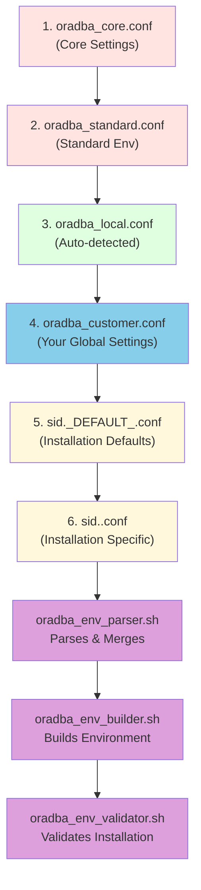

# Configuration System

**Purpose:** Comprehensive guide to OraDBA hierarchical configuration system - the canonical reference for all
configuration files, variables, and customization options.

**Audience:** Users who need to customize OraDBA behavior, paths, or installation-specific settings.

## Introduction

OraDBA uses a sophisticated library-based configuration system powered by Environment Management libraries
(oradba_env_*) that provides flexible customization at multiple levels. The system parses, merges, and validates
configuration from six sources, allowing you to customize globally or per-installation without modifying base files.

This configuration system works with all 8 supported product types: databases, Data Safe connectors, Oracle clients,
Instant Client, OUD, Java, WebLogic, and Enterprise Manager components.

## Configuration Hierarchy

Configuration files are loaded and merged by `oradba_env_parser.sh` in a specific order, with later files overriding
earlier settings:

1. **oradba_core.conf** - Core system settings (required, don't modify)
2. **oradba_standard.conf** - Standard environment and aliases (required, don't modify)
3. **oradba_local.conf** - Auto-detected local settings (auto-generated, don't modify)
4. **oradba_customer.conf** - Your global custom settings (optional, **recommended for customization**)
5. **sid._DEFAULT_.conf** - Default template for all installations (optional)
6. **sid.\<NAME>.conf** - Installation-specific settings (optional, auto-created from template)



**Configuration processing:**  
The Parser reads all 6 levels and merges them with later levels overriding earlier ones. The Builder constructs the
environment using the merged configuration and the appropriate product plugin. The Validator verifies installation
integrity.

**Key Benefits:**

- Base settings work everywhere (levels 1-2)
- Auto-detected settings adapt to your system (level 3)
- Customize globally or per-database (levels 4-6)
- Your customizations survive updates
- Later configurations override earlier ones
- All processing is validated and logged

## Configuration Files

### oradba_core.conf - Core System Settings

**Location:** `${ORADBA_PREFIX}/etc/oradba_core.conf`

**Purpose:** Core system settings that control OraDBA behavior

**Key Settings:**

```bash
# Installation paths
ORADBA_PREFIX="/opt/oradba"                    # Installation directory
ORADBA_LOCAL_BASE="/opt"                       # Parent directory (auto-detected)
ORADBA_BASE="${ORADBA_PREFIX}"                 # Alias to ORADBA_PREFIX
ORADBA_CONFIG_DIR="${ORADBA_PREFIX}/etc"
ORADBA_BIN_DIR="${ORADBA_PREFIX}/bin"
ORATAB_FILE="/etc/oratab"

# Behavior control
DEBUG="0"                                      # Legacy debug mode (use ORADBA_DEBUG instead)
ORADBA_DEBUG="false"                           # Debug mode for detailed output
ORADBA_LOAD_ALIASES="true"
ORADBA_SHOW_DB_STATUS="true"
ORADBA_AUTO_CREATE_SID_CONFIG="true"

# Directories
LOG_DIR="${ORADBA_PREFIX}/log"
BACKUP_DIR="/backup"
RECOVERY_DIR="${ORADBA_PREFIX}/rcv"
```

**Path Variables Explained:**

- **ORADBA_PREFIX**: Main installation directory (e.g., `/opt/oracle/local/oradba`)
- **ORADBA_LOCAL_BASE**: Parent "local" directory, auto-detected from:
  - `${ORACLE_BASE}/local` if ORACLE_BASE is set
  - Parent directory of ORADBA_PREFIX otherwise
  - Used by `cdl` alias to navigate to shared tools directory
- **ORADBA_BASE**: Alias to ORADBA_PREFIX for compatibility when installed alongside TVD BasEnv
- **ORADBA_BIN_DIR**: Binary directory, automatically added to PATH

**When to Edit:** Rarely. Only modify if changing installation paths or core
features. Most settings should be overridden in customer config instead.

### oradba_standard.conf - Standard Settings

**Location:** `${ORADBA_PREFIX}/etc/oradba_standard.conf`

**Purpose:** Standard Oracle environment variables and simple aliases

**Key Settings:**

```bash
# Oracle directories
ORACLE_BASE="/u01/app/oracle"
TNS_ADMIN=""  # Defaults to $ORACLE_HOME/network/admin

# NLS settings
NLS_LANG="AMERICAN_AMERICA.AL32UTF8"
NLS_DATE_FORMAT="YYYY-MM-DD HH24:MI:SS"
NLS_TIMESTAMP_FORMAT="YYYY-MM-DD HH24:MI:SS.FF"

# SQL*Plus paths
SQLPATH="${ORADBA_PREFIX}/sql"
ORACLE_PATH="${ORADBA_PREFIX}/sql"

# rlwrap configuration
RLWRAP_COMMAND="rlwrap"
RLWRAP_OPTS="-i -c -f $ORACLE_HOME/bin/sqlplus"
ORADBA_RLWRAP_FILTER="false"  # Enable password filtering

# Simple aliases defined here
alias sq='sqlplus / as sysdba'
alias cdh='cd ${ORACLE_HOME}'
# ... and 50+ more aliases
```

**When to Edit:** Not recommended. Override settings in `oradba_customer.conf`
instead to preserve your changes during updates.

### oradba_local.conf - Auto-Detected Settings

**Location:** `${ORADBA_PREFIX}/etc/oradba_local.conf`

**Purpose:** Auto-generated file containing locally-detected settings

**Created By:** Installer during installation, automatically maintained

**Key Settings:**

```bash
# Installation detection
ORADBA_PREFIX="/opt/oradba"
ORADBA_INSTALL_TYPE="standalone"
ORADBA_INSTALL_DATE="2025-01-14"
ORADBA_VERSION="0.19.5"

# System detection
DETECTED_SHELL="bash"
DETECTED_OS="Linux"
```

**When to Edit:** Never - this file is auto-generated and auto-maintained. If you need to override these settings, use `oradba_customer.conf`.

### oradba_customer.conf - Your Customizations ⭐

**Location:** `${ORADBA_PREFIX}/etc/oradba_customer.conf`

**Template:** `${ORADBA_PREFIX}/templates/etc/oradba_customer.conf.example`

**Purpose:** **This is the recommended file for your customizations**

**Example Configuration:**

```bash
# ==============================================================================
# Customer Configuration
# ==============================================================================
# This file is loaded after core and standard configs, allowing you to
# override defaults without modifying base files.

# --- Oracle Environment ---

# Override default Oracle base
ORACLE_BASE="/u02/app/oracle"

# Custom TNS_ADMIN location
TNS_ADMIN="/u01/app/oracle/network/admin"

# --- NLS Settings ---

# Use German locale
NLS_LANG="GERMAN_GERMANY.AL32UTF8"
NLS_DATE_FORMAT="DD.MM.YYYY HH24:MI:SS"

# --- Directories ---

# Custom backup location
BACKUP_DIR="/backup/oracle"
LOG_DIR="/var/log/oracle"

# --- Behavior ---

# Disable automatic database status display
ORADBA_SHOW_DB_STATUS="false"

# Enable debug mode (shows detailed configuration loading, SID creation, etc.)
ORADBA_DEBUG="true"

# Legacy debug mode (deprecated, use ORADBA_DEBUG)
# DEBUG="1"

# Disable alias loading
ORADBA_LOAD_ALIASES="false"

# Disable auto-creation of SID configurations
# ORADBA_AUTO_CREATE_SID_CONFIG="false"

# --- rlwrap ---

# Enable password filtering
ORADBA_RLWRAP_FILTER="true"

# --- Custom Aliases ---

# Development environment shortcuts
alias sqdev='sqlplus username/password@devdb'
alias cdarch='cd /backup/oracle/archive'
alias mytail='tail -f /var/log/oracle/myapp.log'

# Custom functions
backup_config() {
    cp ${ORADBA_ETC}/*.conf /backup/config/
}

# --- Custom Variables ---

export CUSTOM_APP_HOME="/u01/app/custom"
export PATH="${CUSTOM_APP_HOME}/bin:${PATH}"
```

**When to Edit:** This is where you should make all your customizations! Copy from the `.example` template:

```bash
cp ${ORADBA_PREFIX}/templates/etc/oradba_customer.conf.example \
   ${ORADBA_PREFIX}/etc/oradba_customer.conf

# Edit with your settings
vi ${ORADBA_PREFIX}/etc/oradba_customer.conf
```

### sid._DEFAULT_.conf - Installation Defaults

**Location:** `${ORADBA_PREFIX}/etc/sid._DEFAULT_.conf`

**Purpose:** Default settings that apply to all installations (unless overridden per-installation)

**Example Configuration:**

```bash
# ==============================================================================
# Default Installation Configuration
# Applied to all installations unless overridden in sid.<NAME>.conf
# ==============================================================================

# --- Installation Identity ---
ORADBA_INST_NAME="${ORACLE_SID}"
ORADBA_INST_TYPE="unknown"  # Set by plugin: database, datasafe, iclient, etc.

# --- Database-Specific Settings (for product type: database) ---
ORADBA_DB_NAME="${ORACLE_SID}"
ORADBA_DB_UNIQUE_NAME="${ORACLE_SID}"
ORADBA_DB_ROLE="PRIMARY"
ORADBA_CONNECT_TYPE="LOCAL"

# --- Backup Settings ---
ORADBA_BACKUP_DIR="${BACKUP_DIR}/${ORACLE_SID}"
ORADBA_BACKUP_RETENTION=7
ORADBA_BACKUP_TYPE="INCREMENTAL"
ORADBA_BACKUP_COMPRESSION="MEDIUM"

# --- Diagnostic Settings ---
ORADBA_DIAGNOSTIC_DEST="${ORACLE_BASE}/diag"
ORADBA_ARCHIVE_DEST="/u01/app/oracle/archive/${ORACLE_SID}"
```

**When to Edit:** Modify to set defaults that apply to all your installations. Individual installations can override
in their own sid configs.

### sid.\\{NAME}.conf - Installation-Specific Settings

**Location:** `${ORADBA_PREFIX}/etc/sid.\\{NAME}.conf`

**Purpose:** Settings specific to one installation (database, Data Safe connector, etc.)

**Auto-Creation:** Automatically created on first environment switch if `ORADBA_AUTO_CREATE_SID_CONFIG=true`

**Example for Database (sid.FREE.conf):**

```bash
# ==============================================================================
# OraDBA Installation Configuration: FREE
# Product Type: database
# Auto-created: 2025-01-14 10:30:00
# Last updated: 2025-01-14 10:30:00
# ==============================================================================

# --- Installation Identity ---
ORADBA_INST_NAME="FREE"
ORADBA_INST_TYPE="database"

# --- Database Identity (Auto-populated for databases) ---
ORADBA_DB_NAME="FREE"
ORADBA_DB_UNIQUE_NAME="FREE"
ORADBA_DBID="3456789012"
ORADBA_DB_ROLE="PRIMARY"
ORADBA_DB_VERSION="23.4.0.24.05"

# --- Connection Settings ---
ORADBA_TNS_ALIAS="FREE"
ORADBA_CONNECT_TYPE="LOCAL"

# --- Diagnostic Paths (Auto-populated from v$parameter) ---
ORADBA_DIAGNOSTIC_DEST="/u01/app/oracle/diag/rdbms/free/FREE"
ORADBA_ARCHIVE_DEST="/u01/app/oracle/archive/FREE"

# --- Backup Settings (Can be customized) ---
ORADBA_DB_BACKUP_DIR="/backup/FREE"
ORADBA_BACKUP_RETENTION=7
ORADBA_BACKUP_TYPE="INCREMENTAL"
ORADBA_BACKUP_COMPRESSION="MEDIUM"

# --- Custom Settings ---
# Add your database-specific customizations here

# Example: Special NLS settings for this database
# NLS_LANG="GERMAN_GERMANY.AL32UTF8"

# Example: Custom backup retention for production
# ORADBA_BACKUP_RETENTION=30
```

**When to Edit:** Add database-specific customizations. The auto-populated
metadata helps document your database but can be manually adjusted if needed.

## Configuration Loading Process

### When Configuration is Loaded

Configuration files are loaded when you set your environment:

```bash
$ source oraenv.sh FREE

# Loading sequence:
# 1. oradba_core.conf (core settings)
# 2. oradba_standard.conf (standard environment)
# 3. oradba_customer.conf (your global settings)
# 4. sid._DEFAULT_.conf (database defaults)
# 5. sid.FREE.conf (FREE-specific settings)
```

### Debug Configuration Loading

Enable debug mode to see detailed information about configuration loading and SID creation:

```bash
$ export ORADBA_DEBUG=true
$ source oraenv.sh FREE

[DEBUG] Loading OraDBA configuration for SID: FREE
[DEBUG] Loading core config: /opt/oradba/etc/oradba_core.conf
[DEBUG] Loading standard config: /opt/oradba/etc/oradba_standard.conf
[DEBUG] Loading customer config: /opt/oradba/etc/oradba_customer.conf
[DEBUG] Loading default SID config: /opt/oradba/etc/sid._DEFAULT_.conf
[DEBUG] Auto-create enabled, config_dir=/opt/oradba/etc, template should be at: /opt/oradba/templates/etc/sid.ORACLE_SID.conf.example
[DEBUG] create_sid_config called with SID=FREE
[DEBUG] Will create: /opt/oradba/etc/sid.FREE.conf from template: /opt/oradba/templates/etc/sid.ORACLE_SID.conf.example
[INFO] Auto-creating SID configuration for FREE...
[INFO] [OK] Created SID configuration: /opt/oradba/etc/sid.FREE.conf
[DEBUG] Loading newly created SID config: /opt/oradba/etc/sid.FREE.conf
[DEBUG] Configuration loading complete
```

**Debug Output Includes:**

- Configuration file loading sequence
- Template paths and file creation details
- Dummy SID detection and skipping logic
- Variable resolution and overrides

**Legacy DEBUG Variable:**
The old `DEBUG=1` variable still works but is deprecated. Use `ORADBA_DEBUG=true` for consistent boolean behavior.

## Auto-Created SID Configurations

### How Auto-Creation Works

When you switch to a new ORACLE_SID for the first time, OraDBA automatically
creates a SID-specific configuration file from a template.

**Default Behavior:**

- **Enabled by default** (`ORADBA_AUTO_CREATE_SID_CONFIG=true`)
- **Only for real SIDs** - Skips dummy SIDs (oratab entries with startup flag `D`)
- **Template-based** - Uses `templates/etc/sid.ORACLE_SID.conf.example` as the base
- **No database queries** - Uses placeholders from template, not live data

**Example Output:**

```bash
$ free  # First time switching to FREE instance

[INFO] Auto-creating SID configuration for FREE...
[INFO] [OK] Created SID configuration: /opt/oracle/local/oradba/etc/sid.FREE.conf
```

**What Gets Created:**

The auto-creation process:

1. Checks if SID is in `ORADBA_REALSIDLIST` (not a dummy SID)
2. Copies `templates/etc/sid.ORACLE_SID.conf.example` template
3. Replaces `ORCL` with actual SID name (uppercase and lowercase)
4. Updates date stamp and creation timestamp
5. Creates `sid.${ORACLE_SID}.conf` in the configuration directory

**Dummy SID Support:**

Dummy SIDs (used for environment setup before database creation) are automatically skipped:

```bash
# /etc/oratab
FREE:/opt/oracle/product/19c/dbhome:N      # Real DB - config will be auto-created
rdbms26:/opt/oracle/product/26ai/dbhome:D  # Dummy - skipped (only visible in debug mode)
```

**Template Content:**

The template includes static metadata placeholders:

- `ORADBA_DB_NAME="ORCL"` → Replaced with actual SID
- `ORADBA_DB_UNIQUE_NAME="ORCL"` → Replaced with actual SID
- `ORADBA_DBID=""` → Empty, can be filled manually
- NLS settings and backup configuration defaults

**Disabling Auto-Creation:**

```bash
# In oradba_customer.conf or environment
export ORADBA_AUTO_CREATE_SID_CONFIG=false

# Or temporarily:
ORADBA_AUTO_CREATE_SID_CONFIG=false source oraenv.sh FREE
```

**Manual Creation:**

You can also manually create SID configurations:

```bash
# Copy template
cp ${ORADBA_PREFIX}/templates/etc/sid.ORACLE_SID.conf.example \
   ${ORADBA_PREFIX}/etc/sid.MYDB.conf

# Edit with your settings
vi ${ORADBA_PREFIX}/etc/sid.MYDB.conf

# Update ORCL references to your SID
sed -i 's/ORCL/MYDB/g' ${ORADBA_PREFIX}/etc/sid.MYDB.conf
```

### Static vs Dynamic Metadata

**Important:** The SID configuration file tracks only **static metadata** (values that rarely change):

**Static (stored in SID config):**

- Database name
- DB unique name
- DBID
- Database version
- NLS settings
- Backup/recovery paths

**Dynamic (queried at runtime):**

- Database role (PRIMARY/STANDBY)
- Open mode (READ WRITE/READ ONLY/MOUNTED)
- Instance status
- Session counts
- Memory sizes

This design ensures configurations remain valid even when database state changes (e.g., Data Guard switchover).

- `version` → ORADBA_DB_VERSION

From `v$parameter`:

- `diagnostic_dest` → ORADBA_DIAGNOSTIC_DEST

### Fallback Behavior

If the database is not accessible:

- Configuration file is still created
- Metadata fields use defaults based on ORACLE_SID
- You can manually update the file later

### Manual Creation

Create a SID configuration manually if needed:

```bash
# Copy from example
cp ${ORADBA_PREFIX}/templates/etc/sid.ORACLE_SID.conf.example \
   ${ORADBA_PREFIX}/etc/sid.MYDB.conf

# Edit as needed
vi ${ORADBA_PREFIX}/etc/sid.MYDB.conf
```

## Common Configuration Scenarios

### Scenario 1: Enable Oracle Homes Auto-Discovery

**Problem:** You want OraDBA to automatically discover and register Oracle installations

**Solution:** Enable auto-discovery in `oradba_customer.conf`:

```bash
# oradba_customer.conf

# Enable auto-discovery on environment load
# - Database homes from oratab
export ORADBA_AUTO_DISCOVER_ORATAB="true"
# - All Oracle products (database, datasafe, java, client, iclient, oud)
export ORADBA_AUTO_DISCOVER_PRODUCTS="true"

# Customize discovery paths (optional, default: ${ORACLE_BASE}/product)
export ORADBA_DISCOVERY_PATHS="${ORACLE_BASE}/product /opt/oracle /u01/oracle"
```

**How It Works:**

- Scans configured paths (up to 3 levels deep) for Oracle installations
- Detects all product types: database, client, instant client, Data Safe, OUD, Java, WebLogic
- Generates smart names based on product type and version (jdk17, iclient2610, dsconn01, etc.)
- Silently skips already registered homes (no duplicates)
- Adds discovered homes to `${ORADBA_PREFIX}/etc/oradba_homes.conf`

**Manual Discovery:**

```bash
# Discover and display found homes (dry run)
oradba_homes.sh discover

# Discover and automatically add to configuration
oradba_homes.sh discover --auto-add

# Discover from custom path
oradba_homes.sh discover --base /u01/oracle --auto-add
```

**Example Output:**

```bash
Found Oracle Homes:
  jdk17     : /u01/app/oracle/product/jdk-17.0.1
  iclient26 : /u01/app/oracle/product/instantclient_26_10
  dsconn01  : /u01/app/oracle/product/exacc-test-ha1
  rdbms1918 : /u01/app/oracle/product/dbhome_19_18

Use --auto-add to register these homes.
```

**Benefits:**

- Automatic registration of all Oracle products
- Consistent naming across installations
- Opt-in feature (backward compatible)
- Silent mode for non-interactive use
- Single source of truth for discovery logic

### Scenario 2: Custom Oracle Base

**Problem:** Your Oracle base is not `/u01/app/oracle`

**Solution:** Override in `oradba_customer.conf`:

```bash
# oradba_customer.conf
ORACLE_BASE="/u02/app/oracle"
```

### Scenario 2: Different NLS Settings

**Problem:** Need German locale for all databases

**Solution:** Override in `oradba_customer.conf`:

```bash
# oradba_customer.conf
NLS_LANG="GERMAN_GERMANY.AL32UTF8"
NLS_DATE_FORMAT="DD.MM.YYYY HH24:MI:SS"
NLS_TIMESTAMP_FORMAT="DD.MM.YYYY HH24:MI:SS.FF"
```

### Scenario 3: Production Backup Retention

**Problem:** Production database needs 30-day backup retention, others need 7 days

**Solution:** Set default in `sid._DEFAULT_.conf`:

```bash
# sid._DEFAULT_.conf
ORADBA_BACKUP_RETENTION=7
```

Override in `sid.PRODDB.conf`:

```bash
# sid.PRODDB.conf
ORADBA_BACKUP_RETENTION=30
ORADBA_BACKUP_COMPRESSION="HIGH"
```

### Scenario 4: Custom oratab Location

**Problem:** oratab is in non-standard location

**Solution:** Override in `oradba_customer.conf`:

```bash
# oradba_customer.conf
ORATAB_FILE="/u01/app/oracle/oratab"
```

### Scenario 5: Disable Status Display

**Problem:** Don't want automatic status display when switching databases

**Solution:** Override in `oradba_customer.conf`:

```bash
# oradba_customer.conf
ORADBA_SHOW_DB_STATUS="false"
```

You can still manually run `oraup.sh` or `dbstatus.sh` when needed.

### Scenario 6: Enable Password Filtering

**Problem:** Want to hide passwords in rlwrap command history

**Solution:** Enable in `oradba_customer.conf`:

```bash
# oradba_customer.conf
ORADBA_RLWRAP_FILTER="true"
```

See [rlwrap Filter Configuration](rlwrap.md) for setup details.

### Scenario 7: Managing Non-Database Products

**Problem:** Want to configure Data Safe connector or Instant Client with custom settings

**Solution:** Create installation-specific configuration files for any product type.

**Example - Data Safe Connector:**

```bash
# sid.datasafe-prod.conf
ORADBA_INST_NAME="datasafe-prod"
ORADBA_INST_TYPE="datasafe"

# Custom startup behavior
ORADBA_AUTO_START="true"
ORADBA_STARTUP_WAIT=30

# Monitoring
ORADBA_HEALTH_CHECK_ENABLED="true"
ORADBA_HEALTH_CHECK_INTERVAL=300
```

**Example - Instant Client:**

```bash
# sid.ic23c.conf
ORADBA_INST_NAME="ic23c"
ORADBA_INST_TYPE="iclient"

# Custom TNS settings
TNS_ADMIN="/opt/oracle/network/admin"

# Connection pooling
ORADBA_CONNECTION_POOL_SIZE=10
```

## Configuration Variables Reference

### Core System Variables

| Variable            | Default                | Description                               |
|---------------------|------------------------|-------------------------------------------|
| `ORADBA_PREFIX`     | `/opt/oradba`          | Installation base directory               |
| `ORADBA_CONFIG_DIR` | `${ORADBA_PREFIX}/etc` | Configuration directory                   |
| `ORATAB_FILE`       | `/etc/oratab`          | oratab file location                      |
| `DEBUG`             | `0`                    | Debug mode (deprecated, use ORADBA_DEBUG) |
| `ORADBA_DEBUG`      | `false`                | Debug mode for detailed output            |
| `LOG_DIR`           | `${ORADBA_PREFIX}/log` | Log directory                             |
| `BACKUP_DIR`        | `/backup`              | Default backup directory                  |

### Behavior Variables

| Variable                            | Default | Description                                        |
|-------------------------------------|---------|----------------------------------------------------|
| `ORADBA_LOAD_ALIASES`               | `true`  | Load aliases and functions                         |
| `ORADBA_SHOW_DB_STATUS`             | `true`  | Show status display on environment switch          |
| `ORADBA_AUTO_CREATE_SID_CONFIG`     | `true`  | Auto-create installation configurations            |
| `ORADBA_RLWRAP_FILTER`              | `false` | Enable password filtering in rlwrap                |
| `ORADBA_AUTO_DISCOVER_EXTENSIONS`   | `true`  | Auto-discover extensions in standard locations     |

### Extension System Variables

For complete extension configuration details, see the [Extension System Guide](extensions.md).

| Variable                          | Default | Description                                    |
|-----------------------------------|---------|------------------------------------------------|
| `ORADBA_AUTO_DISCOVER_EXTENSIONS` | `true`  | Auto-discover extensions                       |
| `ORADBA_EXTENSION_PATHS`          | (none)  | Colon-separated additional extension paths     |

### Oracle Environment Variables

| Variable          | Default                      | Description                    |
|-------------------|------------------------------|--------------------------------|
| `ORACLE_BASE`     | `/u01/app/oracle`            | Oracle base directory          |
| `TNS_ADMIN`       | `$ORACLE_HOME/network/admin` | TNS configuration directory    |
| `NLS_LANG`        | `AMERICAN_AMERICA.AL32UTF8`  | NLS language and character set |
| `NLS_DATE_FORMAT` | `YYYY-MM-DD HH24:MI:SS`      | Date format                    |
| `SQLPATH`         | `${ORADBA_PREFIX}/sql`       | SQL*Plus script path           |

### Database Metadata (SID-specific, auto-populated)

| Variable                 | Source                        | Description                      |
|--------------------------|-------------------------------|----------------------------------|
| `ORADBA_DB_NAME`         | `v$database.name`             | Database name                    |
| `ORADBA_DB_UNIQUE_NAME`  | `v$database.db_unique_name`   | Unique database name             |
| `ORADBA_DBID`            | `v$database.dbid`             | Database ID                      |
| `ORADBA_DB_ROLE`         | `v$database.database_role`    | Database role (PRIMARY, STANDBY) |
| `ORADBA_DB_VERSION`      | `v$instance.version`          | Database version                 |
| `ORADBA_DIAGNOSTIC_DEST` | `v$parameter.diagnostic_dest` | Diagnostic directory             |

### Backup Variables (SID-specific, customizable)

| Variable                    | Default                       | Description               |
|-----------------------------|-------------------------------|---------------------------|
| `ORADBA_DB_BACKUP_DIR`      | `${BACKUP_DIR}/${ORACLE_SID}` | Database backup directory |
| `ORADBA_BACKUP_RETENTION`   | `7`                           | Backup retention (days)   |
| `ORADBA_BACKUP_TYPE`        | `INCREMENTAL`                 | Backup type               |
| `ORADBA_BACKUP_COMPRESSION` | `MEDIUM`                      | Compression level         |

## Troubleshooting

### Configuration File Not Found

```bash
# Check if file exists
ls -l ${ORADBA_PREFIX}/etc/oradba_customer.conf

# Create from example
cp ${ORADBA_PREFIX}/templates/etc/oradba_customer.conf.example \
   ${ORADBA_PREFIX}/etc/oradba_customer.conf
```

### Override Not Taking Effect

**Problem:** Changed a setting but it's not applied

**Solution:** Check the loading order. Later configs override earlier ones:

```bash
# This will NOT work (wrong file):
# Edit oradba_standard.conf - will be overridden by customer config

# This WILL work (correct file):
# Edit oradba_customer.conf - loaded last, overrides standard
```

Enable debug mode to see which file sets the final value:

```bash
DEBUG=1 source oraenv.sh FREE | grep "MY_VARIABLE"
```

### SID Configuration Not Auto-Created

**Check 1:** Is auto-creation enabled?

```bash
grep ORADBA_AUTO_CREATE_SID_CONFIG ${ORADBA_PREFIX}/etc/oradba_core.conf
```

**Check 2:** Is database accessible?

```bash
source oraenv.sh FREE
sqlplus -S / as sysdba <<< "SELECT 1 FROM dual;"
```

**Check 3:** Does file already exist?

```bash
ls -l ${ORADBA_PREFIX}/etc/sid.FREE.conf
```

**Manual Creation:**

```bash
# Create manually
vi ${ORADBA_PREFIX}/etc/sid.FREE.conf

# Or copy from example
cp ${ORADBA_PREFIX}/templates/etc/sid.ORACLE_SID.conf.example \
   ${ORADBA_PREFIX}/etc/sid.FREE.conf
```

### Variables Not Persisting

Configuration files are sourced, not exported. For custom variables to persist
across shells:

```bash
# In oradba_customer.conf:
export MY_CUSTOM_VAR="value"  # Use 'export' for environment variables
```

## Best Practices

1. **Never modify core or standard configs** - Use customer config for overrides
2. **Use oradba_customer.conf for global settings** - All your customizations in one place
3. **Use sid.\<NAME>.conf for installation-specific settings** - Per-installation customization
4. **Comment your customizations** - Explain why you changed defaults
5. **Backup your configs** - Keep copies of customer and installation-specific configs
6. **Test configuration changes** - Use `ORADBA_DEBUG=true` to verify loading
7. **Use version control** - Track configuration changes over time
8. **Document non-obvious settings** - Help future you understand decisions
9. **Namespace custom variables** - Use `ORADBA_CUSTOM_*` or `MY_*` prefix
10. **Keep oradba_local.conf intact** - Auto-generated, reflects installation state

## Configuration for Different Product Types

### Database Configurations

Database installations can use all database-specific variables:

```bash
# sid.PRODDB.conf
ORADBA_DB_NAME="PRODDB"
ORADBA_DB_UNIQUE_NAME="PRODDB_SITE1"
ORADBA_DB_ROLE="PRIMARY"
ORADBA_BACKUP_RETENTION=30
ORADBA_CONNECT_TYPE="LOCAL"
TNS_ADMIN="/u01/app/oracle/network/admin"
```

### Data Safe Configurations

Data Safe connectors have connector-specific settings:

```bash
# sid.datasafe-prod.conf
ORADBA_INST_NAME="datasafe-prod"
ORADBA_INST_TYPE="datasafe"
ORADBA_STARTUP_WAIT=30
ORADBA_AUTO_START="true"
```

### Instant Client Configurations

Instant Client installations typically need minimal configuration:

```bash
# sid.ic23c.conf
ORADBA_INST_NAME="ic23c"
ORADBA_INST_TYPE="iclient"
TNS_ADMIN="/opt/oracle/network/admin"
LD_LIBRARY_PATH="${ORACLE_HOME}:/lib:/usr/lib"
```

### Java Configurations

Oracle Java installations can configure JAVA_HOME-related settings:

```bash
# sid.java21.conf
ORADBA_INST_NAME="java21"
ORADBA_INST_TYPE="java"
JAVA_OPTS="-Xmx2g -XX:+UseG1GC"
```

## See Also

- [Installation](installation.md) - Installation and setup
- [Environment Management](environment.md) - How oraenv.sh loads configurations
- [Aliases](aliases.md) - Configuring and customizing aliases
- [Registry API](quickstart.md#understand-the-registry) - Managing installations
- [Troubleshooting](troubleshooting.md) - Configuration issues

## Navigation

**Previous:** [Environment Management](environment.md)  
**Next:** [Installation](installation.md)
