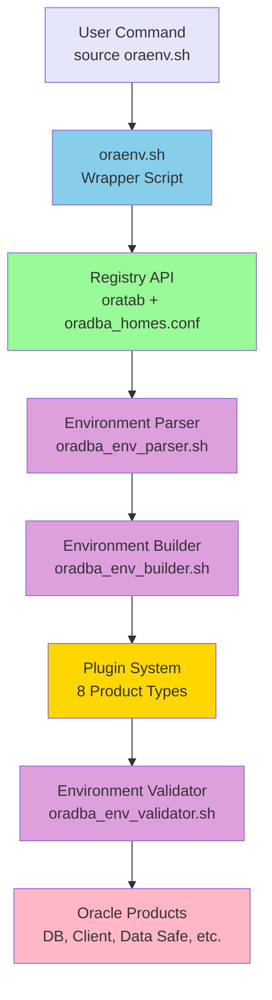

# Environment Management

**Purpose:** Comprehensive guide to OraDBA environment management - Registry API, Plugin System, and the
`oraenv.sh` command.

**Audience:** All users - essential for daily OraDBA use.

## Introduction {.unlisted}

OraDBA introduces a modern environment management system built on three key components:

1. **Registry API**: Unified interface for all Oracle installations
2. **Plugin System**: Product-specific intelligence for 8 Oracle product types
3. **Environment Libraries**: Modular libraries for parsing, building, and validating environments

This architecture replaces the old oratab-only approach with a comprehensive system that supports databases, clients,
Data Safe connectors, OUD, Java, and more.

## Architecture Overview



**Flow:**

1. User runs `source oraenv.sh <name>`
2. Wrapper calls Registry API to resolve installation
3. Parser loads and merges 6-level configuration
4. Builder constructs environment with appropriate plugin
5. Plugin sets product-specific variables (PATH, LD_LIBRARY_PATH, etc.)
6. Validator verifies installation integrity
7. Environment ready for Oracle operations

## Registry API

The Registry API provides a unified interface for managing all Oracle installations.

### Automatic Database Discovery

Databases are automatically synchronized from `/etc/oratab`:

```bash
# First login triggers auto-sync
source oraenv.sh

# Registry scans oratab:
# FREE:/u01/app/oracle/product/23ai/dbhomeFree:N
# TESTDB:/u01/app/oracle/product/19c/dbhome_1:N

# Creates registry entries:
# - FREE (database) → /u01/app/oracle/product/23ai/dbhomeFree
# - TESTDB (database) → /u01/app/oracle/product/19c/dbhome_1

# Deduplication by ORACLE_HOME path (multiple SIDs per home)
# Names derived from directory: dbhomeFree, dbhome_1, etc.
```

### Manual Registration for Non-Database Products

Register other Oracle products manually:

```bash
# Data Safe connector
oradba_homes.sh add \
  --name datasafe-prod \
  --path /u01/app/oracle/datasafe-prod \
  --type datasafe

# Instant Client
oradba_homes.sh add \
  --name ic23c \
  --path /usr/lib/oracle/23/client64 \
  --type iclient

# Oracle Unified Directory
oradba_homes.sh add \
  --name oud1 \
  --path /u01/app/oracle/oud1 \
  --type oud

# Oracle Java
oradba_homes.sh add \
  --name java21 \
  --path /u01/app/oracle/product/jdk-21 \
  --type java
```

### Registry Storage

The registry uses two data sources:

#### 1. /etc/oratab (Databases)

```bash
# Standard oratab format
FREE:/u01/app/oracle/product/23ai/dbhomeFree:N
TESTDB:/u01/app/oracle/product/19c/dbhome_1:N
PRODDB:/u01/app/oracle/product/19c/dbhome_1:Y
```

#### 2. oradba_homes.conf (All Products)

```bash
# Auto-generated and manually registered homes
# Format: NAME|TYPE|PATH|VERSION|DESCRIPTION
FREE|database|/u01/app/oracle/product/23ai/dbhomeFree|23.4.0.24.05|Auto-synced from oratab
datasafe-prod|datasafe|/u01/app/oracle/datasafe-prod|1.2.0|Production Data Safe
ic23c|iclient|/usr/lib/oracle/23/client64|23.0.0.0.0|Instant Client 23c
java21|java|/u01/app/oracle/product/jdk-21|21.0.2|Oracle Java 21
```

## Plugin System

Each Oracle product type has a dedicated plugin that handles product-specific operations.

### Supported Product Types

| Type | Plugin | Description | Full Support |
| ------- | ------------ | ---------------------------------- | ------------ |
| database | database.sh | Oracle Database (RDBMS) | ✅ Yes |
| datasafe | datasafe.sh | Data Safe On-Premises Connector | ✅ Yes |
| client | client.sh | Oracle Full Client | ✅ Yes |
| iclient | iclient.sh | Oracle Instant Client | ✅ Yes |
| oud | oud.sh | Oracle Unified Directory | ✅ Yes |
| java | java.sh | Oracle Java (JDK/JRE) | ✅ Yes |
| weblogic | weblogic.sh | WebLogic Server | ⚠️ Basic |
| oms | oms.sh | Enterprise Manager OMS | ⚠️ Basic |
| emagent | emagent.sh | Enterprise Manager Agent | ⚠️ Basic |

### Plugin Interface

All plugins implement 11 standard functions:

```bash
# Core Functions
plugin_should_handle()           # Can this plugin handle this path?
plugin_detect_installation()     # Detect product at this path
plugin_get_version()             # Get product version
plugin_validate_installation()   # Validate installation integrity

# Environment Setup
plugin_set_environment()         # Set environment variables
plugin_get_path_entries()        # Get PATH entries
plugin_get_ld_library_path()     # Get LD_LIBRARY_PATH entries

# Status and Display
plugin_should_show_listener()    # Does product have listener?
plugin_get_product_display_name()# Get display name
plugin_supports_service_management() # Supports start/stop?
plugin_get_description()         # Get plugin description
```

### Plugin-Based Environment Setup

When you run `source oraenv.sh <name>`, the system:

1. **Resolves Name**: Registry API finds installation
2. **Loads Plugin**: Appropriate plugin for product type
3. **Validates**: Plugin verifies installation
4. **Sets Variables**: Plugin-specific environment setup
5. **Configures Paths**: PATH and LD_LIBRARY_PATH from plugin
6. **Loads Config**: Applies configuration from 6-level hierarchy

Example for database:

```bash
source oraenv.sh FREE

# Plugin: database.sh
# Sets: ORACLE_HOME, ORACLE_BASE, ORACLE_SID
# PATH: $ORACLE_HOME/bin (prepended)
# LD_LIBRARY_PATH: $ORACLE_HOME/lib
# Listener: Yes (checks for listener)
# Version: From $ORACLE_HOME/bin/sqlplus -V
```

Example for Instant Client:

```bash
source oraenv.sh ic23c

# Plugin: iclient.sh
# Sets: ORACLE_HOME (Instant Client path)
# PATH: $ORACLE_HOME (prepended, no bin/ subdirectory)
# LD_LIBRARY_PATH: $ORACLE_HOME
# Listener: No
# Version: From library filenames (libclntsh.so.23.1)
```

## Using oraenv.sh

### Basic Usage

Set environment for any registered installation:

```bash
# Database
source oraenv.sh FREE

# Data Safe connector
source oraenv.sh datasafe-prod

# Instant Client
source oraenv.sh ic23c

# Oracle Java
source oraenv.sh java21

# Interactive selection (shows all registered installations)
source oraenv.sh
```

### Interactive Mode

When called without arguments, shows all registered installations:

```bash
$ source oraenv.sh

Available Oracle Installations:
  [1] FREE (database) - /u01/app/oracle/product/23ai/dbhomeFree [23.4.0.24.05]
  [2] TESTDB (database) - /u01/app/oracle/product/19c/dbhome_1 [19.23.0.0.0]
  [3] datasafe-prod (datasafe) - /u01/app/oracle/datasafe-prod [1.2.0]
  [4] ic23c (iclient) - /usr/lib/oracle/23/client64 [23.0.0.0.0]
  [5] java21 (java) - /u01/app/oracle/product/jdk-21 [21.0.2]

Select [1-5, or 0 to cancel]: 1

Setting environment for: FREE (database)
ORACLE_SID set to: FREE
ORACLE_HOME set to: /u01/app/oracle/product/23ai/dbhomeFree
```

### Silent Mode

For scripts and automation:

```bash
#!/usr/bin/env bash

# Set environment silently (no output except errors)
source oraenv.sh FREE --silent

# Verify environment
if [[ "$ORACLE_SID" != "FREE" ]]; then
    echo "Failed to set environment" >&2
    exit 1
fi

# Continue with operations
sqlplus -S / as sysdba <<EOF
    SELECT name FROM v\$database;
    EXIT;
EOF
```

### Data Safe Environment Details

When working with Data Safe connectors, `oradba_env.sh` now exposes the key
connector paths so you can verify the effective environment quickly:

```bash
# Detailed info for a connector
oradba_env.sh show dscon1

# Status view with connector paths
oradba_env.sh status dscon1
```

The output includes:

- Install directory (connector base path)
- `ORACLE_HOME` (resolved `oracle_cman_home`)
- `TNS_ADMIN` (resolved from connector paths)
- `JAVA_HOME` (resolved Java runtime if configured)
- `STATUS` (connector status)
- `SERVICE` (connector service name from `cman.ora`)
- `PORT` (connector port from `cman.ora` when available)

Data Safe connectors **always** use a connector-specific `TNS_ADMIN` so each
connector reads its own `cman.ora`. This is enforced by `oraenv.sh` and
`oradba_dsctl.sh` to avoid cross-connector configuration leakage.

Example status output:

```text
-------------------------------------------------------------------------------
ORACLE_BASE    : /opt/oracle
DATASAFE_HOME  : /opt/oracle/product/exacc-wob-vwg-test
ORACLE_HOME    : /opt/oracle/product/exacc-wob-vwg-test/oracle_cman_home
TNS_ADMIN      : /opt/oracle/product/exacc-wob-vwg-test/oracle_cman_home/network/admin
JAVA_HOME      : /opt/oracle/product/jdk-17.0.17
ORACLE_VERSION : 21.0.0.0
STATUS         : open
SERVICE        : cust_cman
PORT           : 1521
-------------------------------------------------------------------------------
PRODUCT_TYPE   : datasafe
-------------------------------------------------------------------------------
```

### Case-Insensitive Matching

Installation names are case-insensitive:

```bash
# All equivalent
source oraenv.sh FREE
source oraenv.sh free
source oraenv.sh Free
```

### Auto-Generated Aliases

Each registered installation gets an automatic alias:

```bash
# Aliases created automatically
free              # source oraenv.sh FREE
testdb            # source oraenv.sh TESTDB
datasafe-prod     # source oraenv.sh datasafe-prod
ic23c             # source oraenv.sh ic23c

# Use them directly
free
echo $ORACLE_SID  # Shows: FREE

datasafe-prod
cmctl status      # Data Safe connector command
```

## Environment Variables

### Core Oracle Variables

Set for all product types:

```bash
ORACLE_SID        # Installation name (e.g., FREE, datasafe-prod, ic23c)
ORACLE_HOME       # Product installation path
ORACLE_BASE       # Oracle base directory
```

### Database-Specific Variables

Set by database plugin only:

```bash
ORACLE_UNQNAME    # Database unique name (from Registry or autodetection)
TWO_TASK          # TNS connection alias
ORACLE_TERM       # Terminal type for SQL*Plus
```

### Path Variables

Set by all plugins (product-specific):

```bash
PATH              # Includes product bin directory
LD_LIBRARY_PATH   # Includes product lib directory
SQLPATH           # SQL script search path (databases and clients)
TNS_ADMIN         # SQL*Net configuration directory
```

### OraDBA Variables

Set by OraDBA environment system:

```bash
ORADBA_PREFIX     # OraDBA installation directory
ORADBA_VERSION    # OraDBA version
ORADBA_PRODUCT_TYPE  # Product type (database, datasafe, iclient, etc.)
ORADBA_PRODUCT_VERSION # Product version
ORADBA_PLUGIN_NAME    # Plugin handling this installation
```

### NLS Variables

Configured from oradba_standard.conf:

```bash
NLS_LANG="AMERICAN_AMERICA.AL32UTF8"
NLS_DATE_FORMAT="YYYY-MM-DD HH24:MI:SS"
NLS_TIMESTAMP_FORMAT="YYYY-MM-DD HH24:MI:SS.FF"
NLS_TIMESTAMP_TZ_FORMAT="YYYY-MM-DD HH24:MI:SS.FF TZH:TZM"
```

## Environment Libraries

OraDBA uses modular environment libraries:

### Parser Library (oradba_env_parser.sh)

Parses and merges 6-level configuration hierarchy:

```bash
# Functions:
oradba_env_parse_config()         # Parse all config levels
oradba_env_merge_configs()        # Merge configs with override logic
oradba_env_load_config_file()     # Load single config file
oradba_env_validate_config()      # Validate configuration values
```

### Builder Library (oradba_env_builder.sh)

Constructs Oracle environment:

```bash
# Functions:
oradba_env_build()                # Build complete environment
oradba_env_set_oracle_vars()      # Set Oracle variables
oradba_env_configure_paths()      # Configure PATH and LD_LIBRARY_PATH
oradba_env_load_plugins()         # Load and execute plugin
oradba_env_generate_aliases()     # Generate installation aliases
```

### Validator Library (oradba_env_validator.sh)

Validates installations:

```bash
# Functions:
oradba_env_validate()             # Validate installation
oradba_env_check_oracle_home()    # Verify ORACLE_HOME
oradba_env_check_permissions()    # Check file permissions
oradba_env_verify_product()       # Verify product integrity
```

### Config Library (oradba_env_config.sh)

Manages configuration system:

```bash
# Functions:
oradba_env_get_config_value()     # Get config value
oradba_env_set_config_value()     # Set config value
oradba_env_list_config_files()    # List all config files
oradba_env_reload_config()        # Reload configuration
```

### Status Library (oradba_env_status.sh)

Displays environment status:

```bash
# Functions:
oradba_env_show_status()          # Show current environment
oradba_env_show_installation()    # Show installation details
oradba_env_list_installations()   # List all registrations
oradba_env_show_plugin_info()     # Show plugin information
```

### Changes Library (oradba_env_changes.sh)

Tracks configuration changes:

```bash
# Functions:
oradba_env_detect_changes()       # Detect config changes
oradba_env_auto_reload()          # Auto-reload if changed
oradba_env_track_modification()   # Track file modifications
oradba_env_get_change_status()    # Get change status
```

## Advanced Usage

### Switching Between Installations

```bash
# Switch to database
source oraenv.sh FREE

# Switch to Instant Client
source oraenv.sh ic23c

# Switch to Data Safe
source oraenv.sh datasafe-prod

# Each switch:
# - Clears previous environment
# - Loads appropriate plugin
# - Sets product-specific variables
# - Configures paths correctly
```

### Verify Current Environment

```bash
# Show current environment
oraup.sh

# Or use alias
u

# Shows:
# - Current ORACLE_SID/installation name
# - Product type and version
# - ORACLE_HOME and ORACLE_BASE
# - Product-specific status (database state, connector status, etc.)
# - All registered installations
```

### List All Registered Installations

```bash
# Simple list
oradba_homes.sh list

# Detailed list
oradba_homes.sh list --verbose

# Filter by type
oradba_homes.sh list --type database
oradba_homes.sh list --type datasafe
oradba_homes.sh list --type iclient
```

### Show Installation Details

```bash
# Show details for specific installation
oradba_homes.sh show FREE

# Output:
# Installation: FREE
# Type: database
# ORACLE_HOME: /u01/app/oracle/product/23ai/dbhomeFree
# Version: 23.4.0.24.05
# Plugin: database.sh
# Status: OPEN
# Description: Auto-synced from oratab
```

### Sync Database Homes from Oratab

```bash
# Manual sync (automatic on first login)
oradba_homes.sh sync-oratab

# Shows:
# Syncing database homes from /etc/oratab...
# Found: FREE → /u01/app/oracle/product/23ai/dbhomeFree
# Found: TESTDB → /u01/app/oracle/product/19c/dbhome_1
# Deduplicating by ORACLE_HOME...
# Added: FREE (database)
# Skipped: TESTDB (already registered)
# Sync complete: 1 added, 1 skipped
```

## Product-Specific Examples

### Database Environment

```bash
source oraenv.sh FREE

# Variables set:
# ORACLE_SID=FREE
# ORACLE_HOME=/u01/app/oracle/product/23ai/dbhomeFree
# ORACLE_BASE=/u01/app/oracle
# PATH includes: $ORACLE_HOME/bin
# LD_LIBRARY_PATH includes: $ORACLE_HOME/lib

# Database operations:
sqlplus / as sysdba
rman target /
lsnrctl status
```

### Data Safe Environment

```bash
source oraenv.sh datasafe-prod

# Variables set:
# ORACLE_SID=datasafe-prod
# ORACLE_HOME=/u01/app/oracle/datasafe-prod
# PATH includes: $ORACLE_HOME/bin
# LD_LIBRARY_PATH includes: $ORACLE_HOME/lib

# Data Safe operations:
cmctl status
cmctl start
cmctl stop
```

### Instant Client Environment

```bash
source oraenv.sh ic23c

# Variables set:
# ORACLE_SID=ic23c
# ORACLE_HOME=/usr/lib/oracle/23/client64
# PATH includes: $ORACLE_HOME (no bin/ subdirectory)
# LD_LIBRARY_PATH includes: $ORACLE_HOME
# SQLPATH includes: OraDBA SQL scripts

# Client operations:
sqlplus64 username/password@remote_db
sqlldr64 control=loader.ctl
```

### Oracle Java Environment

```bash
source oraenv.sh java21

# Variables set:
# ORACLE_SID=java21
# ORACLE_HOME=/u01/app/oracle/product/jdk-21
# PATH includes: $ORACLE_HOME/bin
# LD_LIBRARY_PATH includes: $ORACLE_HOME/lib

# Java operations:
java -version
javac MyApp.java
```

## Configuration System Integration

The environment system integrates with the 6-level configuration hierarchy:

1. **oradba_core.conf**: Core OraDBA settings
2. **oradba_standard.conf**: Standard Oracle variables and aliases
3. **oradba_local.conf**: Auto-detected local settings
4. **oradba_customer.conf**: Global customizations
5. **sid._DEFAULT_.conf**: Default template for all installations
6. **sid.\<name>.conf**: Installation-specific settings

Example custom configuration:

```bash
# In oradba_customer.conf:
export NLS_LANG="GERMAN_GERMANY.UTF8"
export ORACLE_BASE="/opt/oracle"
export TNS_ADMIN="/opt/oracle/network/admin"

# In sid.FREE.conf:
export ORACLE_UNQNAME="FREE_SITE1"
export TWO_TASK="FREE_REMOTE"
```

See [Configuration System](configuration.md) for complete details.

## Troubleshooting

### Installation Not Found

```bash
$ source oraenv.sh MISSING

Error: Installation 'MISSING' not found in registry

# Solutions:
# 1. List available installations
oradba_homes.sh list

# 2. Register if missing
oradba_homes.sh add --name MISSING --path /path/to/oracle_home --type database

# 3. Sync from oratab (for databases)
oradba_homes.sh sync-oratab
```

### Wrong Product Type Detected

```bash
# View current detection
oradba_homes.sh show MYDB

# Re-register with correct type
oradba_homes.sh remove --name MYDB
oradba_homes.sh add --name MYDB --path /path --type datasafe
```

### Plugin Not Loading

```bash
# Check plugin availability
ls -1 $ORADBA_PREFIX/lib/plugins/

# Verify plugin version
grep "PLUGIN_VERSION" $ORADBA_PREFIX/lib/plugins/database.sh

# Enable debug mode
export ORADBA_DEBUG=true
source oraenv.sh FREE
```

### Environment Not Persisting

```bash
# Ensure you're using 'source' not direct execution
source oraenv.sh FREE  # ✅ Correct
./oraenv.sh FREE       # ❌ Wrong - creates subshell

# Add to shell profile for persistence
echo 'source /opt/oradba/bin/oraenv.sh FREE' >> ~/.bashrc
```

See [Troubleshooting Guide](troubleshooting.md) for more solutions.

## Next Steps

- **[Configuration System](configuration.md)** - Customize environment and aliases
- **[Quick Start](quickstart.md)** - Get started quickly
- **[Aliases](aliases.md)** - Learn 50+ pre-configured aliases
- **[Troubleshooting](troubleshooting.md)** - Common issues and solutions

## Navigation {.unlisted .unnumbered}

**Previous:** [Quick Start](quickstart.md)  
**Next:** [Configuration System](configuration.md)
