# Introduction

**Purpose:** Overview of OraDBA, its features, and benefits for Oracle database administration.

**Audience:** Database administrators, development teams, and anyone managing Oracle environments.

## What is OraDBA?

OraDBA is a comprehensive toolset for Oracle Database administration and operations, designed for production,
development, and test environments. It provides an intelligent environment management system based on a unified
**Registry API** and extensible **Plugin System** that simplifies Oracle administration through automation and
consistent workflows.

### System Architecture

```mermaid
graph TB
    User[👤 User/DBA]
    CLI[CLI Layer<br/>oraenv.sh, oraup.sh, etc.]
    Registry[Registry API<br/>Unified Oracle Installation Metadata]
    Plugins[Plugin System<br/>8 Product Types]
    EnvLibs[Environment Libraries<br/>Parser, Builder, Validator]
    Oracle[🗄️ Oracle Layer<br/>Database, Client, Data Safe, OUD, Java]
    
    User --> CLI
    CLI --> Registry
    Registry --> Plugins
    Registry --> EnvLibs
    Plugins --> Oracle
    EnvLibs --> Oracle
    
    style User fill:#E6E6FA
    style CLI fill:#87CEEB
    style Registry fill:#98FB98
    style Plugins fill:#FFD700
    style EnvLibs fill:#DDA0DD
    style Oracle fill:#FFB6C6
```



**Key architectural components:**

- **Registry API**: Unified interface for all Oracle installations (oratab + oradba_homes.conf)
- **Plugin System**: 8 product-specific plugins (database, datasafe, client, iclient, oud, java, weblogic, oms, emagent)
- **Environment Libraries**: Modular libraries for parsing, building, validating, and managing Oracle environments
- **Configuration System**: 6-level hierarchy for flexible customization

## Key Features

### Unified Registry API

OraDBA introduces a **Registry API** that provides a single, consistent interface for managing all Oracle installations:

- **Automatic Discovery**: Database homes auto-synced from `/etc/oratab`
- **Unified Interface**: Consistent access to databases, clients, Data Safe connectors, OUD, and Java installations
- **Transparent Integration**: Non-database homes managed via `oradba_homes.conf`
- **Deduplication**: Automatic handling of multiple SIDs per Oracle Home
- **On-Demand Sync**: Transparent fallback if a home isn't found in the registry

**Supported Products:**

- Oracle Database (primary focus)
- Oracle Data Safe On-Premises Connector
- Oracle Client (full client installations)
- Oracle Instant Client
- Oracle Unified Directory (OUD)
- Oracle Java (JDK/JRE)
- WebLogic Server, OMS, EM Agent (basic support)

### Intelligent Plugin System

Each Oracle product type has a dedicated plugin that handles product-specific operations:

- **Standard Interface**: All plugins implement 11 standard functions
- **Product Detection**: Automatic identification of installation types
- **Version Management**: Product-specific version detection logic
- **Environment Setup**: Custom PATH, LD_LIBRARY_PATH, and variable configuration
- **Service Integration**: Listener and service status management where applicable

### Automatic Environment Setup

OraDBA's core feature is automatic Oracle environment configuration:

- **Interactive SID Selection**: Numbered list when no SID specified
- **Case-Insensitive Matching**: Accept 'free', 'Free', or 'FREE'
- **Auto-Generated Aliases**: Each database gets instant shortcuts
- **Multi-Product Support**: Switch between databases, clients, Data Safe, OUD, and Java
- **Smart Detection**: TTY-aware for interactive vs scripted use

```bash
# Interactive selection
source oraenv.sh

# Direct SID
source oraenv.sh FREE

# Non-database products
source oraenv.sh datasafe-conn1    # Data Safe connector
source oraenv.sh ic23c             # Instant Client 23c
source oraenv.sh java21            # Oracle Java 21
```

### Hierarchical Configuration System

Flexible 6-level configuration hierarchy with override capability:

1. **oradba_core.conf**: Core system settings (read-only)
2. **oradba_standard.conf**: Standard aliases and functions
3. **oradba_local.conf**: Site-specific configuration (optional)
4. **oradba_customer.conf**: Customer overrides (recommended for customization)
5. **sid._DEFAULT_.conf**: Default SID template
6. **sid.\<SID>.conf**: Per-SID configurations

Later levels override earlier settings, giving complete control without modifying base configurations.

See [Configuration System](configuration.md) for complete details.

### Comprehensive Alias System

Over 50 pre-configured aliases for common tasks:

**SQL*Plus Aliases:**

- `sq` - sqlplus / as sysdba
- `sqh` - sqlplus with rlwrap (command history)
- `sessionsql` - SQL*Plus with auto-sizing

**RMAN Aliases:**

- `rman` - RMAN connection
- `rmanc` - RMAN with catalog
- `rmanh` - RMAN with rlwrap

**Navigation Aliases:**

- `cdh` - cd to ORACLE_HOME
- `cda` - cd to admin directory
- `cdd` - cd to diagnostic destination
- `cdt` - cd to trace directory

**Alert Log Aliases:**

- `taa` - tail alert log
- `vaa` - view alert log
- `via` - edit alert log with vi

**Database Control:**

- `lstat` - listener status
- `lstart` - start listener
- `lstop` - stop listener

**Information Aliases:**

- `pmon` - show pmon processes
- `oratab` - display oratab
- `tns` - show TNS entries
- `alih` - alias help
- `alig` - list all aliases

All aliases integrate rlwrap for command history and line editing where applicable.

### Extension System

Modular extension architecture for custom functionality:

- **Auto-Discovery**: Extensions found in `${ORADBA_LOCAL_BASE}/*/bin/*.sh`
- **Easy Integration**: Scripts added to PATH and SQLPATH automatically
- **Priority Control**: Load order with numeric priorities (0-100)
- **No Core Modifications**: Add tools without touching base installation
- **Available Extensions**:
  - **odb_datasafe**: Data Safe target management (7 core scripts + service installer)
  - **odb_autoupgrade**: AutoUpgrade wrapper and config templates
  - **Custom Extensions**: Use template to create your own

See [Extension System](extensions.md) for complete guide.

### Environment Status Display

The `oraup.sh` utility provides comprehensive environment information:

- **Current Environment**: SID, ORACLE_HOME, product type, version
- **Database Status**: Instance state, memory, storage, PDB information
- **Registry Information**: All registered Oracle installations
- **Listener Status**: Running listeners and their configurations
- **Service Status**: Database services and availability
- **Works Everywhere**: Graceful fallbacks for all installation types

### Version Management & Integrity

Built-in version and integrity verification:

- **Version Display**: Show installed version
- **Update Detection**: Check GitHub for newer releases
- **Integrity Validation**: SHA256 checksum verification
- **Installation Metadata**: Track installation details

### Administration Scripts

Ready-to-use script libraries:

**SQL Scripts:**

- Database information and metadata queries
- Session and lock management
- Security and audit reports
- TDE (Transparent Data Encryption) status
- Performance and diagnostics

**RMAN Scripts:**

- Full and incremental backups
- Archive log backups
- Recovery and restore templates
- Backup maintenance and validation

**Service Management:**

- Database start/stop/restart
- Listener management
- Service registration and configuration

## What's New in v0.20.0

### Registry API

Unified interface replacing direct oratab parsing:

- Single source of truth for all Oracle installations
- Auto-sync from oratab on first login and on-demand
- Support for non-database products (Data Safe, Client, OUD, Java)
- Transparent deduplication of homes

### Plugin Architecture

Pure plugin-based system:

- 8 product plugins with standard interface
- No hardcoded product logic in core code
- Extensible for future products
- Each plugin handles: detection, validation, environment setup, status display

### Auto-Sync from Oratab

Databases automatically registered:

- First login triggers sync from oratab
- On-demand sync when home lookup fails
- Deduplication by ORACLE_HOME path
- Names derived from directory (dbhomeFree, dbhome19c)

### Java Plugin

New support for Oracle Java installations:

- Auto-detection under `$ORACLE_BASE/product/java*` and `jdk*`
- Version detection from `java -version`
- JDK vs JRE distinction
- PATH and LD_LIBRARY_PATH configuration

### Complete Plugin Coverage

Stub plugins added for all supported types:

- WebLogic Server (stub)
- Enterprise Manager OMS (stub)
- Enterprise Manager Agent (stub)
- Ready for future enhancement

## Benefits

### For Database Administrators

- **Faster Environment Switching**: Single command to change databases
- **Consistent Interface**: Same commands across all environments
- **Reduced Errors**: Automated environment variable management
- **Multi-Product Support**: Manage databases, clients, Data Safe, OUD, Java from one system

### For Development Teams

- **Quick Setup**: Get productive immediately after installation
- **Easy Testing**: Switch between test instances rapidly
- **Script Reuse**: Standard aliases work everywhere
- **Extension Support**: Add team-specific tools easily

### For Operations

- **Standardization**: Consistent administration across environments
- **Automation Ready**: Scripting-friendly commands
- **Extensible**: Add site-specific functionality without core changes
- **Production Safe**: Validated, tested, comprehensive test suite (1033 tests)

## Architecture Highlights

OraDBA is built on three pillars:

1. **Registry API**: Unified metadata access layer
2. **Plugin System**: Product-specific intelligence
3. **Environment Libraries**: Modular, reusable components

This architecture provides:

- **Consistency**: Same patterns across all products
- **Extensibility**: Easy to add new product types
- **Maintainability**: Modular design, comprehensive testing
- **Performance**: Efficient caching and minimal overhead

## Next Steps

- **[Quick Start](quickstart.md)**: Get started in 5 minutes
- **[Installation](installation.md)**: Detailed installation guide
- **[Environment Management](environment.md)**: Deep dive into Registry API and Plugin System
- **[Configuration](configuration.md)**: Customize OraDBA for your needs
- **[Troubleshooting](troubleshooting.md)**: Common issues and solutions

## Getting Help

- **Documentation**: Complete guides in this documentation site
- **Alias Help**: Run `alih` for quick alias reference
- **GitHub Issues**: Report bugs or request features at [github.com/oehrlis/oradba/issues](https://github.com/oehrlis/oradba/issues)
- **Examples**: See [Usage Guide](usage.md) for common scenarios
