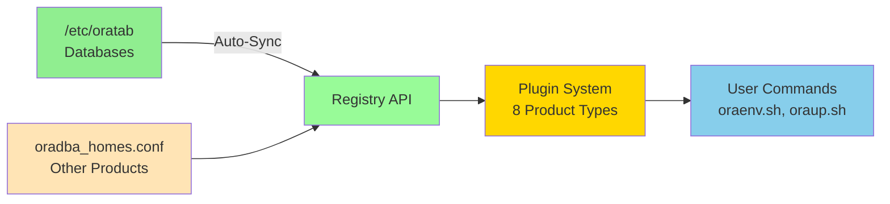

# Quick Start Guide

**Purpose:** Get started with OraDBA in 5 minutes — environment setup, Registry API basics, and common tasks.

**Prerequisites:**

- OraDBA installed (see [Installation](installation.md))
- Oracle Database or other Oracle products installed
- Shell profile configured

## First Steps

### Verify Installation

```bash
# Check version and integrity
oradba_version.sh --check
oradba_validate.sh
```

### Understand the Registry

OraDBA uses a **Registry API** that automatically manages all Oracle installations:

- **Databases**: Auto-synced from `/etc/oratab` on first login
- **Non-Database Products**: Registered in `oradba_homes.conf`
- **Unified Access**: Single interface for all Oracle products



### Set Up Your First Environment

**For Databases** (auto-discovered from oratab):

```bash
# Interactive selection on first run
source oraenv.sh

# Or directly by SID
source oraenv.sh FREE
```

**For Non-Database Products** (register manually):

```bash
# Register Data Safe connector
oradba_homes.sh add --name datasafe-conn1 \
  --path /u01/app/oracle/datasafe-conn1 --type datasafe

# Register Instant Client
oradba_homes.sh add --name ic23c \
  --path /usr/lib/oracle/23/client64 --type iclient

# List all registrations
oradba_homes.sh list
```

Each registered installation gets an automatic alias:

```bash
free              # source oraenv.sh FREE
testdb            # source oraenv.sh TESTDB
datasafe-conn1    # source oraenv.sh datasafe-conn1
```

## Working with Oracle Products

### oraenv.sh Options

```text
source oraenv.sh [ORACLE_SID] [OPTIONS]

  --silent          Silent mode — no output (for scripts)
  --fast-silent     Silent + skip alias/SQLPATH setup (fastest startup)
  --status          Display only database status
  -f, --force       Force environment setup
  -h, --help        Display help message
```

**Fast-silent mode** (`--fast-silent`) is optimized for `.bash_profile` performance. It skips alias
generation and SQLPATH configuration — OraDBA aliases (`sq`, `taa`, `cdh`, etc.) will not be available
until you reload in normal mode.

### Check All Environments

```bash
oraup.sh        # Show all registered installations and their status
u               # Short alias for oraup.sh
```

Output shows Oracle Homes (type, status, path), database instances (SID, flag, status), and listeners.

### Database Operations

```bash
source oraenv.sh FREE

sq              # sqlplus / as sysdba
sqh             # sqlplus with rlwrap (command history)
rmanc           # rman target / [catalog]

sta             # Database status — alias for dbstatus.sh
dbstatus.sh     # Detailed status: state, memory, storage, PDB info
dbstatus.sh --sid FREE --debug
```

**dbstatus.sh** displays:

- Instance state (NOMOUNT / MOUNT / OPEN) and uptime
- Memory allocation (SGA/PGA targets) and actual usage
- Database storage size, archive log mode, character set
- PDB status and session counts (for OPEN databases)

### Running SQL Scripts

```bash
# SQLPATH is configured automatically
sqlplus / as sysdba @db_info.sql    # Database name, version, status
sqlplus / as sysdba @space.sql      # Tablespace usage
sqlplus / as sysdba @sess.sql       # Active sessions
```

### Navigating Directories

```bash
cdh / cdob / cda    # Oracle Home / Base / Admin
cddt / cdda         # Diagnostic trace / alert directories
cdb / etc / cdlog   # OraDBA prefix / etc / log
```

### Viewing Logs

```bash
taa             # tail -f alert log (real-time)
vaa             # browse alert log (less)
lstat           # lsnrctl status
```

### Data Safe and Instant Client

```bash
# Data Safe connector
source oraenv.sh datasafe-conn1
cmctl status

# Instant Client
source oraenv.sh ic23c
sqlplus64 -V
sqlplus username/password@hostname:1521/service_name
```

### Scripts and Automation

Use `--silent` in scripts to suppress interactive output:

```bash
#!/usr/bin/env bash
source oraenv.sh FREE --silent

sqlplus -S / as sysdba <<EOF
SELECT name, open_mode FROM v\$database;
EXIT;
EOF
```

## Registry API

```bash
# List all installations
oradba_homes.sh list
oradba_homes.sh list --type database
oradba_homes.sh list --verbose

# Show details for one installation
oradba_homes.sh show FREE

# Sync databases from oratab (runs automatically on first login)
oradba_homes.sh sync-oratab

# Add non-database installation
oradba_homes.sh add --name oud1 --path /u01/app/oracle/oud1 --type oud

# Remove from registry (does not delete files)
oradba_homes.sh remove --name old-test-db
```

**Supported product types:** `database`, `datasafe`, `client`, `iclient`, `oud`, `java`, `weblogic`, `oms`, `emagent`

## Extensions

Extensions add custom scripts and tools without modifying OraDBA core:

```bash
# List extensions
oradba_extension.sh list

# Create new extension from template
oradba_extension.sh create mycompany

# Install from GitHub
oradba_extension.sh add oehrlis/odb_autoupgrade

# Scripts in extensions/bin/ are added to PATH automatically
# SQL in extensions/sql/ is added to SQLPATH
```

See [Extension System](extensions.md) for details on creating and managing extensions.

## Quick Reference

```bash
# Environment Setup
source oraenv.sh FREE          # Set environment
source oraenv.sh               # Interactive selection
oraup.sh / u                   # Show all installations
oradba_version.sh --check      # Version check
oradba_validate.sh             # Validate installation

# Registry Management
oradba_homes.sh list           # List all installations
oradba_homes.sh add ...        # Register installation
oradba_homes.sh sync-oratab    # Sync from oratab

# Database Operations
sq / sqh                       # SQL*Plus (bare / with rlwrap)
rmanc / rmanh                  # RMAN (with catalog / with rlwrap)
sta / dbstatus.sh              # Database status

# Navigation
cdh / cdob / cda / cdd         # Oracle directories
taa / vaa                      # Alert log (tail / less)

# Product-Specific
cmctl status                   # Data Safe connector status
sqlplus64 -V                   # Instant Client version

# Help
alih                           # Alias quick reference
oradba_version.sh --info       # Installation info
```

**Tips:**

1. Always `source oraenv.sh` before Oracle operations
2. Use `--silent` in scripts and cron jobs
3. Use `sqh` / `rmanh` for interactive work (rlwrap history)
4. Use `$cdh`, `$cda`, `$etc` convenience variables in commands
5. Check `$ORACLE_SID` after switching environments

If you encounter issues: [Troubleshooting Guide](troubleshooting.md) · `alih` · [GitHub Issues](https://github.com/oehrlis/oradba/issues)

## See Also {.unlisted .unnumbered}

- [Environment Management](environment.md) - Registry API and Plugin System deep dive
- [Configuration](configuration.md) - Customizing OraDBA
- [Aliases](aliases.md) - Complete alias reference
- [Extensions](extensions.md) - Adding custom functionality
- [Troubleshooting](troubleshooting.md) - Common issues

## Navigation {.unlisted .unnumbered}

**Previous:** [Installation](installation.md)
**Next:** [Environment Management](environment.md)
